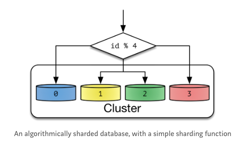
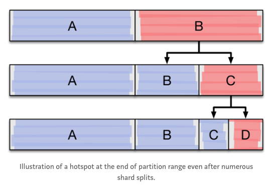

# Backend

* 데이터 엔지니어가 되기위해서 백엔드를 배워야 하는 이유
  * 데이터 엔지니어의 일은 실시간 트랜젝션 데이터를 하둡에 모으고 내부/외부에 serving하는 것이다
  * 하둡에 대한 이해, 데이터베이스 스키마 설계, API 서버 개발, 실시간 대용량 데이터 저장/처리하는 기술이 중요하다
* 주제
  * https://d2.naver.com/news/3435170
  * DB관리
    * Sharding
    * Global/Local Cache 적용범위
    * B-Tree, B+Tree
    * DB 스키마 관리(Liquibase)
    * MySQL, Redis, Memchaced, HBase, MongoDB, Elasticsearch
  * 검색엔진연동
  * 웹서버
    * Java HashMap 작동방식
    * Servlet기반 Java웹서버
    * 백엔드 개발 프레임워크 Netty/Spring
    * Rest-assured와 Spring MVC Test Integration, JUnit
    * 스레드풀(병렬처리)
    * 비동기/동기
    * REST API(HATEOAS)
    * CRUD API
    * GraphQL
    * Nginx, Tomcat, JVM
    * JVM, 커널 파라미터, 웹 서버 튜닝
  * 테스트
    * CI
    * 검사도구 Eslint
    * TDD(Test Driven Develop)
  * 설계 및 디자인패턴
    * Serverless 아키텍처
    * Value Object, Transfer Object, DTO
    * 구성요소 간의 역할과 책임 분배
      * MSA(Micro Service Architecture)
    * Docker, Kubernetes
  * PHOLAR의 흔들림 보정 원리
  * 모니터링 및 성능측정
    * SRE
    * SLA SLO

# DB관리

* Sharding

  * https://nesoy.github.io/articles/2018-05/Database-Shard

  * https://nesoy.github.io/articles/2018-02/Database-Partitioning

  * Sharding이란

    * Horizontal Partitioning

    * 같은 테이블 스키마를 가진 데이터를 다수의 데이터베이스에 분산하여 저장하는 것

      

  * Vertical Partitioning과의 차이점

    * Vertical Partitioning의 경우 컬럼으로 나누기 때문에 도메인에 영향을 많이 받아 application level에서 CRUD를 구현한다
    * Horizontal Partitioning은 application, database level에서 CRUD 구현이 가능하다

  * Sharding을 하는 이유

    * 큰 테이블을 관리하기 힘들어져 관리하기 쉬운단위로 분리하기 위해서 한다
    * 대용량 Data Write 환경에서 효율적이고, 많은 Insert가 있는 OLTP 시스템에서 Insert 작업을 분리된 파티션들로 분산시켜준다
    * 데이터의 훼손 가능성이 줄고 데이터 가용성이 향상된다
    * 그러나 운영하기 복잡하여 가능하면 Sharding을 피하는 다른 방안을 찾는 것이 좋다
      * Scale-in(하드웨어 성능 향상)
      * Cache나 Replication으로 Read부하를 줄이기
      * Table의 일부 컬럼만 자주사용하면
        * Vertical Partitioning
        * Hot, Warm, Cold 데이터로 분리

  * Sharding 방법

    * Hash Sharding

      * Database id를 Hashing하여 결정

      * Hash Key로 분산되어 Data가 skew되면 특정 파티션의 크기가 매우 커진다

      * Cluster의 Node개수를 변화시키면 Hash Key가 변하여 기존해 분배된 Data들을 다시 분배해야하는 ReSharding작업이 필요해진다

        

    * Dynamic Sharding

      * Locator Service를 통해 Shard Key를 얻는다

      * Cluster Node개수를 늘릴 때 Locator Service에 Shard Key만 추가하면 되고, 기존 Data들을 변경할 필요가 없어 확장에 유연하다

      * HDFS의 NameNode, MongoDB의 ConfigServer에서 사용

      * Locator가 성능을 위해 Cache하거나 Replication을 하려고하면 잘못된 Routing을 통해 에러가 발생할 수 있다

        

    * Entity Group

      * Key-Value가 아닌 객체들로 구성되었을 때 사용 가능

      * join, index, transaction을 사용해 관련있는 테이블들이 뭉치도록 sharding하는 방법

      * 하나의 물리적인 Shard에 쿼리를 진행하면 효율적이다

      * 사용자별로 분리저장되기 때문에 확장성이 좋다

      * cross-partition 쿼리는 single partition 쿼리보다 일관성보장을 못하고 성능도 떨어진다

        

    * Pitfall

      * HotSpot을 찾고 Sharding을 진행한다

      * 지속적으로 Sharding을 진행하면 가장 오른쪽 Node만 Write하여 나머지 Node들에 대해서 읽기 속도가 향상되는 효과를 얻는다

        

* Global/Local Cache 적용범위

* B-Tree, B+Tree

* DB 스키마 관리(Liquibase)

* MySQL, Redis, Memchaced, HBase, MongoDB, Elasticsearch

* 검색엔진연동
* 웹서버
  * Java HashMap 작동방식
  * Servlet기반 Java웹서버
  * 백엔드 개발 프레임워크 Netty/Spring
  * Rest-assured와 Spring MVC Test Integration, JUnit
  * 스레드풀(병렬처리)
  * 비동기/동기
  * REST API(HATEOAS)
  * CRUD API
  * GraphQL
  * Nginx, Tomcat, JVM
  * JVM, 커널 파라미터, 웹 서버 튜닝
* 테스트
  * CI
  * 검사도구 Eslint
  * TDD(Test Driven Develop)
* 설계 및 디자인패턴
  * Serverless 아키텍처
  * Value Object, Transfer Object, DTO
  * 구성요소 간의 역할과 책임 분배
    * MSA(Micro Service Architecture)
  * Docker, Kubernetes
* PHOLAR의 흔들림 보정 원리
* 모니터링 및 성능측정
  * SRE
  * SLA SLO