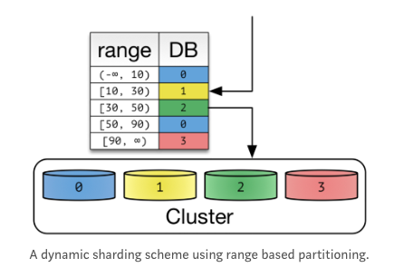
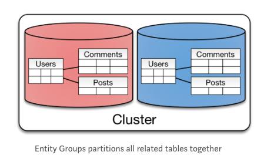

# Backend

* 데이터 엔지니어가 되기위해서 백엔드를 배워야 하는 이유
  * 데이터 엔지니어의 일은 실시간 트랜젝션 데이터를 하둡에 모으고 내부/외부에 serving하는 것이다
  * 하둡에 대한 이해, 데이터베이스 스키마 설계, API 서버 개발, 실시간 대용량 데이터 저장/처리하는 기술이 중요하다
* 주제
  * https://d2.naver.com/news/3435170
  * DB관리
    * Sharding
    * Global/Local Cache 적용범위
    * B-Tree, B+Tree
    * DB 스키마 관리(Liquibase)
    * MySQL, Redis, Memchaced, HBase, MongoDB, Elasticsearch
  * 검색엔진연동
  * 웹서버
    * Java HashMap 작동방식
    * Servlet기반 Java웹서버
    * 백엔드 개발 프레임워크 Netty/Spring
    * Rest-assured와 Spring MVC Test Integration, JUnit
    * 스레드풀(병렬처리)
    * 비동기/동기
    * REST API(HATEOAS)
    * CRUD API
    * GraphQL
    * Nginx, Tomcat, JVM
    * JVM, 커널 파라미터, 웹 서버 튜닝
  * 테스트
    * CI
    * 검사도구 Eslint
    * TDD(Test Driven Develop)
  * 설계 및 디자인패턴
    * Serverless 아키텍처
    * Value Object, Transfer Object, DTO
    * 구성요소 간의 역할과 책임 분배
      * MSA(Micro Service Architecture)
    * Docker, Kubernetes
  * PHOLAR의 흔들림 보정 원리
  * 모니터링 및 성능측정
    * SRE
    * SLA SLO

# DB관리

* Sharding

  * https://nesoy.github.io/articles/2018-05/Database-Shard

  * https://nesoy.github.io/articles/2018-02/Database-Partitioning

  * Sharding이란

    * Horizontal Partitioning

    * 같은 테이블 스키마를 가진 데이터를 다수의 데이터베이스에 분산하여 저장하는 것

      

  * Vertical Partitioning과의 차이점

    * Vertical Partitioning의 경우 컬럼으로 나누기 때문에 도메인에 영향을 많이 받아 application level에서 CRUD를 구현한다
    * Horizontal Partitioning은 application, database level에서 CRUD 구현이 가능하다

  * Sharding을 하는 이유

    * 큰 테이블을 관리하기 힘들어져 관리하기 쉬운단위로 분리하기 위해서 한다
    * 대용량 Data Write 환경에서 효율적이고, 많은 Insert가 있는 OLTP 시스템에서 Insert 작업을 분리된 파티션들로 분산시켜준다
    * 데이터의 훼손 가능성이 줄고 데이터 가용성이 향상된다
    * 그러나 운영하기 복잡하여 가능하면 Sharding을 피하는 다른 방안을 찾는 것이 좋다
      * Scale-in(하드웨어 성능 향상)
      * Cache나 Replication으로 Read부하를 줄이기
      * Table의 일부 컬럼만 자주사용하면
        * Vertical Partitioning
        * Hot, Warm, Cold 데이터로 분리

  * Sharding 방법

    * Hash Sharding

      * Database id를 Hashing하여 결정

      * Hash Key로 분산되어 Data가 skew되면 특정 파티션의 크기가 매우 커진다

      * Cluster의 Node개수를 변화시키면 Hash Key가 변하여 기존해 분배된 Data들을 다시 분배해야하는 ReSharding작업이 필요해진다

        

    * Dynamic Sharding

      * Locator Service를 통해 Shard Key를 얻는다

      * Cluster Node개수를 늘릴 때 Locator Service에 Shard Key만 추가하면 되고, 기존 Data들을 변경할 필요가 없어 확장에 유연하다

      * HDFS의 NameNode, MongoDB의 ConfigServer에서 사용

      * Locator가 성능을 위해 Cache하거나 Replication을 하려고하면 잘못된 Routing을 통해 에러가 발생할 수 있다

        

    * Entity Group

      * Key-Value가 아닌 객체들로 구성되었을 때 사용 가능

      * join, index, transaction을 사용해 관련있는 테이블들이 뭉치도록 sharding하는 방법

      * 하나의 물리적인 Shard에 쿼리를 진행하면 효율적이다

      * 사용자별로 분리저장되기 때문에 확장성이 좋다

      * cross-partition 쿼리는 single partition 쿼리보다 일관성보장을 못하고 성능도 떨어진다

        

    * Pitfall

      * HotSpot을 찾고 Sharding을 진행한다

      * 지속적으로 Sharding을 진행하면 가장 오른쪽 Node만 Write하여 나머지 Node들에 대해서 읽기 속도가 향상되는 효과를 얻는다

        

* Global/Local Cache 적용범위

* DB 스키마 관리(Liquibase)

* MySQL, Redis, Memchaced, HBase, MongoDB, Elasticsearch

* 검색엔진연동

# 웹서버

* Java HashMap 작동방식

  * https://ysjee141.github.io/blog/jdk/java-hashmap/
  * Hash
  * 내부구조는 배열로 되어있고, 해시함수를 이용해 hashcode() % M값을 인덱스로 삼는다
  * 해시함수를 쓸 때 충돌하면 Separate Chaining을 사용해 LinkedList로 관리하고, 값이 8개이상이면 Tree로 변경하여 관리한다

* 웹서버, WAS 구성요소

  * https://codevang.tistory.com/191

  * https://losskatsu.github.io/it-infra/webserver/#%ED%86%B0%EC%BA%A3tomcat

  * 웹 어플리케이션 : JSP, Servlet

  * 웹 서버 : IIS, Apache, Nginx

  * WAS : Tomcat, Jeus

    

    

* 백엔드 개발 프레임워크 Netty/Spring

  * Netty
    * https://narup.tistory.com/118
    * 프로토콜 서버 및 클라이언트같은 네트워크 응용 프로그램을 빠르고 쉽게 개발할 수 있는 Non-Blocking Input Output 클라이언트 서버 프레임워크
    * 기존 소켓 프로그래밍에서 클라이언트가 많이 접속할 경우 클라이언트 수만큼 스레드를 생성해야해서 리소스 낭비(문맥교환, 입출력 데이터에 관련한 무한 대기)가 이루어져서 이를 해결하기 위해 Non-Blocking Input Output 방식으로 개발한 것
  * Spring
    * https://jerryjerryjerry.tistory.com/62
    * JAVA 기술들을 더 쉽게 사용할 수 있게 해주는 오픈소스 프레임워크
    * JSP, MyBatis, JPA 등에 쓰인다

* Rest-assured와 Spring MVC Test Integration, JUnit

  * Rest-assured JAVA 라이브러리
    * https://beenlife.tistory.com/34
    * Rest api black box 테스트
    * 어플리케이션에 Request를 보내고, Response를 받고 미리 결정된 결과와 비교
    * JSON, HTTP 기반
  * Spring MVC Test
    
    * https://doflamingo.tistory.com/20
  * JUnit
    * https://www.nextree.co.kr/p11104/
    
    * 단위 테스트 도구
    
    * 테스트 클래스를 만들고 안에 테스트할 객체를 생성한다음 assertEquals등의 함수를 이용해 예상한 값이 나오는지 확인
    
    * @Before, @After, @BeforeClass, @AfterClass 등의 어노테이션으로 단위 테스트 메소드를 기준으로 실행할 메소드를 작성할 수 있다
    
      

* 스레드풀(병렬처리)

  * https://cheershennah.tistory.com/170
  * 작업처리에 사용되는 스레드를 제한된 개수만큼 정해놓고 작업큐에 들어오는 작업들을 하나씩 스레드가 처리하는 것
  * 작업처리 요청이 폭증해도 스레드 전체개수가 늘어나지 않아 성능이 급격히 저하되지 않는다
  * 작업처리과정
    * Executors 클래스에서 ExcutorService를 생성하여 thread pool에 개수와 종류를 정한다
    * ExcutorService의 작업큐에 Runnable(리턴값 없음) 또는 Callable(리턴값 있음) 객체를 넣어서 작업처리를 요청한다
    * ExcutorService에 작업을 추가하는 방법은 execute(결과반환x, 재사용x), submit(결과반환o, 재사용o, 스레드 오버헤드 적음)가 있다
    * ExcutorService는 Future 객체를 리턴하고, Future 객체는 바로 작업결과가 나오진 않고 작업이 완료될 때까지 기다렸다가 최종결과를 얻는 객체이다
    * 작업은 양과 스레드 스케쥴링에 따라 순서대로 처리되지 않을 수 있다
    * 스레드풀에서 작업처리가 완료된 것만 통보받는 방법은 CompletionService의 poll(), take() 메소드가 있다

* REST API(HATEOAS)

  * https://wonit.tistory.com/454

  * REST API의 필수 제약 조건들

    * Client-Server : Client와 Server는 서로 독립적이라 내부 작업을 몰라도 별도의 진화가 가능하다

    * Stateless : Client에서 Server로 각 요청에는 그 요청에 필요한 모든 정보가 있어야 한다

    * Cache : 요청에 대한 응답에는 해당 요청이 캐시가 가능한지 불가능한지 명시해야 한다

    * Uniform Interface

      * https://doitnow-man.tistory.com/96

      * 보통 많은 REST API를 지칭하는 것들에서 지켜지지 않는다

      * Resource-Based : 리소스를 URI로 식별

      * Manipluation Of Resources Through Representations : HTTP메소드(PUT, GET, POST, DELETE)를 통해 리소스를 조작

      * Self-Descriptive Message : 메시지 스스로가 자신의 모든것에 대한 설명을 할 수 있어야 한다(최소 API문서가 어디있는지 알려줘야 함)

      * Hypermedia As The Engine Of Application State(HATEOAS) : 애플리케이션의 State는 Hyperlink를 이용해서 전이되어야한다

        ```json
        {
          "data": {
            "id": 1000,
            "name": "게시글 1",
            "content": "HAL JSON을 이용한 예시 JSON",
            "self": "http://localhost:8080/api/article/1000", // 현재 api 주소
            "profile": "http://localhost:8080/docs#query-article", // 해당 api의 문서
            "next": "http://localhost:8080/api/article/1001", // 다음 article을 조회하는 URI
            "comment": "http://localhost:8080/api/article/comment", // article의 댓글 달기
            "save": "http://localhost:8080/api/feed/article/1000", // article을 내 피드로 저장
          },
        }
        ```

        보다는

        ```json
        {
          "data": { // HAL JSON의 리소스 필드
            "id": 1000,
            "name": "게시글 1",
            "content": "HAL JSON을 이용한 예시 JSON"
          },
          "_links": { // HAL JSON의 링크 필드
            "self": {
              "href": "http://localhost:8080/api/article/1000" // 현재 api 주소
            },
            "profile": {
              "href": "http://localhost:8080/docs#query-article" // 해당 api의 문서
            },
            "next": {
              "href": "http://localhost:8080/api/article/1001" // article 의 다음 api 주소
            },
            "prev": {
              "href": "http://localhost:8080/api/article/999" // article의 이전 api 주소
            }
          }
        }
        ```

        

* CRUD API

  * https://nordicapis.com/crud-vs-rest-whats-the-difference/
  * 데이터베이스와 상호작용하는 Create, Read, Update, Delete와 같은 함수
  * SQL(Insert, Select, Update, Delete), HTTP(POST/PUT, GET, PUT/POST/PATCH, DELETE)

* GraphQL

  * https://tech.kakao.com/2019/08/01/graphql-basic/

  * sql은 데이터베이스에 저장된 데이터를 효율적으로 가져오는 것이 목적이고, gql은 웹 클라이언트가 데이터를 서버에서 효율적으로 가져오는 것이 목적

  * url, method와 조합하는 REST API와 달리 단 하나의 endpoint가 존재한다

  * gql을 사용하면 한번의 네트워크 호출로 처리할 수 있다

    

    ```sql
    SELECT plot_id, species_id, sex, weight, ROUND(weight / 1000.0, 2) FROM surveys;
    ```

    ```gql
    {
      hero {
        name
        friends {
          name
        }
      }
    }
    ```

    

* JVM, 커널 파라미터, 웹 서버 튜닝

  * https://pringles.tistory.com/268

# 테스트

* https://www.redhat.com/ko/topics/devops/what-is-ci-cd

* CI

  * Continuous Integration
  * 성공적으로 구현할 경우 어플리케이션에 대한 변경 사항을 정기적으로 빌드 및 테스트되어 공유 리포지토리에 통합되는 것
  * 동시에 어플리케이션 개발과 관련된 코드 작업을 할 경우 서로 충돌할 수 있는 문제 해결

* CD

  * Continuous Delivery, Continous Deployment

  * CI가 끝나고 해당 변경사항이 운영/프로턱션 환경까지 자동으로 배포하는 것

    

* 검사도구 Eslint

  * https://tech.kakao.com/2019/12/05/make-better-use-of-eslint/
  * JavaScript, JSX의 문법오류에 표시를 달아놓는 정적분석도구

* TDD(Test Driven Develop)

  * http://clipsoft.co.kr/wp/blog/tddtest-driven-development-%EB%B0%A9%EB%B2%95%EB%A1%A0/

  * 테스트코드 작성 -> 코드개발 -> 리펙토링을 반복해서 개발하는 것

  * 애자일 개발에서 불확실성이 높을 때 피드백, 협력을 통해 더 좋은 결과를 내기 위해 사용하는 방법론

    * 처음해보는 주제
    * 고객의 요구조건이 자주 바뀔 때
    * 개발 중 코드를 많이 바꿔야 된다고 생각할 때
    * 코드를 누가 유지보수할 지 모를 때

  * 반대로 익숙하고 결과가 예측가능하다면 TDD를 하지 않아도 된다

    

# 설계 및 디자인패턴

* Serverless 아키텍처
* Value Object, Transfer Object, DTO
* 구성요소 간의 역할과 책임 분배
  * MSA(Micro Service Architecture)
* Docker, Kubernetes
* PHOLAR의 흔들림 보정 원리
* 모니터링 및 성능측정
  * SRE
  * SLA SLO