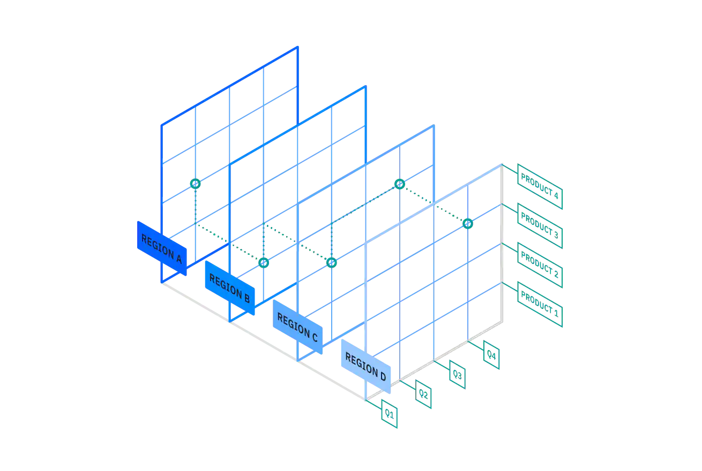
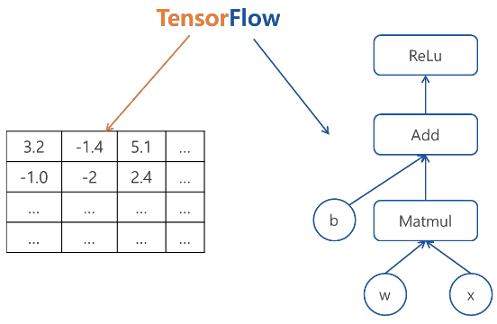

# Data Engineer Roadmap


* https://github.com/datastacktv/data-engineer-roadmap

* 전반적으로 쓰이는 것

  * CS fundamentals
    * Basic Terminal usage
      * https://towardsdatascience.com/a-quick-guide-to-using-command-line-terminal-96815b97b955
      * 터미널 사용법
      * ssh : 서버 접속
      * mv : 파일 옮기기
      * cp : 파일 복사
      * rm : 파일 지우기
      * ls : 파일 나열
      * cd : 현재 디렉토리 바꾸기
      * mkdir : 새폴더 만들기
      * clear : 너무 많은 커맨드를 화면에서 지우기
      * python target, java target, javac target : 스크립트 실행하기
    * 자료구조와 알고리즘
    * APIs
      * https://www.mulesoft.com/resources/api/what-is-an-api
      * 서로 다른 두 애플리케이션간에 소통할 수 있도록 만들어 놓은 중간 인터페이스
      * 서로 전체를 보여주지 않고 필요한 부분만 보여준다
    * REST
      * https://ko.wikipedia.org/wiki/REST
      * 월드 와이드 웹과 같이 분산 하이퍼미디어 시스템을 위한 소프트웨어 아키텍처의 한 형식
      * 자원을 정의하고 자원에 대한 주소를 지정하는 방법 전반
      * REST 인터페이스 원칙에 대한 가이드
        * 자원의 식별 : 요청 내에 기술된 개별 자원을 식별할 수 있어야 한다
        * 메시지를 통한 리소스의 조작 : 클라이언트가 어떤 자원을 지칭하는 메시지와 특정 메타데이터만 가지고 있다면 서버 상의 해당 자원을 변경, 삭제할 수 있다
        * 자기서술적 메시지 : 각 메시지는 자신을 어떻게 처리해야 하는지에 대한 충분한 정보를 포함해야 한다(실제 데이터 내용을 다운받기 전에 무엇을 해야하는지 알 수 있어야 한다)
        * 애플리케이션 상태에 대한 엔진으로서 하이퍼미디어 : 클라이언트가 관련된 리소스에 접근하기를 원한다면, 리턴되는 지시자에서 구별될 수 있어야 한다
    * Structured vs unstructured data
      * https://www.talend.com/resources/structured-vs-unstructured-data/
      * Structured data
        * schema-on-write
        * Data warehouse
        * 머신러닝에 쉽게 사용될 수 있고, 비즈니스 목적인 사용자가 쉽게 쓸 수 있다.
        * 이미 정제되어 쓸 수 있는 곳이 한정된다
      * Unstructured data
        * schema-on-read
        * Data lake
        * 더 빨리 데이터를 쌓을 수 있고 형식이 자유롭다
        * data science에 능통해야 잘 다룰 수 있다
    * computer 작동원리
    * internet 작동원리
    * git
  * Programming language
    * python
    * java
  * Testing
    * 코드가 잘 동작하는지, 버그가 없는지를 점검하는 범위별 테스트 종류
    * https://cjwoov.tistory.com/9
    * Unit testing
      * 함수 하나하나와 같이 코드의 작은 부분을 테스트
      * test-driven develpoment에서 꼭 작성해야 한다
    * Integration testing
      * 서로 다른 시스템들의 상호작용이 잘 이루어지는지 테스트
      * 네트워크, 데이터베이스와의 상호작용 등
      * 꼭 필요한 것이 아니면 유닛테스트보다 오래걸리는 과정이므로 하지 않는다
    * Functional testing
      * 사용자와 어플리케이션의 상호작용이 원활하게 이루어지는지 테스트
      * 회원가입 등 앱의 특정 흐름을 테스트 하는 경우
      * 꼭 필요한 것이 아니면 유닛테스트보다 오래걸리는 과정이므로 하지 않는다
  * Network
    * Protocols
      * https://www.britannica.com/technology/protocol-computer-science
      * 전자기기들 간의 데이터 전송 절차
      * HTTP/HTTPS
        * W3 상에서 정보(HTML)를 주고받을 수 있는 프로토콜
      * TCP
        * 월드 와이드 웹에서 서버에 연결할 때, 이메일 전송, 파일 전송에도 사용된다
      * IP
        * 송신 호스트와 수신 호스트가 패킷 교환 네트워크에서 정보를 주고받는 데 사용하는 정보 위주의 규약
      * SSH
        * 네트워크 상의 다른 컴퓨터에 로그인하거나 원격 시스템에서 명령을 실행하고 다른 시스템으로 파일을 복사할 수 있도록 해주는 프로토콜
      * DNS
        * 호스트 도메인 이름을 호스트 네트워크 주소로 바꾸거나 그 반대의 변환을 수행할 수 있도록 개발
    * Firewalls
      * 네트워크 트래픽을 감시하는 역할
    * VPN
      * 공중 네트워크를 통해 한 회사나 단체가 내용을 바깥 사람에게 드러내지 않고 통신할 목적으로 쓰이는 사설 통신망
    * VPC
      * 논리적으로 격리된 공간을 만들고 이 위에 리소스를 생성
  * Infrastructure as Code
    * Containers
      * Docker
        * https://velog.io/@sseyoung0419/Docker%EB%9E%80-%EB%AC%B4%EC%97%87%EC%9D%B8%EA%B0%80
        * 애플리케이션을 신속하게 구축, 테스트 및 배포할 수 있는 소프트웨어 플랫폼
        * 환경에 구애받지 않고 응용프로그램을 더 쉽게 만들 수 있도록 설계된 오픈소스 가상화 플랫폼
    * Container orchestration
      * Kubernetes
        * https://kubernetes.io/ko/docs/concepts/overview/what-is-kubernetes/
        * 프로덕션 환경에서 애플리케이션을 실행하는 컨테이너를 관리하기 위해 사용
        * 애플리케이션의 확장과 장애 조치를 처리하고 배포 패턴 등을 제공
      * GKE
        * Google Kubernetes Engine
    * Infrastructure provisioning
      * Terraform
        * https://techblog.woowahan.com/2646/
        * 원하는 인프라를 코드로 서술할 수 있다
      * AWS CDK
        * https://docs.aws.amazon.com/cdk/latest/guide/home.html
        * 원하는 인프라를 코드로 서술할 수 있다
  * CI/CD
    * Github Action
      * https://jonnung.dev/devops/2020/01/31/github_action_getting_started/
      * github 저장소를 기반으로 소프트웨어 개발 workflow를 자동화 할 수 있는 도구
      * build, test, package, release, deploy 등 다양한 이벤트 기반으로 직접 원하는 workflow를 만들 수 있다
    * Jenkins
      * https://ict-nroo.tistory.com/31
      * 자동화된 빌드와 테스트 작업들 가능
      * 데이터베이스 구축, 어플리케이션 서버로의 deploy, 라이브러리 릴리즈 등을 웹 인터페이스로 조작 가능
      * 코드 표준 준수 여부 검사, 정적 분석을 통한 코드 품질 검사 진행
      * 빌드 파이프라인 구성을 간단하게 할 수 있다
  * Identity and access management
    * Active Directory
      * https://mpain.tistory.com/153
      * 회사 직원들의 계정 정보, 컴퓨터 정보, 회사에서 강제하는 정책들(패스워드 자리수, 5분뒤 화면보호기 실행 등)에 대한 정보를 저장하는 데이터베이스
      * 암호화된 파일 타입의 데이터베이스
      * 회사 전체 IT 시스템에서 사용자에 대한 인증, 권한이 필요한 부분에서 사용
  * Data security & privacy
    * Legal compliance
      * 기업 윤리
    * Encryption
      * https://ko.wikipedia.org/wiki/%EC%95%94%ED%98%B8%ED%99%94
      * 특별한 지식을 소유한 사람들을 제외하고 누구든지 읽어볼 수 없도록 알고리즘을 이용하여 정보를 전달하는 과정
    * Key management
      * https://en.wikipedia.org/wiki/Key_management
      * cryptosystem에서 crpytographic key를 관리하는 기술

* Data engineer

  * Database fundamentals

    * Entity-Relationship model : entity(개체)들과 그들간의 relationship(관계)를 보여주는 개념적 모델

      * https://ko.wikipedia.org/wiki/%EA%B0%9C%EC%B2%B4-%EA%B4%80%EA%B3%84_%EB%AA%A8%EB%8D%B8

    * Relational model : E-R model을 컴퓨터에 적용시키기 위해 만든 논리적 모델. 데이터가 2차원 테이블에 담겨있다.

      * https://chartworld.tistory.com/6

    * SQL : 관계형 데이터베이스 관리 시스템(RDBMS)의 데이터를 관리하기 위해 설계된 특수 목적의 프로그래밍 언어. 자료검색 및 관리, 데이터베이스 스키마 생성과 수정, 데이터베이스 객체 접근 조정 관리.

      * https://ko.wikipedia.org/wiki/SQL

    * Normalization, Denormalization : 관계형 데이터베이스의 설계에서 중복을 최소화하게 데이터를 구조화하는 프로세스를 정규화라고 한다. 데이터를 정규화하면 하나의 테이블에서의 데이터 삽입, 삭제, 변경이 정의된 관계들로 인해 데이터베이스의 나머지 부분들로 전파된다. 보통 제 3정규화(3NF)되면 정규화되었다고 한다. 하지만 성능상의 이유로, 예를 들어 데이터 웨어하우스 디자인을 위해선 비정규화된 디자인을 추천한다.

      * https://ko.wikipedia.org/wiki/%EB%8D%B0%EC%9D%B4%ED%84%B0%EB%B2%A0%EC%9D%B4%EC%8A%A4_%EC%A0%95%EA%B7%9C%ED%99%94

    * ACID transactions : 데이터베이스 트랜잭션(데이터에 대한 하나의 논리적 실행단계)이 안전하게 수행된다는 것을 보장하기 위한 성질을 가리키는 약어. 원자성, 일관성, 독립성, 지속성을 의미.

      * https://ko.wikipedia.org/wiki/ACID

    * PACELC

      * CAP에서는 정상상황일 때의 분산 시스템 동작을 설명하지 못하기 때문에 새로 등장한 분산시스템에서 일관성과 가용성의 관계를 적은 이론
      * P(네트워크 파티션 장애) 상황에서 A(가용성)와 C(일관성)의 상충 관계, E(else, 정상) 상황에서 L(지연 시간)과 C(일관성)의 상충 관계를 설명
      * 완벽한 CA 또는 CP 시스템은 실효성이 없다
        * P(partition) : 네트워크 파티션 장애
        * A(availability) : 모든 노드가 어떤 상황이던 간에 시스템이 응답(성공 또는 실패여부)할 수 있는것
        * C(consistency) : 모든 노드가 같은 순간에 같은 데이터를 보기 위해 하나의 트랜젝션이 다른 모든 노드에 복제된 후에 완료되는 것
        * L(lagency) : 응답하는데 걸리는 시간
        * https://ko.wikipedia.org/wiki/CAP_%EC%A0%95%EB%A6%AC
        * http://eincs.com/2013/07/misleading-and-truth-of-cap-theorem/
        * http://happinessoncode.com/2017/07/29/cap-theorem-and-pacelc-theorem/

    * OLTP vs OLAP

      * OLAP(Online Analytical Processing) : 복잡한 판단을 하기 위해 다차원 분석을 빠르게 해주는 것
      * OLAP cube 예시) sales data를 region, quarter, product에 따라 보여줌

      

      * OLTP(Online Transaction Processing) : real time으로 수많은 transaction을 처리해주는 것

      * OLTP로 데이터를 수집한 다음 OLAP에게 데이터를 제공하는 형식으로 많이 쓰인다.

        | 속성       | OLAP                                                         | OLTP                                                         |
        | ---------- | ------------------------------------------------------------ | ------------------------------------------------------------ |
        | 목적       | 복잡한 분석으로 사업결정하기 위해서 하나의 쿼리가 많은 레코드를 다룬다 | 간단한 update, insertion, deletion쿼리들이 적은 레코드를 다룬다 |
        | 데이터소스 | 여러 OLTP 데이터베이스나 data warehouse                      | 전통적인 DBMS                                                |
        | 처리시간   | OLTP보단 느리고, read에 특화되어 있다                        | 빠르다                                                       |
        | 가용성     | 현재 데이터를 수정하지 않으므로 백업을 적게한다              | 데이터를 수시소 바꾸어 무결성을 유지하기 위해서 백업을 자주 해야한다 |

      * https://www.ibm.com/cloud/blog/olap-vs-oltp

    * Horizontal vs Vertical scaling

      * Horizontal Scaling(scaling out) : 자원을 증가시키기 위해 기기 개수 증가

      * Vertical Scaling(scaling up) : 자원을 증가시키기 위해 현재 기기에 cpu, ram등의 성능 증가

        | 속성               | Horizontal Scaling                                      | Vertical Scaling                                             |
        | ------------------ | ------------------------------------------------------- | ------------------------------------------------------------ |
        | 데이터 위치        | 각 노드들은 데이터의 일부만                             | 단일 노드에 모든 데이터                                      |
        | 성능               | 짧은 시간에 쉽게 무한대로 늘릴 수 있다                  | 같은 기기에서 작업해야하기 때문에 scaling 하기 쉽지 않고 늘릴 수 있는 한계가 있다 |
        | 병행수행방법       | Master/Worker, Tuple Spaces, Blackboard, MapReduce      | Multi threading, in process message passing                  |
        | 메시지 교환        | 주소부족, 여러개의 복사본을 가져야 해서 복잡하고 비싸다 | Multi threading의 경우 공유 주소 공간을 통해 pass by reference가 가능 |
        | DB 종류            | Cassandra, MongoDB, Google Cloud Spanner                | MySQL, Amazon RDS                                            |
        | 다중화(Redundancy) | 시스템 일부에 장애가 생겨도 전체의 기능 유지가능        | 시스템 일부에 장애가 생기면 전체가 중단한다                  |

      * https://www.section.io/blog/scaling-horizontally-vs-vertically/

    * Dimensional modeling

      * 데이터웨어 하우스 디자인
      * 사실(측정값, 일반적으로 집계할 수 있는 숫자 값, 판매금액 등), 차원(컨텍스트, 사실을 정의하는 계층, 타임 스탬프, 제품, 레지스터 번호, 상점 번호 등) 개념 사용
      * 장점
        * 이해도 : 정규화된 모델에 비해 이해하기 쉽고 직관적
        * 쿼리성능 : 비정규화 되고 데이터 쿼리에 최적화
        * 확장성 : 예상치 못한 새로운 데이터를 쉽게 수용 가능

  * Relational databases & Non-relational databases

    | 속성            | Relational databases(SQL)                                    | Non-relational databases(NoSQL, 특히 MongoDB)              |
    | --------------- | ------------------------------------------------------------ | ---------------------------------------------------------- |
    | 스키마          | 존재                                                         | 없음                                                       |
    | 처리 트랜잭션양 | 적음                                                         | 많음                                                       |
    | 사용용도        | 잘 바뀌지 않는 정해진 일만 할 때, record나 column형태로 저장하는 것이 나을 때 | 여러 목적으로 쓰일 때, 많은 양의 데이터를 처리해야만 할 때 |

    * https://www.simplilearn.com/difference-between-nosql-and-relational-database-systems-article
    * http://www.incodom.kr/NoSQL_DB_%EC%9D%98_%EC%A2%85%EB%A5%98#h_38691cefb3cd82117e6e8c1d3f903c0f

    * Document DB

      * 계층적 트리 데이터(XML, JSON, BSON)

      * Embedded Document(여러 개의 테이블을 하나의 Document 내에 모아둘 수 있음, join 기능 대체)

      * MongoDB, CouchDB

      * 로깅 시스템에 적합(로그의 중앙집중화된 저장소로 사용하기 적합)

      * 인터넷 상거래 시스템과 같이 잦은 비즈니스 요구사항 변경이 있을 때 적합

      * SNS서비스, 블로그에 적합

      * 엄격한 다중 트랜잭션이 요구될 때 부적합

      * 엄격한 일관성, 무결성이 요구될 때 부적합

      * Update가 빈번할 때 Document 크기가 크면 단편화가 발생해 성능저하

      * https://blog.voidmainvoid.net/238

        ```json
        {
          "_id" : "mspark11",
          "name" : "박명수",
          "phones" : [ "010-2452-8864", "02-2214-3521" ],
          "title" : "수석 컨설턴트",
          "team" : { "name" : "기술컨설팅팀", "code" : "Z03212" }, "schedules" : [
            { "time" : "20150311130000", "loc" : "과천", "work" : "업무협의" },
            { "time" : "20150402150000", "loc" : "강남역", "work" : "제휴상담" },
            { "time" : "20150211100000", "loc" : "종로", "work" : "전략회의", "done": true },
            { "time" : "20150211170000", "loc" : "삼성동", "work" : "세미나 참석", "done" :true }
          ] 
        }
        ```

    * Wide Column DB

      

      * 행마다 키와 해당 값을 저장할 때마다 각각 다른값의 다른 수의 스키마를 가질 수 있다.
      * 대량의 데이터 압축, 분산처리, 집계 쿼리(sum, count, avg 등)및 쿼리 동작 속도, 확장성에 뛰어나다
      * Cassandra, HBase, Google Bigtable

    * Graph DB

      

      * 데이터를 노드로 표현하며 노드 사이의 관계를 엣지로 표현
      * RDBMS보다 성능이 좋고 유연하며 유지보수에 용이
      * Social networks, Network diagrams 등에 사용
      * Neo4j

    * Key-Value DB

      

      * Key-Value 하나의 묶음으로 저장되는 단순한 구조
      * 속도가 빠르고 분산 저장시 용이
      * server config, session clustering 등에 사용
      * scan에는 용이하지 않다
      * Redis, DynamoDB

  * Data warehouses

    * https://ko.wikipedia.org/wiki/%EB%8D%B0%EC%9D%B4%ED%84%B0_%EC%9B%A8%EC%96%B4%ED%95%98%EC%9A%B0%EC%8A%A4
    * 방대한 조직 내에서 분산 운영되는 각각의 데이터 베이스 관리 시스템을 효율적으로 통합하여 조정, 관리 하는 곳
    * 주제 지향적(subjectorientation) : 데이터를 주제별로 구성하여 누구나 이해하기 쉬운 형태
    * 통합성(integration) : 데이터가 데이터 웨어하우스에 들어갈 때 일관적인 형태로 변환된다
    * 시계열성(time-variancy) : 데이터는 일정 기간동안 정확성을 나타낸다
    * 비휘발성(nonvolatilization) : 데이터가 일단 적재되면 batch 작업에 의한 갱신 이외에는 insert, delete 등의 변경이 수행되지 않는다
    * 기업의 운영시스템과 분리되며, 운영시스템으로부터 많은 종류의 데이터가 재구조화되어 공급된다
    * 비즈니스 사용자들의 의사결정 지원에 전적으로 이용된다
    * https://giljae.medium.com/snowflake-bigquery-redshift-%EB%B9%84%EA%B5%90-5c585df450b7
    * 기존의 Postgres, MySQL, MSSQL 등 RDBMS는 최대 1TB크기의 데이터를 지원하고 이 크기를 초과하면 성능이 저하될 수 있지만, Redshift, BigQuery, Snowflake는 최적의 방식으로 최대 수 PB 데이터 세트 크기를 지원한다
    * Snowflake
    * Redshift
      * 망고플레이트 적용 사례
        * https://medium.com/team-mangoplate/%EB%A7%9D%EA%B3%A0%ED%94%8C%EB%A0%88%EC%9D%B4%ED%8A%B8-%EB%8D%B0%EC%9D%B4%ED%84%B0%EC%9B%A8%EC%96%B4%ED%95%98%EC%9A%B0%EC%8A%A4-%EC%9D%B4%EC%95%BC%EA%B8%B0-602e4e073078
      * 스타트업에선 비용 때문에 기존 HW기반 고성능 DW장비(IBM Netezza, Teradata)보다 클라우드 기반 서비스를 사용한다
    * BigQuery

  * Object storage

    * AWS S3
      * https://docs.aws.amazon.com/ko_kr/AmazonS3/latest/userguide/Welcome.html
      * 인터넷 스토리지 서비스
      * 버킷(객체를 저장할 컨테이너) 생성 가능
      * 버킷에 데이터를 무한정으로 저장가능(각 객체에 최대 5TB 데이터 포함, 고유한 개발자 할당키를 사용해 객체 저장 및 검색 가능)
      * 권한에 따라 버킷으로 데이터를 업로드 또는 다운로드 할 수 있는가가 정해진다
      * REST 및 SOAP 인터페이스 사용

  * Cluster computing fundamentals

    * Hadoop
      * https://m.blog.naver.com/acornedu/222069158703
      * https://butter-shower.tistory.com/71
      * 간단한 프로그래밍 모델을 사용하여 여러 대의 컴퓨터 클러스터에서 대규모 데이터 세트를 분산처리할 수 있게 해주는 프레임워크
      * HDFS(Hadoop Distrubuted File System)
        * 애플리케이션 데이터에 대한 높은 액세스를 제공하는 분산파일 시스템
        * 데이터를 저장하면, 다수의 노드에 복제 데이터도 함께 저장된다
        * 파일을 저장하거나 조회하려면 스트리밍 방식으로 데이터에 접근해야 한다
        * 한번 저장한 데이터는 수정할 수 없고, 읽기만 가능해 데이터 무결성 유지
        * 파일 이동, 삭제, 복사할 수 있는 인터페이스 제공
      * MapReduce
        * 대용량 데이터를 분산처리하기 위한 프로그램
        * 대규모 분산 컴퓨팅 환경에서 대량의 데이터를 병렬로 분석 가능
        * 데이터를 종류별로 모으고(Map)하고, filtering과 sorting을 거쳐 데이터를 뽑아내는(Reduce)과정

  * Data processing

    * https://www.precisely.com/blog/big-data/big-data-101-batch-stream-processing
    * Batch
      * 더 많은 데이터를 처리하고 오래걸린다
      * 시간에 민감하지 않아도 된다
      * 실시간으로 처리하지 못하는 큰 데이터를 처리해야할 때 사용한다
      * 급여, 청구, 고객에게서 들어온 주문
    * Streaming
      * 적은 양이 데이터가 실시간으로 처리된다
      * 데이터 들어오는 즉시 분석한다
      * 사기탐지, 소셜 미디어 감정 분석, 로그 모니터링, 고객 행동 분석

  * Messaging

    * RabbitMQ

      

      * message broker로서 producer와 consumer 사이 중간자 역할을 담당한다
      * Message는 queue에 저장되어 소비자가 조회할 때까지 저장
      * 많은 리소스가 필요한 작업은 event를 발생시켜 다른 api에게 위임하여서 요청에 대해 빠르게 응답할 수 있다
      * producer와 consumer 간의 결합도를 Message Queue를 통해 낮출 수 있다

  * Workflow scheduling

    * Airflow
      * https://berrrrr.github.io/programming/2020/01/12/what-is-apache-airflow/
      * Dynamic : 에어플로우 파이프라인을 파이썬 코드를 이용하여 구성하기 때문에 동적인 구성 가능
      * Extensible : python에서 Operator, Executor 사용하여 사용자 환경에 맞게 확장하여 구성 가능
      * Elegant : 에어플로우 파이프라인은 간결하고 명시적
      * Scalable : 분산구조와 메시지큐를 이용하여 많은 수의 워커간의 협업을 지원하고, 스케일 아웃이 가능함
      * DAG(Directed Acyclic Graph) 형태로 작업 순서를 정의하여 전단계들이 끝나야 다음 단계를 실행할 수 있도록 스케줄링

  * Monitoring data pipelines

    * Prometheus

      

      * https://medium.com/finda-tech/prometheus%EB%9E%80-cf52c9a8785f
      * 오픈소스 시스템 모니터링 및 경고 툴킷
      * Jobs/exporters로 매트릭을 수집하고 시계열 데이터로 그래프, 테이블, 경고등을 생성할 수 있다.

    * Datadog

      * https://www.44bits.io/ko/keyword/datadog
      * 인프라 모니터링(서버 시스템 정보 수집)
      * 서버 이외 다양한 서비스들(아마존 웹 서비스, 마이크로소프트 애저, 구글 클라우드, MySQL, PostgreSQL, Kubernetes, Redis, Docker, Slack 등)과의 알림 연동 지원(integration)
      * APM(Application Performance Management)를 애플리케이션 내부에 심어 애플리케이션의 성능을 분석할 수 있다.
      * 실시간 로그 수집 및 모니터링 구축가능
      * API 테스트와 브라우저 테스트를 제공하여 특정 리전에서의 접속 문제나 퍼포먼스 이슈를 지속적으로 파악 가능
      * 네트워크 모니터링 기능을 통해 트래픽의 흐름을 추적하거나 정상적이지 않은 네트워크 현황을 파악하는 것이 가능
      * 다양하게 수집되는 매트릭들을 검색하고 확인이 가능하고, 대시보드를 구성하거나 모니터를 만들 수 있다
      
    * Sentry
    
      * https://johnmarc.tistory.com/51
      * 실시간으로 프로그램 이슈를 트래킹하며 에러 발생 시 설정에 따라 특정 사용자 또는 특정 대상에게 알림을 보낼 수 있다
      * 에러 stack trace 수집하기 때문에 에러가 발생한 지점과 전후 상황을 빠르게 파악할 수 있다.

* Data scientist, Data analyst, Machine Learning engineer

  * Visualize data
    * Tableau
      * https://post.naver.com/viewer/postView.nhn?volumeNo=23721092&memberNo=35871176
      * 데이터 연동하여 시각화 차트를 그리고 데이터 분석이 편하다
    * Looker
    * Grafana
      * https://medium.com/finda-tech/grafana%EB%9E%80-f3c7c1551c38
      * 시계열 매트릭 데이터를 시각화하는데 최적화된 대시보드를 제공해주는 오픈소스 툴킷
    * Jupyter Notebook
  * Machine Learning fundamentals
    * Terminology
      * Supervised vs unsupervised learning
        * https://www.ibm.com/cloud/blog/supervised-vs-unsupervised-learning
        * supervised learning : labeled dataset을 이용해 데이터를 분류하거나 겨로가를 예측하는 것
          * classification
            * 데이터를 특정 카테고리에 배치하는 알고리즘을 사용한다
            * Linear classifier, support vector machine, decision tree, random forest
          * regression
            * dependent와 independent 변수들 간의 관계를 알기 위한 알고리즘 사용, 어떤 숫자 값을 예측하는데 도움이 된다
            * linear regression, logistic regression, polynomial regression
        * unsupervised learning
          * unlabeled dataset을 분석 혹은 클러스터링하여 숨겨진 패턴을 찾는 것
            * clustering : 비슷한 것끼리 묶는 것
            * Association : 변수들간의 관계를 찾기 위해 서로 다른 규칙들을 여러개 사용하는 방법
            * Dimensionality reduction : feature의 개수가 너무 많을 때 데이터의 integrity(무결성)을 유지하면서 차원을 줄여나가는 것
      * evaluation metrics
        * https://deepai.org/machine-learning-glossary-and-terms/evaluation-metrics
        * 통계나 머신러닝 모델의 품질을 측정하기 위해 사용
        * classification accuracy, logarithmic loss, confusion matrix 등 있다
      
    * scikit-learn
    
      * https://engineer-mole.tistory.com/16
      * 많은 머신러닝 알고리즘이 구현되어 있는 오픈소스
    
    * Tensorflow
    
      * https://computer-science-student.tistory.com/73
    
      * 데이터 그래프를 수치적으로 연산하기 위해 구글에서 만든 오픈소스 라이브러리
    
      * Tensor(다차원의 배열)을 담고 있는 Node와 이를 다양한 연산으로 연결하고 있는 Edge로 구성되어 Tensor들이 서로 연산을 통해 값을 주고 받는 흐름(Flow)으로 작동
    
        
    
    * Keras
    
      * https://velog.io/@ye050425/kerasinfo
      * 파이썬 딥러닝 라이브러리
    
    * PyTorch
    
      * https://jfun.tistory.com/238
      * 딥러닝 프레임워크로 GPU를 활용하여 인공 신경망 모델을 만들고 학습가능
  * Machine Learning Ops
    * Tensorflow Extended
      * https://jinwooklim.github.io/development/TF_extended/
      * ML ecosystem을 수행하기 위한 여러 구성요소들의 데이터 흐름을 정의하고 DAG 형태의 파이프라인으로 표현한 것
    * Kubeflow
      * https://monkey3199.github.io/develop/ai/kubeflow/2018/12/07/what-is-kubeflow.html
      * Kubernetes 환경에서 머신러닝 워크플로우를 배포할 수 있게 도와주는 시스템