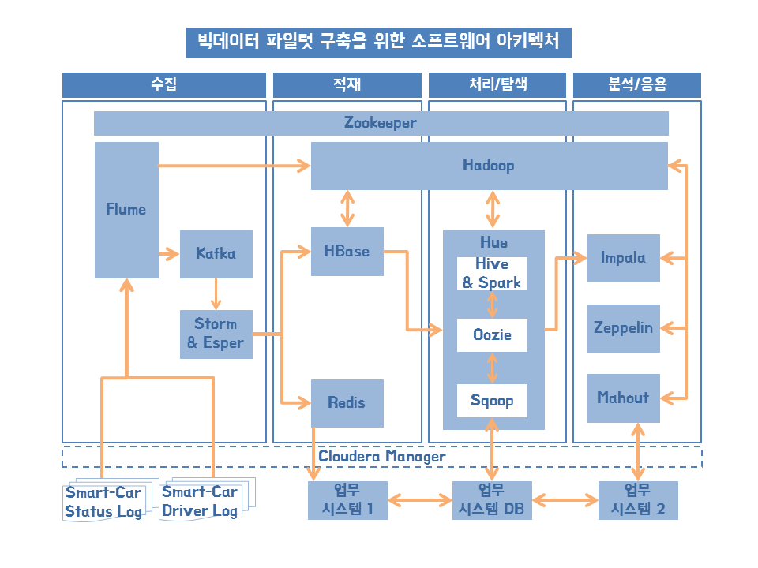
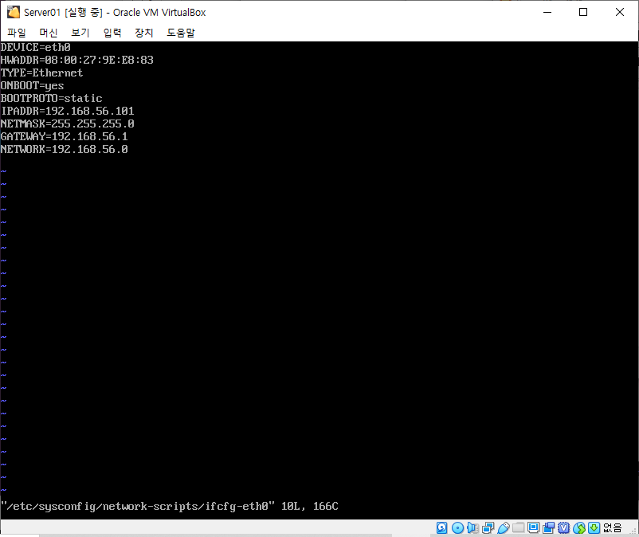

# 책에서 다루는 파이프라인을 이루는 프레임워크들

* 수집
  * 조직의 내외부에 있는 다양한 시스템으로부터 원천 데이터를 효과적으로 수집하는 기술
  * 기존의 수집 시스템(EAI, ETL, ESB)에서 다뤘던 데이터보다 더 크고 다양한 형식의 데이터를 빠르게 처리해야 함
  * 데이터 크기, 다양성, 생성 속도를 효과적으로 처리해야 한다
  * Flume, Fluented, Scribe, Logstash, Chukwa, NiFi, Embulk
  * 실시간 스트림 데이터 처리를 위해 Storm, Esper도 사용
* 적재
  * 수집한 데이터를 분산 스토리지에 영구 또는 임시로 적재하는 기술
  * 탐색, 분석을 위해 비정형 데이터(음성, 이미지, 텍스트, 동영상)를 정형 데이터로 가공
  * 데이터의 크기, 속도, 진실성(신뢰성)을 효과적으로 처리해야 한다
  * 분산 저장소 유형
    * HDFS : 대용량 파일 전체를 영구적으로 저장
    * NoSQL : 대규모 메시징 데이터 전체를 영구 저장(HBase, MongoDB, Casandra)
    * 인메모리 캐시 : 대규모 메시징 데이터의 일부만 임시 저장(Redis, Memcached, Infinispan)
    * Message Oriented Middleware : 대규모 메시징 데이터 전체를 버퍼링 처리(Kafka, RabbitMQ, ActiveMQ)
  * 대용량 파일의 적재는 HDFS, 실시간 대량으로 발생하는 작은 메시지는 NoSQL, 인메모리 캐시, MoM 중 선택
* 처리/탐색
  * 대용량 저장소에 적재된 데이터를 분석에 활용하기 위해 데이터를 정형화 및 정규화하는 기술
  * 가치를 발굴하기 위해 지속적으로 분석하고 그에 대한 결과를 정기적으로 구조화해야한다
  * 데이터의 크기, 진실성, 시각화를 효과적으로 처리해야 한다
  * 데이터를 탐색, 선택, 변환, 통합, 축소함
    * 내외부의 정형/비정형 데이터를 결합해 새로운 데이터셋을 생성
    * 정기적으로 발생하는 처리/탐색 과정들은 워크플로(workflow)로 프로세스화해서 자동화
    * 워크플로 작업 후 데이터 저장소(Data Warehouse, Mart)로 옮겨짐
  * 처리/탐색 기술
    * Hue, Hive, Spark SQL
  * 후처리 작업 자동화
    * Oozie
* 분석/응용
  * 대규모 데이터로부터 새로운 패턴을 찾고 해석하여 통찰력을 확보하는 기술
  * 통계, 데이터마이닝, 텍스트마이닝, 소셜 미디어 분석, 머신러닝(딥러닝)
  * 데이터의 크기, 다양성, 속도, 진실성, 시각화, 가치 모두 효과적으로 처리해야 한다
  * Impala, Zeppelin, Mahout, R, Tensorflow, Sqoop

# 빅데이터 파일럿 프로젝트

* 파일럿 프로젝트 도메인의 이해

  * 차량상태정보(100MB/1일), 운전자 운행 정보(400KB/1초) 요구사항 파악

* 빅데이터 파일럿 아키텍처 이해

  * 가상 머신 3대

  * 플럼->카프카->스톰&에스퍼--->HBase--->휴(Hive&Spark, Oozie, Sqoop)--->임팔라

  * 플럼->하둡->임팔라, 제플린, 머하웃

    

* 빅데이터 파일럿 프로젝트용 PC 환경 구성

  * 버츄얼 박스 설치

* 빅데이터 파일럿 프로젝트용 PC 서버 구성

  * 3대의 가상머신 생성, 리눅스 서버 설치

* CM(Cloudera Manager)설치

  * 빅데이터 소프트웨어 설치

* 스마트카 로그 시뮬레이터 설치

  * 스마트카의 상태, 운행 정보를 시뮬레이션해 로그 데이터 생성하는 자바 프로그램 설치

* 파일럿 환경 관리

  * 파일럿 환경을 안전하게 시작하고 종료

# 버츄얼 박스 세팅

* NAT 네트워크 설정
  
  * 환경설정
* 호스트 전용 네트워크 설정
  
  * 호스트 네트워크 관리자
* centOS 설치
  * 6버전은 20년 11월부로 종료되어 7버전을 고려
  
  * 7버전에서 CM까는 법
    
    * https://wooyoung85.tistory.com/47
    
  * 7.9버전
    
    * http://mirror.anigil.com/CentOS/7.9.2009/isos/x86_64/
    
  * 네트워크 어댑터 설정
  
  * 버츄얼박스 실행오류
    * https://banzi.tistory.com/entry/VirtualBox-%EC%98%A4%EB%A5%98
    * bcdedit /set hypervisorlaunchtype off 수행하고 재부팅시 virtualbox 작동, Hyper-V와 가상화(도커) 오류
    
  * hostname 변경
  
    ```shell
    hostname
    hostnamectl set-hostname server01.hadoop.com
    ```
  
  * timezone 변경
  
    ```shell
    timedatectl list-timezones | grep Seoul
    timedatectl set-timezone Asia/Seoul
    date
    ```
  
  * user 생성
  
    ```shell
    # root 로그인 상태에서
    useradd bigdata
    passwd bigdata
    # type password
    
    # check current user
    id
    # list of all users
    cat /etc/passwd
    ```
  
  * 고정 IP와 네트워크 설정
  
    * vi /etc/sysconfig/network-scripts/ifcfg-eth0
  
    
  
  * 네트워크 관련 패키지 설치
  
    * CentOS6에서는 네트워크 관련 패키지가 설치되어 있지만 CentOS7에서는 설치해줘야 한다
  
      ```shell
      yum install net-tools # 설치실패
      ```
  
    * ip addr로 현재 설정된 ip주소 파악 가능