# 사전세팅

* Java 설치
* Intellij 설치
* virtual box 설치
* ubuntu 18.04 lts server 다운로드
* putty 설치
* filezila 설치
* 크롬

# 가상머신 설정

* NAT 네트워크 추가

  * 10.0.2.0/24

* 호스트 전용 네트워크(어댑터, DHCP 서버) 설정

  * 192.168.56.1 / 255.255.255.0
  * 192.168.56.100 / 255.255.255.0 / 192.168.56.101 / 192.168.56.254

* Hostname

  * server01.hadoop.com

* server name

  * server01

* username

  * bigdata/bigdata

* root

  * root/adminuser

* 고정 ip 설정

  * /etc/netplan/00-installer-config.yaml

    * 처음 시도는 첫번째 코드로 하였으나 ssh연결은 되었지만 인터넷이 안됨
    * 원인은 enp0s8에서 gateway4값을 세팅해서 통신에 실패했던 것
      * https://askubuntu.com/questions/984445/netplan-configuration-on-ubuntu-17-04-virtual-machine
    * network 관련 커맨드
      * ip r
      * ip addr
      * ifconfig
      * route -n

    ```yaml
    # This is the network config written by 'subiquity'
    network:
      ethernets:
        enp0s3:
          dhcp4: true
        enp0s8:
          dhcp4: false
          addresses:
            - 192.168.56.101/24
          gateway4: 192.168.56.1
          nameservers:
            addresses: [8.8.8.8, 1.1.1.1]
      version: 2
    ```

    ```yaml
    # This is the network config written by 'subiquity'
    network:
      ethernets:
        enp0s3:
          dhcp4: true
        enp0s8:
          dhcp4: false
          addresses:
            - 192.168.56.101/24
          nameservers:
            addresses: [8.8.8.8, 1.1.1.1]
      version: 2
    ```

    

  * 설정반영 및 확인

    ```shell
    sudo netplan apply
    
    ip addr
    ip route
    ```

* hosts 정보 설정

  * /etc/hosts

    * 직접 파일을 수정하거나
      * 반영 안됨
    * hostnamectl set-hostname new-host-name 명령어를 씀
    * 반영 잘됨
      * 재시작하면 완벽하게 반영
    * hostname 명령어로 현재 호스트이름 확인가능
    * https://www.cyberciti.biz/faq/ubuntu-change-hostname-command/
  
    ```shell
    127.0.0.1 localhost
    127.0.1.1 server01
    
    # The following lines are desirable for IPv6 capable hosts
    ::1     ip6-localhost ip6-loopback
    fe00::0 ip6-localnet
  ff00::0 ip6-mcastprefix
    ff02::1 ip6-allnodes
    ff02::2 ip6-allrouters
    ```
  
    ```shell
    127.0.0.1 localhost server01
  192.168.56.101 server01.hadoop.com server01
    192.168.56.102 server02.hadoop.com server02
  192.168.56.103 server03.hadoop.com server03
    ```
  
  * /etc/sysconfig/network
  
    * centos경우
  
    ```shell
    NETWORKING=yes
    NETWORKING IPV6=no
  HOSTNAME=server01.hadoop.com
    ```
    
  * centos, ubuntu 네트워크 설정 방법
  
    * https://m.blog.naver.com/PostView.naver?isHttpsRedirect=true&blogId=hyyi1829&logNo=100114134665

# 가상머신 복제

* 복제과정

  * 복제

  * 가상 머신 선택

    

  * 완전한 복제

    

* 고정 ip 바꾸기

  * /etc/netplan/00-installer-config.yaml를 바꾸고
  * sudo netplan apply

* host이름 바꾸기

  * hostnamectl로 이름 바꾸고
  * 재부팅
  
* 메모리 할당

  * Server01 : 5120MB
  * Server02 : 5120MB
  * Server03 : 3072MB

# 빅데이터 클러스터 구성

* java 설치

  * openjdk 1.8

    ```shell
    sudo apt-get install openjdk-8-jdk
    ```

* cloudera manager 설치

  * 문제
    * 21년 2월 1일부터 cloudera manager를 받기위해선 cloudera subscription이 되어있는 계정이 필요하다(더 이상 free 버전인 cloudera express를 제공안함)
    * https://community.cloudera.com/t5/Support-Questions/How-to-download-Cloudera-Express-version-6-3-2/td-p/314198
    * https://www.opencore.com/blog/2019/7/cloudera-license-changes/
    
  * 방향 재설정
    * 5버전 quickstart용을 vm으로 제공해줌
    * https://stackoverflow.com/questions/61429678/cdh-quickstart-6-3-2-download-link
    * 해당 cloudera manager로 빅데이터 시스템 자동화 도구에 대해서 파악하고, server01, server02, server03 호스트를 추가하여 작업 진행
    * cloudera manager가 있는 가상머신에서도 /etc/hosts에 server01, server02, server03정보 추가해야함
    * cloudera manager가 있는 가상머신은 처음부터 몇몇포트가 localhost의 같은 포트값으로 포트포워딩 설정이 되어있어서 로컬 컴퓨터(http://localhost:7180/)로 접근 가능
    * cloudera manager가 있는 가상머신에서 cloudera express를 실행하기 위해 최소 8gb가 필요하다해서 8gb할당(가상머신 4개 전체에 총 21GB할당)
    
  * window 설정

    * C:\Windows\System32\drivers\etc\hosts

      ```shell
      # 추가
      192.168.56.101 server01.hadoop.com
      192.168.56.102 server02.hadoop.com
      192.168.56.103 server03.hadoop.com
      ```

      

      

  * 주의사항

    * cloudera manager가 켜진 상태에서 virtualbox를 종료하면 나중에 다시킬 때 에러 생김

    * 문제가 있을 경우 cluser와 cloudera manager을 재시작해야함

    * 시스템 상태 저장했다가 다시켜도 안된다

    * 중지 시 약 5분정도 걸림

      

  * 빅데이터 기본 소프트웨어 설치

    * 3대의 host에 정해진 소프트웨어 설치
    
    * 클러스터 추가
    
      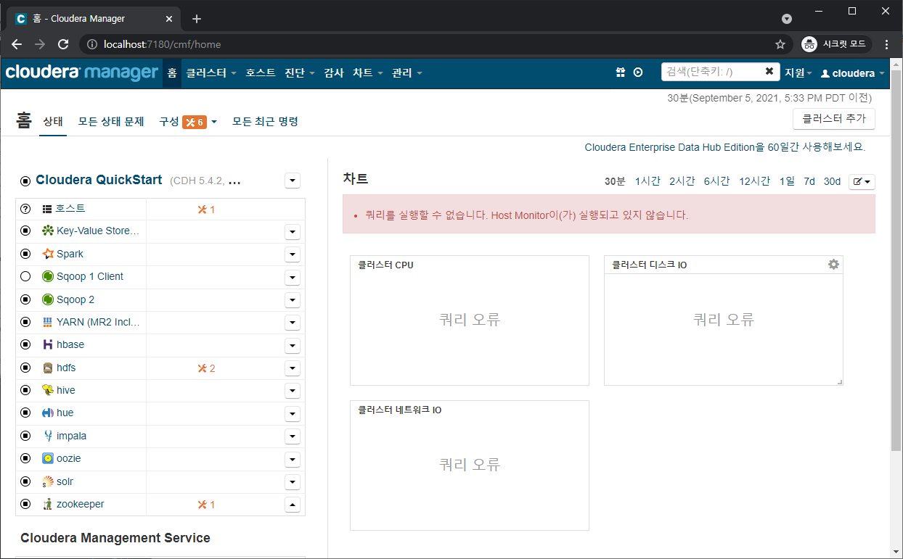
    
    * 호스트 지정
    
      * server01.hadoop.com
        server02.hadoop.com
        server03.hadoop.com
    
      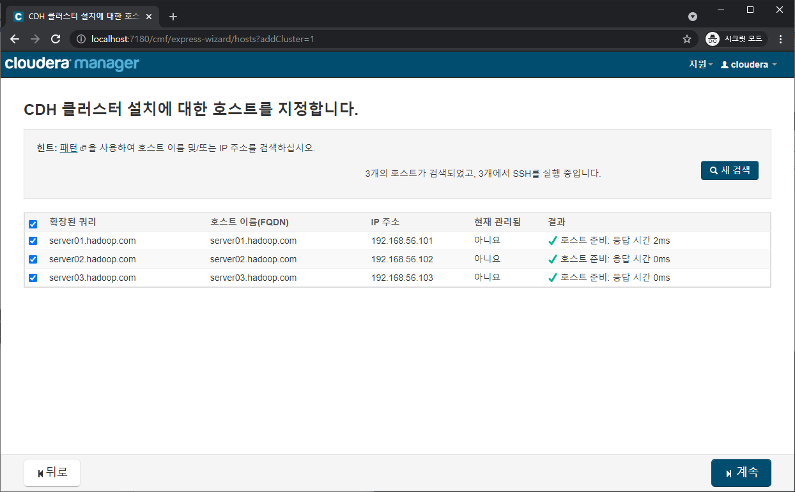
    
    * CDH 버전 선택
    
      * 패키지 사용
    
        * Parcel의 경우 배포 및 업그레이드 자동화가 가능하지만, 현재 유료버전에서만 지원하는지 비활성화됨
    
      * CDH버전 5의 최신 릴리즈
    
        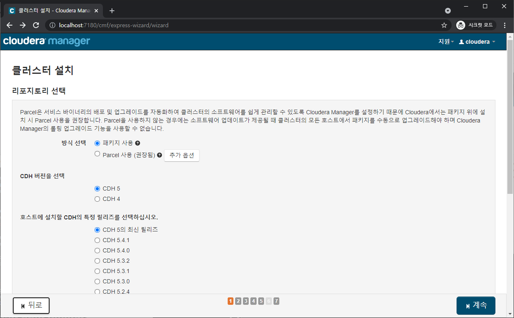
    
    * 호스트들의 ssh 로그인 정보 입력
    
      * 각 호스트의 root 비밀번호가 다 같은 상황이므로 가장 편한 root로 모든 호스트가 동일한 암호 허용 선택
      * 하지만 ssh로 root접근은 처음부터 막혀있으므로 호스트의 sshd_config 수정
    
      ```shell
      vim /etc/ssh/sshd_config
      # PermitRootLogin yes
      # PasswordAuthentication yes (기본 yes라 설정 안해도 됨)
      # ChallengeResponseAuthentication no(이미 세팅되어 있었음)
      service sshd reload
      ```
    
    * 실패
    
      * cloudera 아카이브에서 CDH를 설치하는 것인데 이젠 아카이브 접속하려면 인증이 필요함
    
        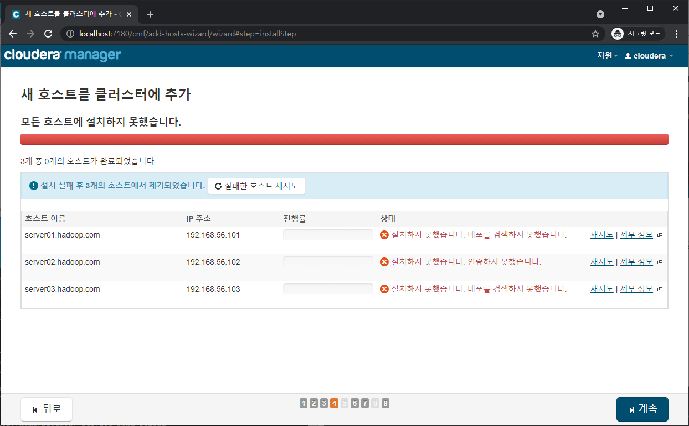
  

# cloudera 정형화데이터 튜토리얼

* MySQL -> HDFS

  * sqoop을 이용해 데이터 변환

  * 다른 workload들을 위해 hadoop 최적화된 파일 형태인 avro로 변환

  * 내부적으로 MapReduce를 실행시켜서 MySQL에서 HDFS의 /user/hive/warehouse에 avro파일 형태로 저장한다.

    ```shell
    sqoop import-all-tables \
        -m 1 \
        --connect jdbc:mysql://quickstart:3306/retail_db \
        --username=retail_dba \
        --password=cloudera \
        --compression-codec=snappy \
        --as-avrodatafile \
        --warehouse-dir=/user/hive/warehouse
    ```

  * 스키마의 경우엔 실행시킨 로컬 디렉토리에 avsc파일 형태로 저장되어서 hive, Impala로 쿼리를 실행시키려면 hdfs로 파일을 옮겨야 한다

    ```shell
    sudo -u hdfs hadoop fs -mkdir /user/examples
    sudo -u hdfs hadoop fs -chmod +rw /user/examples
    hadoop fs -copyFromLocal ~/*.avsc /user/examples/
    ```

    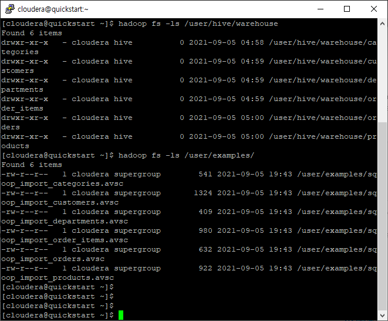

* Impala

  * Hue 인터페이스로 Impala 접근

    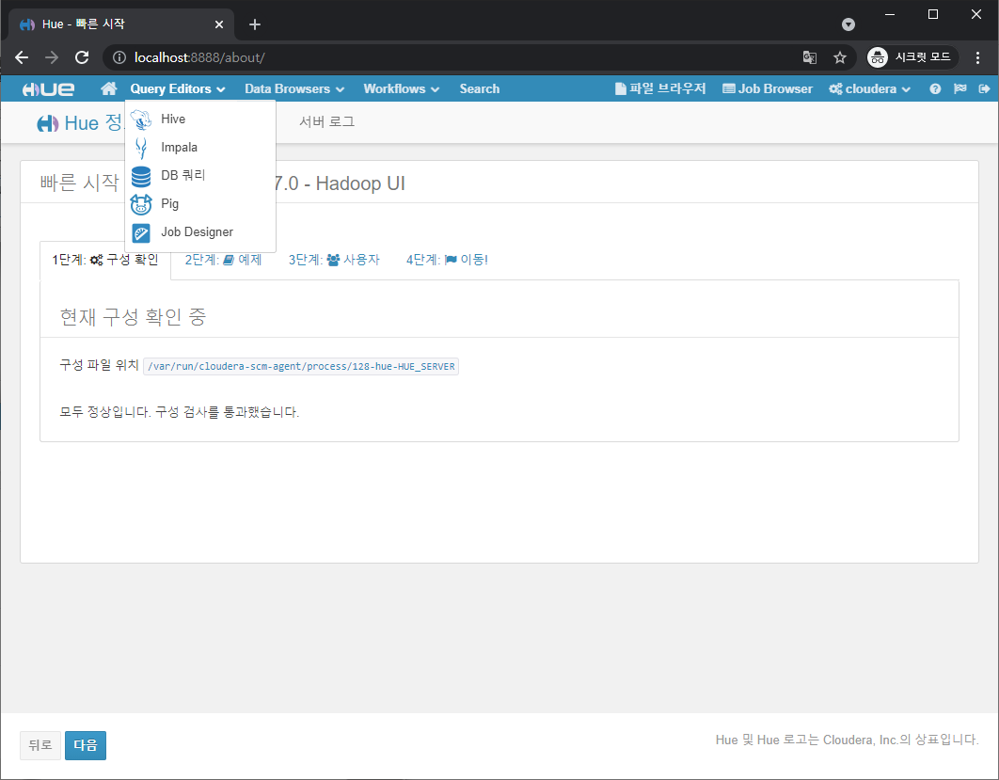

  * 다음 query를 통해 table 생성

    ```sql
    CREATE EXTERNAL TABLE categories STORED AS AVRO
    LOCATION 'hdfs:///user/hive/warehouse/categories'
    TBLPROPERTIES ('avro.schema.url'='hdfs://quickstart/user/examples/sqoop_import_categories.avsc');
    
    CREATE EXTERNAL TABLE customers STORED AS AVRO
    LOCATION 'hdfs:///user/hive/warehouse/customers'
    TBLPROPERTIES ('avro.schema.url'='hdfs://quickstart/user/examples/sqoop_import_customers.avsc');
    
    CREATE EXTERNAL TABLE departments STORED AS AVRO
    LOCATION 'hdfs:///user/hive/warehouse/departments'
    TBLPROPERTIES ('avro.schema.url'='hdfs://quickstart/user/examples/sqoop_import_departments.avsc');
    
    CREATE EXTERNAL TABLE orders STORED AS AVRO
    LOCATION 'hdfs:///user/hive/warehouse/orders'
    TBLPROPERTIES ('avro.schema.url'='hdfs://quickstart/user/examples/sqoop_import_orders.avsc');
    
    CREATE EXTERNAL TABLE order_items STORED AS AVRO
    LOCATION 'hdfs:///user/hive/warehouse/order_items'
    TBLPROPERTIES ('avro.schema.url'='hdfs://quickstart/user/examples/sqoop_import_order_items.avsc');
    
    CREATE EXTERNAL TABLE products STORED AS AVRO
    LOCATION 'hdfs:///user/hive/warehouse/products'
    TBLPROPERTIES ('avro.schema.url'='hdfs://quickstart/user/examples/sqoop_import_products.avsc');
    ```

    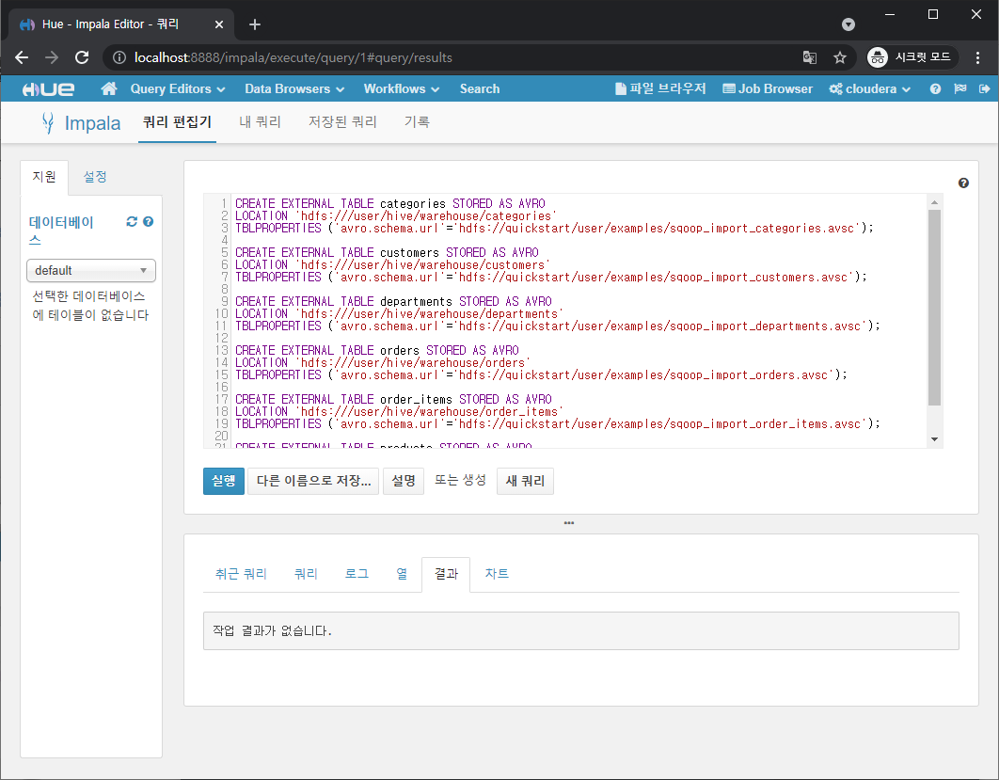

  * 테이블 확인

    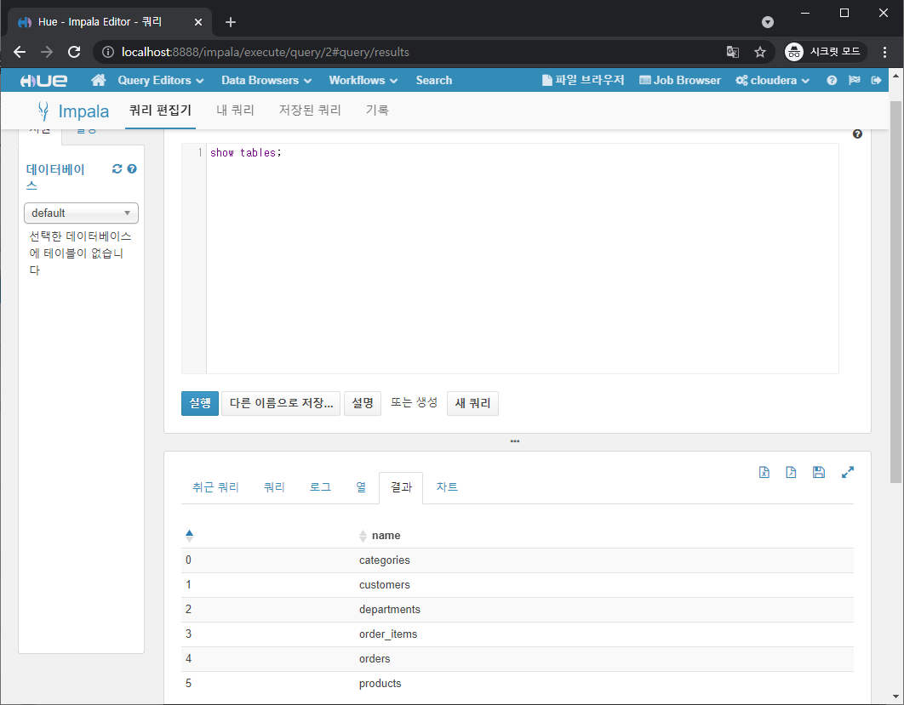

  * total revenue값이 가장 큰 top10 상품들 출력

    ```sql
    -- Most popular product categories
    select c.category_name, count(order_item_quantity) as count
    from order_items oi
    inner join products p on oi.order_item_product_id = p.product_id
    inner join categories c on c.category_id = p.product_category_id
    group by c.category_name
    order by count desc
    limit 10;
    ```

    

    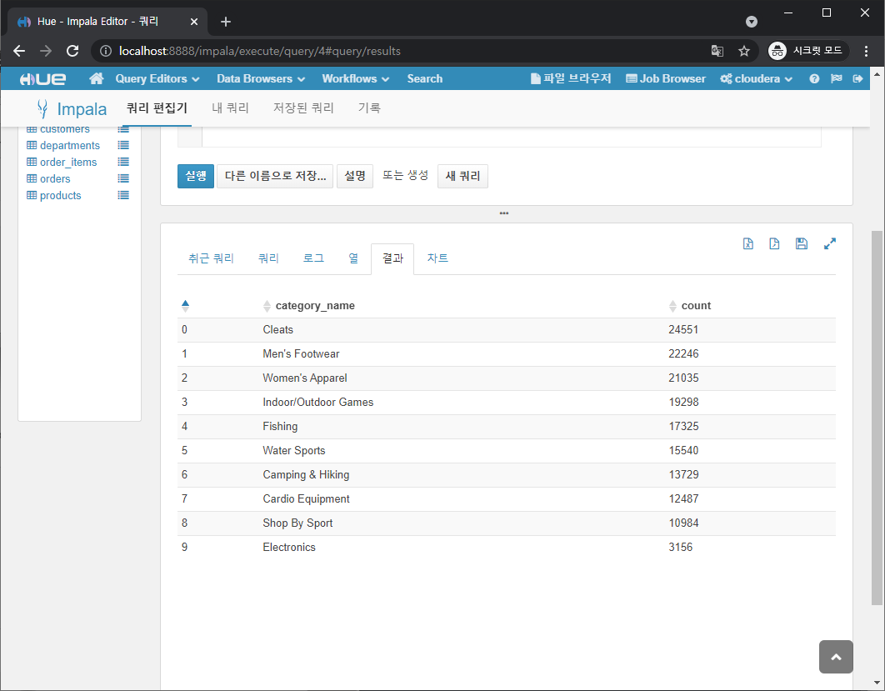

# cloudera log데이터 튜토리얼

* 1달치 access log data가 /opt/examples/log_data/access.log.2 형태로 저장되어 있음

* Local File System -> HDFS

  * 로그를 HDFS로 옮김

  * original_access_logs로 저장

    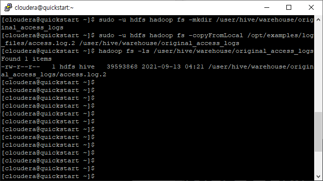

  * 로그 내용물

    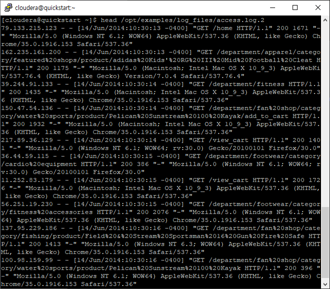

* Hive에 쿼리사용

  * Beeline이라는 JDBC client를 이용해 Hive에 쿼리를 날린다

    ```shell
    beeline -u jdbc:hive2://quickstart:10000/default -n admin -d org.apache.hive.jdbc.HiveDriver
    ```

  * 쿼리 실행

    ```shell
    #
    CREATE EXTERNAL TABLE intermediate_access_logs (
     ip STRING,
     date STRING,
     method STRING,
     url STRING,
     http_version STRING,
     code1 STRING,
     code2 STRING,
     dash STRING,
     user_agent STRING)
     ROW FORMAT SERDE 'org.apache.hadoop.hive.contrib.serde2.RegexSerDe'
     WITH SERDEPROPERTIES (
     'input.regex' = '([^ ]*) - - \\[([^\\]]*)\\] "([^\ ]*) ([^\ ]*) ([^\ ]*)" (\\d*) (\\d*) "([^"]*)" "([^"]*)"',
     'output.format.string' = "%1$s %2$s %3$s %4$s %5$s %6$s %7$s %8$s %9$s"
     )
     LOCATION '/user/hive/warehouse/original_access_logs';
     #
     CREATE EXTERNAL TABLE tokenized_access_logs (
     ip STRING,
     date STRING,
     method STRING,
     url STRING,
     http_version STRING,
     code1 STRING,
     code2 STRING,
     dash STRING,
     user_agent STRING)
     ROW FORMAT DELIMITED FIELDS TERMINATED BY ','
     LOCATION '/user/hive/warehouse/tokenized_access_logs';
     #
     ADD JAR /usr/lib/hive/lib/hive-contrib.jar;
     #
     INSERT OVERWRITE TABLE tokenized_access_logs SELECT * FROM intermediate_access_logs;
     #
     !quit
    ```

    