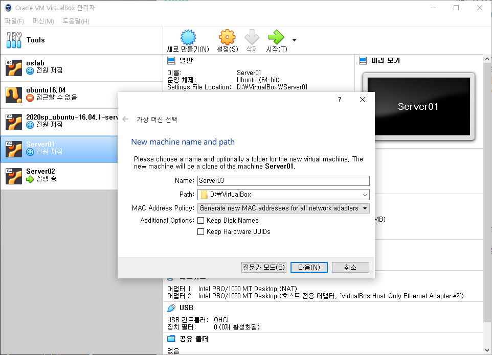
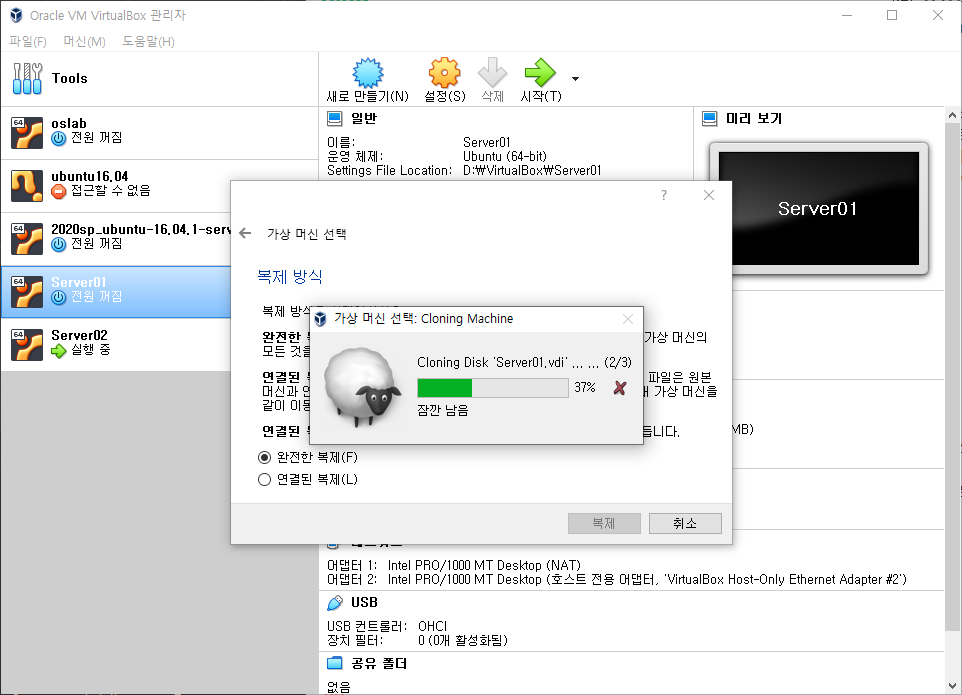
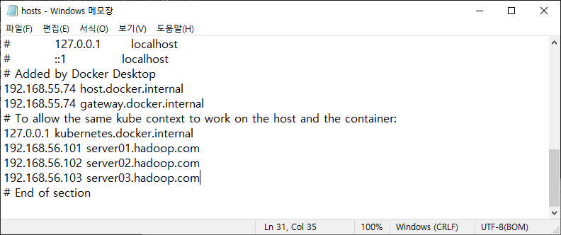
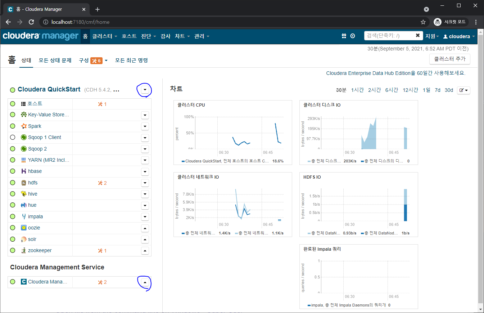

# 사전세팅

* Java 설치
* Intellij 설치
* virtual box 설치
* ubuntu 18.04 lts server 다운로드
* putty 설치
* filezila 설치
* 크롬

# 가상머신 설정

* NAT 네트워크 추가

  * 10.0.2.0/24

* 호스트 전용 네트워크(어댑터, DHCP 서버) 설정

  * 192.168.56.1 / 255.255.255.0
  * 192.168.56.100 / 255.255.255.0 / 192.168.56.101 / 192.168.56.254

* Hostname

  * server01.hadoop.com

* server name

  * server01

* username

  * bigdata/bigdata

* 고정 ip 설정

  * /etc/netplan/00-installer-config.yaml

    * 처음 시도는 첫번째 코드로 하였으나 ssh연결은 되었지만 인터넷이 안됨
    * 원인은 enp0s8에서 gateway4값을 세팅해서 통신에 실패했던 것
      * https://askubuntu.com/questions/984445/netplan-configuration-on-ubuntu-17-04-virtual-machine
    * network 관련 커맨드
      * ip r
      * ip addr
      * ifconfig
      * route -n

    ```yaml
    # This is the network config written by 'subiquity'
    network:
      ethernets:
        enp0s3:
          dhcp4: true
        enp0s8:
          dhcp4: false
          addresses:
            - 192.168.56.101/24
          gateway4: 192.168.56.1
          nameservers:
            addresses: [8.8.8.8, 1.1.1.1]
      version: 2
    ```

    ```yaml
    # This is the network config written by 'subiquity'
    network:
      ethernets:
        enp0s3:
          dhcp4: true
        enp0s8:
          dhcp4: false
          addresses:
            - 192.168.56.101/24
          nameservers:
            addresses: [8.8.8.8, 1.1.1.1]
      version: 2
    ```

    

  * 설정반영 및 확인

    ```shell
    sudo netplan apply
    
    ip addr
    ip route
    ```

* hosts 정보 설정

  * /etc/hosts

    * 직접 파일을 수정하거나
      * 반영 안됨
    * hostnamectl set-hostname new-host-name 명령어를 씀
    * 반영 잘됨
      * 재시작하면 완벽하게 반영
    * hostname 명령어로 현재 호스트이름 확인가능
    * https://www.cyberciti.biz/faq/ubuntu-change-hostname-command/
  
    ```shell
    127.0.0.1 localhost
    127.0.1.1 server01
    
    # The following lines are desirable for IPv6 capable hosts
    ::1     ip6-localhost ip6-loopback
    fe00::0 ip6-localnet
  ff00::0 ip6-mcastprefix
    ff02::1 ip6-allnodes
    ff02::2 ip6-allrouters
    ```
  
    ```shell
    127.0.0.1 localhost server01
  192.168.56.101 server01.hadoop.com server01
    192.168.56.102 server02.hadoop.com server02
  192.168.56.103 server03.hadoop.com server03
    ```
  
  * /etc/sysconfig/network
  
    * centos경우
  
    ```shell
    NETWORKING=yes
    NETWORKING IPV6=no
  HOSTNAME=server01.hadoop.com
    ```
    
  * centos, ubuntu 네트워크 설정 방법
  
    * https://m.blog.naver.com/PostView.naver?isHttpsRedirect=true&blogId=hyyi1829&logNo=100114134665

# 가상머신 복제

* 복제과정

  * 복제

  * 가상 머신 선택

    

  * 완전한 복제

    

* 고정 ip 바꾸기

  * /etc/netplan/00-installer-config.yaml를 바꾸고
  * sudo netplan apply

* host이름 바꾸기

  * hostnamectl로 이름 바꾸고
  * 재부팅

# 빅데이터 클러스터 구성

* java 설치

  * openjdk 1.8

    ```shell
    sudo apt-get install openjdk-8-jdk
    ```

* cloudera manager 설치

  * 문제
    * 21년 2월 1일부터 cloudera manager를 받기위해선 cloudera subscription이 되어있는 계정이 필요하다(더 이상 free 버전인 cloudera express를 제공안함)
    * https://community.cloudera.com/t5/Support-Questions/How-to-download-Cloudera-Express-version-6-3-2/td-p/314198
    * https://www.opencore.com/blog/2019/7/cloudera-license-changes/
    
  * 방향 재설정
    * 5버전 quickstart용을 vm으로 제공해줌
    * https://stackoverflow.com/questions/61429678/cdh-quickstart-6-3-2-download-link
    * 해당 cloudera manager로 빅데이터 시스템 자동화 도구에 대해서 파악하고, server01, server02, server03 호스트를 추가하여 작업 진행
    * cloudera manager가 있는 가상머신에서도 /etc/hosts에 server01, server02, server03정보 추가해야함
    * cloudera manager가 있는 가상머신은 처음부터 몇몇포트가 localhost의 같은 포트값으로 포트포워딩 설정이 되어있어서 로컬 컴퓨터(http://localhost:7180/)로 접근 가능
    
  * window 설정

    * C:\Windows\System32\drivers\etc\hosts

      ```shell
      # 추가
      192.168.56.101 server01.hadoop.com
      192.168.56.102 server02.hadoop.com
      192.168.56.103 server03.hadoop.com
      ```

      

      

  * 주의사항

    * cloudera manager가 켜진 상태에서 virtualbox를 종료하면 나중에 다시킬 때 에러 생김

    * 문제가 있을 경우 cluser와 cloudera manager을 재시작해야함

    * 시스템 상태 저장했다가 다시켜도 안된다

    * 중지 시 약 5분정도 걸림

      

