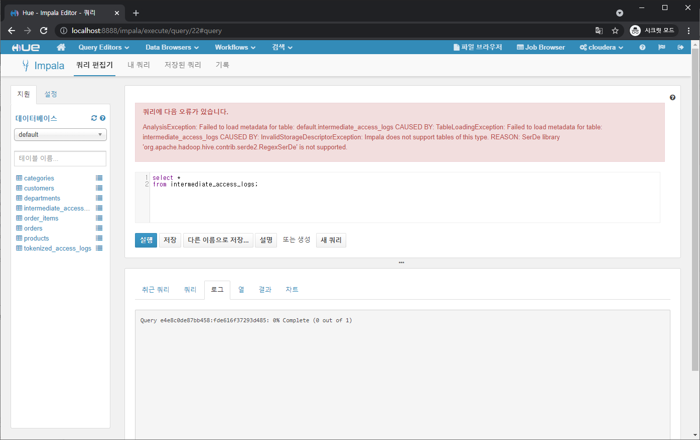
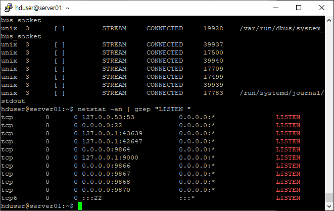
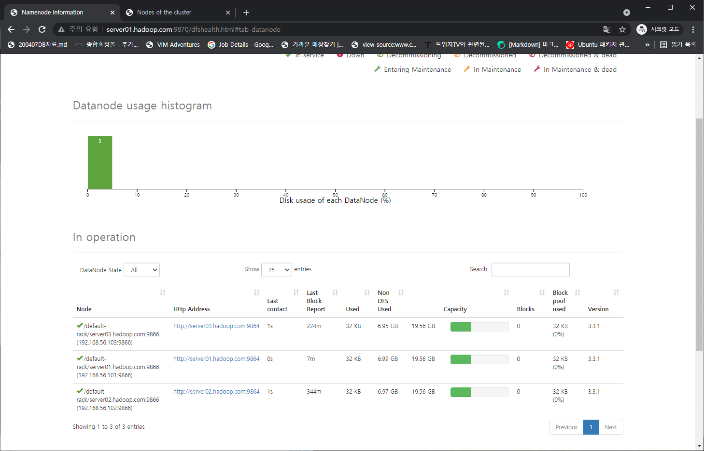
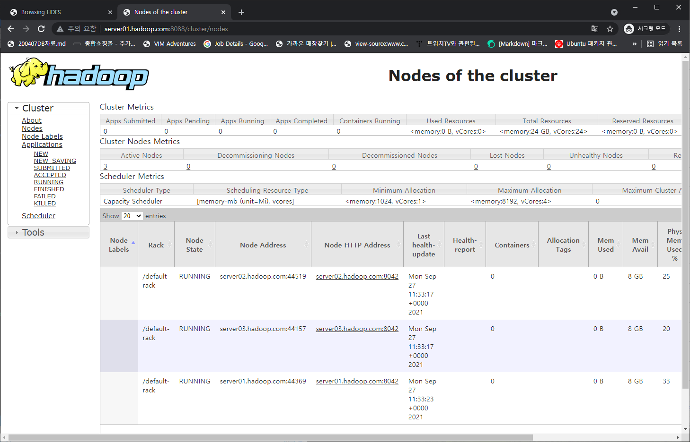

# Data Pipeline을 이루는 구성요소 개념잡기

* 빅데이터 - 하둡, 하이브로 시작하기
  * https://wikidocs.net/book/2203
* YARN
  * https://www.popit.kr/what-is-hadoop-yarn/
  * https://hadoop.apache.org/docs/current/hadoop-yarn/hadoop-yarn-site/YARN.html
  * 처음 Hadoop은 하나의 클러스터에 오직 하나의 컴퓨팅 플랫폼(MapReduce)만 실행되었다
  * 기존 MapReduce의 구성요소
    * 컴퓨팅을 위한 프로그램과 클러스터의 리소스 관리, 장애관리까지 포함되어 있었다
    * Mapper, Reducer
      * MapReduce 핵심 추상화 클래스
      * main()에 사용자가 직접 작성해서 MapReduce를 실행시킨다
    * JobTracker(작업 스케줄링), TaskTracker(프로세스 fork), TaskRunner(프로세스 실행)
      * MapReduce runtime 환경
      * 사용자의 MapReduce 프로그램을 실행시킴
      * 서버 장애 시 수행되던 작업을 다른 서버에서 재시작
      * 중간 단계의 데이터 이동(Shuffle), 이동된 데이터의 정렬(Sort) 작업
    * JobClient, JobConf
      * MapReduce runtime 환경에 사용자가 만든 프로그램의 실행을 지원하는 라이브러리
      * 사용자가 만든 main() 내에서 JobTracker로 작업을 실행하게 요청하거나 작업의 상태 정보 확인 가능
  * 바뀐 MapReduce의 구성요소
    * 컴퓨팅을 위한 프로그램만 제공
  * 새로 등장한 YARN의 구성요소
    * 클러스터의 리소스 관리, 장애관리
    * ApplicationMaster
      * 기존 JobTracker의 역할
      * 각각의 컴퓨팅 클러스터를 Application이라고 하며 Application을 실행하기 위해 필요한 Master서버이다
    * ResourceManager
      * 리소스 관리
    * NodeManager
      * 꾸준히 자신의 상태를 ResourceManager에게 알려준다
      * ResourceManager가 자원을 요청하면 상황에 따라서 넘겨준다
  * MapReduce의 구성요소가 바뀌고 YARN이 등장하게 된 이유
    * Hadoop 클러스터에서 수천 대의 서버랑 연결하면서, MapReduce 컴퓨팅 플랫폼 하나로만 처리하기에는 비효율적이되었고, 다른 컴퓨팅 서비스와 연동하기 위해 컴퓨팅 기능과 리소스 관리 기능 분리가 필요해서

# cloudera tutorial

* Sqoop

  * MySQL -> HDFS
  * HDFS에 avro 파일, avsc 파일(local에서 먼저 저장후 HDFS로 이동한 스키마) 저장

* Impala with Hue

  * HDFS -> Impala
  * HDFS의 avro, avsc 파일을 불러와 table 생성
  * 쿼리를 날려 원하는 분석 정보를 얻음
  * Impala는 runtime 쿼리 가능

* Hive

  * HDFS -> Hive(intermediate_access_logs) -> Hive(tokenized_access_logs )

  * HDFS의 log 파일을 불러와 table 생성

  * Hive 2.1버전부터 HiveCLI는 deprecated되었기 때문에 HiveServer2 실행 후 Beeline CLI로 접속

  * Hive의 기능인 SerDes(serializers/deserializers)를 이용해 정규표현식으로 파싱

  * SerDes 형식으로 저장이 된 intermediate_access_logs 테이블에 데이터 옮김

    * intermediate_access_logs는 Hive에서 읽는 건 가능하지만 Impala에서 읽는 건 불가능

      

  * intermediate_access_logs 테이블로부터 comma형식으로 저장이 된 tokenized_access_logs 테이블에 데이터 옮김

* Spark
  * HDFS -> Spark
  * spark 옵션 설명
    * http://www.mtitek.com/tutorials/bigdata/spark/spark-shell.php
    * --jars : driver, executor에 추가할 classpath들
    * --conf : spark configuration property
      * KryoSerializer : Java 내장 직렬화보다 훨씬 향상된 서드파티 라이브러리 Kryo, 모든 타입의 객체가 자동적으로 직렬화 되지는 않음
  * HDFS에서 avro파일을 불러온 다음 가장 많이 팔린 물건 top10 구하기
  
* Flume, Solr
  * https://blog.warpmemory.com/6
  * (Python log 수집기 -> ) log -> Flume -> Solr
  * Solr configuration, collection 만들기
  * 학습을 위해 Log Generator 돌리기
    * Python으로 랜덤한 request를 log파일에 append함
  * Flume으로 log파일에 수정사항이 있는지 지속적으로 체크하고, 수정사항이 있으면 Solr 검색 엔진에 보냄
  * Hue GUI를 이용해 Solr 검색 엔진 내용 확인, 대시보드 생성
  
* cloudera 비슷한 프로그램

  * hortonworks
    * https://kyumdoctor.tistory.com/54

* rasbperry pi hadoop cluster

  * https://medium.com/data-waffles/raspberry-pi-hadoop-cluster-guide-2559437d232
  * https://scienceon.kisti.re.kr/commons/util/originalView.do?cn=JAKO201614652757357&oCn=JAKO201614652757357&dbt=JAKO&journal=NJOU00557104

# 스마트카 로그 데이터 파이프라인

* 설치프로그램

  * 모든 서버 ubuntu 18.04 LTS

  * 서버별 구성요소들

    

* 계획
  * Hadoop, YARN, HBase와 같이 공통으로 설치된 요소들은 한 서버에 설치후 복제하여 환경을 갖춘다
  * 그 외의 요소들은 책에 쓰인 순서대로 설치하고 테스트해본다
  * 프로그램 중 오픈소스가 아닌 프로그램들은 검색하여 대체 or 생략한다

* Hadoop 설치

  * https://sparkdia.tistory.com/7?category=1101742

  * Hadoop 다운

    * https://hadoop.apache.org/releases.html
    * Binary download링크로 미러사이트에 들어간다음 다운링크 획득

    ```shell
    sudo wget https://dlcdn.apache.org/hadoop/common/hadoop-3.3.1/hadoop-3.3.1.tar.gz
    ```

  * OS 그룹, 사용자 추가

    ```shell
    sudo groupadd -g 10000 hadoop
    sudo useradd -g hadoop -u 10000 -m hduser # m옵션 없으면 디렉토리 생성안함
    sudo passwd hduser # 비밀번호 : hduser
    # group확인은 /etc/group에서
    # user확인은 /etc/passwd에서
    ```

  * 홈 디렉토리 생성법

    ```shell
    sudo mkdir /home/hduser
    sudo chown hduser.hadoop /home/hduser
    # 기본 디렉토리 내용물 복사
    cd /home/hduser
    sudo cp -r /etc/skel/. .
    sudo chown -R hduser.hadoop .
    ```

  * hduser에서 sudo권한부여

    ```shell
    # /etc/sudoers에 쓰기권한 부여
    sudo chmod g+w /etc/sudoers
    # /etc/sudoers에 내용 추가
    hduser ALL=(ALL) NOPASSWD: ALL
    # 참고 사용자가 특정 명령만 비밀번호없이 쓰게하는 법
    # hduser ALL=(ALL) NOPASSWD:/bin/mkdir,/bin/rmdir
    ```

  * Hadoop 압축풀기

    ```shell
    # /usr/local/에 압축풀기
    sudo tar xvzf hadoop-3.3.1.tar.gz -C /usr/local/
    # 사용자와 그룹 지정
    sudo chown -R hduser:hadoop /usr/local/hadoop-3.3.1/
    ```

  * 기본 shell 수정

    * 리눅스 기본 쉘인 /bin/sh에서는 방향키 지원, tab지원 x

    * /bin/bash로 변경

      ```shell
      chsh
      ```

  * bashrc 설정

    ```bash
    export JAVA_HOME=/usr/lib/jvm/java-8-openjdk-amd64
    export HADOOP_HOME=/usr/local/hadoop-3.3.1
    export PATH=$PATH:$JAVA_HOME/bin:$HADOOP_HOME/bin:$HADOOP_HOME/sbin
    ```

  * etc/hadoop/core-site.xml

    * 기본 파일 시스템 이름 설정

      ```xml
      <configuration>
          <property>
              <name>fs.defaultFS</name>
              <value>hdfs://server01:9000</value>
          </property>
      </configuration>
      ```

  * 저장할 디렉토리 미리 생성

    ```shell
    sudo mkdir /data
    cd /data
    sudo mkdir namenode
    sudo mkdir datanode
    sudo mkdir namesecondary
    sudo mkdir yarn
    cd yarn
    sudo mkdir local
    sudo mkdir logs
    sudo chown -R hduser:hadoop /data
    sudo chmod -R 777 /data
    ```

  * etc/hadoop/hdfs-site.xml

    * namespace, namenode, datanode 저장 경로 지정

    * 복제 계수 설정

    * 블록 크기 설정

      ```xml
      <configuration>
          <property>
              <name>dfs.namenode.name.dir</name>
              <value>file:///data/namenode</value>
          </property>
          <property>
              <name>dfs.datanode.data.dir</name>
              <value>file:///data/datanode</value>
          </property>
          <property>
              <name>dfs.namenode.checkpoint.dir</name>
              <value>file:///data/namesecondary</value>
          </property>
          <property>
              <name>dfs.replication</name>
              <value>2</value>
          </property>
          <property>
              <name>dfs.blocksize</name>
              <value>67108864</value>
          </property>
      </configuration>
      ```

  * etc/hadoop/yarn-site.xml

    * nodemanager의 중간단계 파일 및 로그를 저장할 경로, yarn의 web-ui 주소 지정

    * 컴퓨팅 환경이 부족한 파일럿 환경에서는 FairScheduler를 사용할 경우 병목현상이 발생해서 FifoScheduler로 전환

      ```xml
      <configuration>
          <property>
              <name>yarn.nodemanager.local-dirs</name>
              <value>file:///data/yarn/local</value>
          </property>
          <property>
              <name>yarn.nodemanager.log-dirs</name>
              <value>file:///data/yarn/logs</value>
          </property>
          <property>
              <name>yarn.resourcemanager.hostname</name>
              <value>server01</value>
          </property>
          <property>
              <name>yarn.resourcemanager.scheduler.class</name>
              <value>org.apache.hadoop.yarn.server.resourcemanager.scheduler.fifo.FifoScheduler</value>
          </property>
      </configuration>
      ```

  * etc/hadoop/mapred-site.xml

    * 기본 맵리듀스 프레임워크 설정(yarn으로 설정)

      ```xml
      <configuration>
          <property>
              <name>mapreduce.framework.name</name>
              <value>yarn</value>
          </property>
      </configuration>
      ```

  * etc/hadoop/hadoop-env.sh

    * 여기서 JAVA_HOME설정을 안해주면 start-dfs.sh실행 시 java를 못찾아 실행실패

      ```shell
      # export JAVA_HOME이라고 된 곳을 uncomment하고, 지정된 자바 절대경로 씀
      # ${JAVA_HOME}은 안됨
      export JAVA_HOME=/usr/lib/jvm/java-8-openjdk-amd64
      ```

      

  * 위의 절차까지 한 뒤 서버 복제

    * server01, server02, server03

  * /etc/hosts에서 각 서버의 IP, 호스트명 입력

    * 127.0.0.1은 같은 호스트에서만 통신할 수 있으므로 다른 호스트와 통신할 수 있게 0.0.0.0으로 설정

    ```shell
    0.0.0.0 localhost server01
    192.168.56.101 server01.hadoop.com server01
    192.168.56.102 server02.hadoop.com server02
    192.168.56.103 server03.hadoop.com server03
    ```

  * hostnamectl

    ```shell
    hostnamectl set-hostname server01
    ```

  * /etc/netplan/00-installer-config.yaml

    * 고정 ip 설정

      ```yaml
      network:
        ethernets:
          enp0s3:
            dhcp4: true
          enp0s8:
            dhcp4: false
            addresses:
              - 192.168.56.101/24
            gateway4: 192.168.56.1
            nameservers:
              addresses: [8.8.8.8, 1.1.1.1]
        version: 2
      ```

    * 설정반영

      ```shell
      sudo netplan apply
      
      ip addr
      ip route
      ```

  * ssh연결

    * hadoop 클러스터 서버들은 ssh를 이용해 통신하기 때문에 키생성 필요

    * 모든 서버에서 다음 명령어 실행

      ```shell
      ssh-keygen
      ssh-copy-id server01
      ssh-copy-id server02
      ssh-copy-id server03
      ```

  * namenode서버에서 hdfs 포맷 및 시작

    * hadoop namenode -format은 2.x버전에서 쓰던 deprecated 된 명령어

    ```shell
    hdfs namenode -format
    start-dfs.sh
    hdfs dfsadmin -report
    # stop-dfs.sh
    ```

    * namenode가 datanode를 인식못함

      * 외부 서버에서 namenode 서버 9000번 포트에 접근하지 못하는 현상발생

      * netstat으로 확인결과 9000번 포트는 127.0.0.1

        * https://stackoverflow.com/questions/20778771/what-is-the-difference-between-0-0-0-0-127-0-0-1-and-localhost
        * 127.0.0.1 : local-only interface
        * 0.0.0.0 : listen on every available network interface
        * 따라서 /etc/hosts에서 localhost 주소를 0.0.0.0으로 바꿔야 한다

        

    * http://server01.hadoop.com:9870/ 로 상태확인가능

      

  * namenode 서버에서 yarn실행

    ```shell
    start-yarn.sh
    # stop-yarn.sh
    ```

    * http://server01.hadoop.com:8088/ 로 상태확인가능

      

