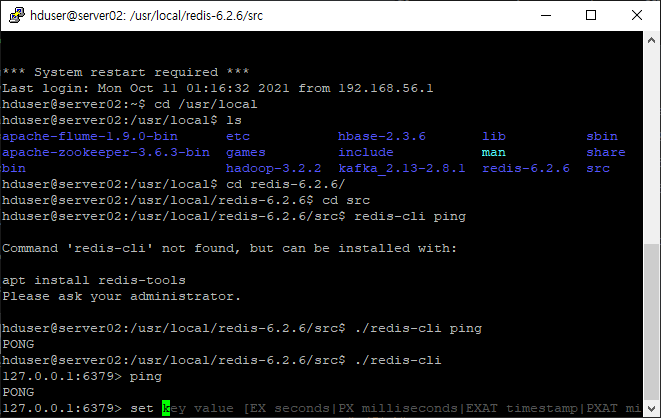

# 지난 내용들 요약

* 설치프로그램

  * 모든 서버 ubuntu 18.04 LTS

  * 서버별 구성요소들

    

* 계획

  * Hadoop, YARN, HBase와 같이 공통으로 설치된 요소들은 한 서버에 설치후 복제하여 환경을 갖춘다
  * 그 외의 요소들은 책에 쓰인 순서대로 설치하고 테스트해본다
  * 프로그램 중 오픈소스가 아닌 프로그램들은 검색하여 대체 or 생략한다

* 파이프라인 구조

  * cloudera manager는 제외

  

* 현재 상황

  * server 사전작업
    * ubuntu 18.04 LTS 설치
    * java 8버전 설치
  * Hadoop, YARN 설치
    * server ip주소, 주변 호스트 정보 설정
    * server끼리 ssh통신 설정
    * Hadoop, YARN xml파일 설정
    * Hadoop, YARN 실행
  * Zookeeper 설치 <------------------------------------ 다음 순서
  * 스마트카 로그 시뮬레이터 설치
  * Flume 설치
  * Kafka 설치
  * 수집 기능 테스트
    * 시뮬레이터->Flume
    * 시뮬레이터->Flume -> Kafka
  * HBase 설치
  * Redis 설치
  * Storm 설치
  * Esper 설치
  * 적재 기능 테스트
    * Flume -> HDFS
    * 실시간 적재
      * Flume -> Kafka -> Storm -> Redis
      * Flume -> Kafka -> Storm -> HBase
  * Hive 설치
  * Spark 설치
  * Oozie 설치
  * Hue 설치
  * 탐색 기능 테스트
  * Impala 설치
  * Zeppelin 설치
  * Mahout 설치
  * Sqoop 설치
    * MySQL 설치(PostgreSQL 대신)

# Zookeeper 설치

* Server02

* zookeeper 역할

  * https://zookeeper.apache.org/doc/r3.6.3/zookeeperOver.html
  * https://oboki.net/workspace/data-engineering/zookeeper/zookeeper-3-x-%EC%84%A4%EC%B9%98/
  * a distributed, open-source coordination service for distributed applications
  * 분산 시스템 간의 정보를 공유, 서버들의 상태 체크, 동기화를 위한 lock처리
  * coordination service
  * 데이타 접근이 빠르고, 장애에 대한 대응성을 가져야 한다
  * 디렉토리 구조기반으로 znode라는 데이터 저장 객체 제공(key-value), 생성 및 삭제 가능

* zookeeper 계정 생성

  * 따로 관리하기 위해 생성

  * root로 접속(비번 : adminuser)

    ```shell
    sudo groupadd -g 20000 zookeeper
    sudo useradd -g zookeeper -u 20000 -m zkuser # m옵션 없으면 디렉토리 생성안함
    sudo passwd zkuser # 비밀번호 : zkuser
    # group확인은 /etc/group에서
    # user확인은 /etc/passwd에서
    # 기본 쉘 /bin/bash로 변경
    chsh
    ```

  * /etc/sudoers를 이용해 zkuser sudo 권한 부여

    ```shell
    zkuser ALL=(ALL) NOPASSWD: ALL
    ```

    

* zookeeper 다운 및 압축풀기

  * 현시점 latest stable 버전다운

  * http://zookeeper.apache.org/releases.html

    ```shell
    wget https://dlcdn.apache.org/zookeeper/zookeeper-3.6.3/apache-zookeeper-3.6.3-bin.tar.gz
    
    # /usr/local/에 압축풀기
    sudo tar xvzf apache-zookeeper-3.6.3-bin.tar.gz -C /usr/local/
    # 사용자와 그룹 지정
    sudo chown -R zkuser:zookeeper /usr/local/apache-zookeeper-3.6.3-bin/
    ```

* bashrc에 환경변수설정

  ```shell
  export JAVA_HOME=/usr/lib/jvm/java-8-openjdk-amd64
  export ZOOKEEPER_HOME=/usr/local/apache-zookeeper-3.6.3-bin
  export PATH=$PATH:$JAVA_HOME/bin:$ZOOKEEPER_HOME/bin
  ```

* conf/zoo.cfg 생성

  * zoo_sample.cfg를 복사하여 값 수정

  * https://zookeeper.apache.org/doc/r3.6.3/zookeeperStarted.html

  * production 에선 replicated mode로 사용하고, 그럴 경우 옵션을 더 적어줘야 한다

    ```shell
    # The number of milliseconds of each tick
    tickTime=2000
    # The number of ticks that the initial
    # synchronization phase can take
    initLimit=10
    # The number of ticks that can pass between
    # sending a request and getting an acknowledgement
    syncLimit=5
    # the directory where the snapshot is stored.
    # do not use /tmp for storage, /tmp here is just
    # example sakes.
    dataDir=/data/zookeeper
    # the port at which the clients will connect
    clientPort=2181
    
    # replicated mode
    # server.1=server01:2888:3888
    # server.2=server02:2888:3888
    # server.3=server03:2888:3888
    ```

* zookeeper 실행

  * https://oboki.net/workspace/data-engineering/zookeeper/zookeeper-3-x-%EC%84%A4%EC%B9%98/
  * replicated mode에선 Mode가 follwer 혹은 leader로 설정되어 있다

  ```shell
  zkServer.sh start
  zkServer.sh status
  ```

  

* zookeeper 연결

  ```shell
  zkCli.sh -server 127.0.0.1:2181
  # 테스트
  create /pilot-pjt bigdata
  ls /
  get /pilot-pjt
  delete /pilot-pjt
  ```

  

* systemmd

  * https://twofootdog.tistory.com/89

  * systemmd 에 등록함으로써 리눅스에서 여러 프로세스를 효율적으로 관리할 수 있게 된다

  * 일단 스킵

    ```shell
    # /etc/systemd/system/zookeeper-server.service 서비스파일 생성
    [Unit]
    Description=zookeeper-server
    After=network.target
    
    [Service]
    Type=forking
    User=root
    Group=root
    SyslogIdentifier=zookeeper-server
    WorkingDirectory=/usr/local/zookeeper
    Restart=always
    RestartSec=0s
    ExecStart=/usr/local/zookeeper/bin/zkServer.sh start
    ExecStop=/usr/local/zookeeper/bin/zkServer.sh stop
    ```

  * systemd 리로드 및 systemctl 시작

    ```shell
    systemctl daemon-reload
    # 기존에 실행되는 zkServer.sh의 프로세스가 없어야 함
    systemctl start zookeeper-server
    ```

    

# 스마트카 로그 시뮬레이터 설치

* Server02

* 로그 폴더 생성 및 권한 부여

  ```shell
  mkdir /home/pilot-pjt/working/car-batch-log -p
  mkdir /home/pilot-pjt/working/driver-realtime-log -p
  chmod 777 -R /home/pilot-pjt/
  ```

* bigdata.smartcar.loggen-1.0.jar 파일을 /home/pilot-pjt/working에 옮기기

  * https://github.com/wikibook/bigdata2nd
  * ch2 폴더

* 로그 시뮬레이터 실행

  ```shell
  # DriverLogMain.java
  # 1번창
  java -cp bigdata.smartcar.loggen-1.0.jar com.wikibook.bigdata.smartcar.loggen.DriverLogMain 20160101 10
  # 2번창
  tail -f SmartCarDriverInfo.log
  
  # CarLogMain.java
  # 1번창
  java -cp bigdata.smartcar.loggen-1.0.jar com.wikibook.bigdata.smartcar.loggen.CarLogMain 20160101 10
  # 2번창
  tail -f SmartCarStatusInfo_20160101.txt
  ```

  

# Flume 설치

* https://flume.apache.org/releases/content/1.9.0/FlumeUserGuide.html

* Flume 다운 및 압축풀기

  ```shell
  wget https://dlcdn.apache.org/flume/1.9.0/apache-flume-1.9.0-bin.tar.gz
  # /usr/local/에 압축풀기
  sudo tar xvzf apache-zookeeper-3.6.3-bin.tar.gz -C /usr/local/
  ```

* bashrc에 환경변수 설정

  ```shell
  export JAVA_HOME=/usr/lib/jvm/java-8-openjdk-amd64
  export FLUME_HOME=/usr/local/apache-flume-1.9.0-bin
  export PATH=$PATH:$JAVA_HOME/bin:$FLUME_HOME/bin
  ```

* Flume 테스트

  * https://flume.apache.org/releases/content/1.9.0/FlumeUserGuide.html

  * conf/example.conf
  
    ```shell
    # example.conf: A single-node Flume configuration
  
    # Name the components on this agent
    a1.sources = r1
    a1.sinks = k1
    a1.channels = c1
  
    # Describe/configure the source
    a1.sources.r1.type = netcat
    a1.sources.r1.bind = localhost
    a1.sources.r1.port = 44444
  
    # Describe the sink
    a1.sinks.k1.type = logger
  
    # Use a channel which buffers events in memory
    a1.channels.c1.type = memory
    a1.channels.c1.capacity = 1000
    a1.channels.c1.transactionCapacity = 100
  
    # Bind the source and sink to the channel
    a1.sources.r1.channels = c1
    a1.sinks.k1.channel = c1
    ```
  
  * agent 실행
  
    ```shell
    # $FLUME_HOME에서 실행
    bin/flume-ng agent --conf conf --conf-file conf/example.conf --name a1 -Dflume.root.logger=INFO,console
    
    ```
  
  * 44444번 포트로 데이터 보내기
  
    ```shell
    telnet localhost 44444
    # 테스트
    Hello world!
    ABCDEFG
    ```
  
    

# Kafka 설치

* Kafka 다운 및 압축풀기

  * 9월에 3.0버전이 나왔지만 아직 잘 모르는 상황이므로 버전2의 최신판 2.8.1 사용결정

  ```shell
  wget https://dlcdn.apache.org/kafka/2.8.1/kafka_2.13-2.8.1.tgz
  # /usr/local/에 압축풀기
  sudo tar xvzf kafka_2.13-2.8.1.tgz -C /usr/local/
  ```

* bashrc에 환경변수 설정

  * root 계정의 bashrc에 입력

  ```shell
  # kafka 하나만 고려
  export JAVA_HOME=/usr/lib/jvm/java-8-openjdk-amd64
  export KAFKA_HOME=/usr/local/kafka_2.13-2.8.1
  export PATH=$PATH:$JAVA_HOME/bin:$KAFKA_HOME/bin
  # kafka, flume
  export JAVA_HOME=/usr/lib/jvm/java-8-openjdk-amd64
  export FLUME_HOME=/usr/local/apache-flume-1.9.0-bin
  export KAFKA_HOME=/usr/local/kafka_2.13-2.8.1
  export PATH=$PATH:$JAVA_HOME/bin:$FLUME_HOME/bin:$KAFKA_HOME/bin
  ```

* Kafka 토픽생성

  * zookeeper 켜져있어야 함

  ```shell
  # 카프카 시작
  kafka-server-start.sh ../config/server.properties
  # 토픽생성
  kafka-topics.sh --create --zookeeper server02.hadoop.com:2181 --replication-factor 1 --partitions 1 --topic SmartCar-Topic
  ```

* Kafka 테스트

  ```shell
  kafka-console-producer.sh --broker-list server02.hadoop.com:9092 -topic test
  kafka-console-consumer.sh --bootstrap-server server02.hadoop.com:9092 --topic test --partition 0 --from-beginning
  ```

  * 왼쪽 위는 zookeeper server 실행

  * 왼쪽 아래는 kafka server 실행

  * 오른쪽이 각각 producer, consumer

    

# 수집 기능 테스트

* 스마트카 로그 시뮬레이터 실행

  ```shell
  cd /home/pilot-pjt/working
  # DriverLogMain.java CarLogMain.java
  java -cp bigdata.smartcar.loggen-1.0.jar com.wikibook.bigdata.smartcar.loggen.DriverLogMain 20160101 3 &
  java -cp bigdata.smartcar.loggen-1.0.jar com.wikibook.bigdata.smartcar.loggen.CarLogMain 20160101 3 &
  # 시뮬레이터 동작 확인
  tail -f /home/pilot-pjt/working/driver-realtime-log/SmartCarDriverInfo.log
  cat /home/pilot-pjt/working/SmartCar/SmartCarStatusInfo_20160101.txt
  ```

* Flume 설정파일

  * conf/SmartCar_Agent.conf

    ```conf
    SmartCar_Agent.sources  = SmartCarInfo_SpoolSource DriverCarInfo_TailSource
    SmartCar_Agent.channels = SmartCarInfo_Channel DriverCarInfo_Channel
    SmartCar_Agent.sinks    = SmartCarInfo_LoggerSink DriverCarInfo_KafkaSink
    
    SmartCar_Agent.sources.SmartCarInfo_SpoolSource.type = spooldir
    SmartCar_Agent.sources.SmartCarInfo_SpoolSource.spoolDir = /home/pilot-pjt/working/car-batch-log
    SmartCar_Agent.sources.SmartCarInfo_SpoolSource.deletePolicy = immediate
    SmartCar_Agent.sources.SmartCarInfo_SpoolSource.batchSize = 1000
    
    SmartCar_Agent.sources.SmartCarInfo_SpoolSource.interceptors = filterInterceptor
    
    SmartCar_Agent.sources.SmartCarInfo_SpoolSource.interceptors.filterInterceptor.type = regex_filter
    SmartCar_Agent.sources.SmartCarInfo_SpoolSource.interceptors.filterInterceptor.regex = ^\\d{14}
    SmartCar_Agent.sources.SmartCarInfo_SpoolSource.interceptors.filterInterceptor.excludeEvents = false
    
    
    SmartCar_Agent.channels.SmartCarInfo_Channel.type = memory
    SmartCar_Agent.channels.SmartCarInfo_Channel.capacity  = 100000
    SmartCar_Agent.channels.SmartCarInfo_Channel.transactionCapacity  = 10000
    
    
    SmartCar_Agent.sinks.SmartCarInfo_LoggerSink.type = logger
    
    SmartCar_Agent.sources.SmartCarInfo_SpoolSource.channels = SmartCarInfo_Channel
    SmartCar_Agent.sinks.SmartCarInfo_LoggerSink.channel = SmartCarInfo_Channel
    
    
    
    SmartCar_Agent.sources.DriverCarInfo_TailSource.type = exec
    SmartCar_Agent.sources.DriverCarInfo_TailSource.command = tail -F /home/pilot-pjt/working/driver-realtime-log/SmartCarDriverInfo.log
    SmartCar_Agent.sources.DriverCarInfo_TailSource.restart = true
    SmartCar_Agent.sources.DriverCarInfo_TailSource.batchSize = 1000
    
    SmartCar_Agent.sources.DriverCarInfo_TailSource.interceptors = filterInterceptor2
    
    SmartCar_Agent.sources.DriverCarInfo_TailSource.interceptors.filterInterceptor2.type = regex_filter
    SmartCar_Agent.sources.DriverCarInfo_TailSource.interceptors.filterInterceptor2.regex = ^\\d{14}
    SmartCar_Agent.sources.DriverCarInfo_TailSource.interceptors.filterInterceptor2.excludeEvents = false
    
    SmartCar_Agent.sinks.DriverCarInfo_KafkaSink.type = org.apache.flume.sink.kafka.KafkaSink
    SmartCar_Agent.sinks.DriverCarInfo_KafkaSink.topic = SmartCar-Topic
    SmartCar_Agent.sinks.DriverCarInfo_KafkaSink.brokerList = server02.hadoop.com:9092
    SmartCar_Agent.sinks.DriverCarInfo_KafkaSink.requiredAcks = 1
    SmartCar_Agent.sinks.DriverCarInfo_KafkaSink.batchSize = 1000
    
    
    SmartCar_Agent.channels.DriverCarInfo_Channel.type = memory
    SmartCar_Agent.channels.DriverCarInfo_Channel.capacity= 100000
    SmartCar_Agent.channels.DriverCarInfo_Channel.transactionCapacity = 10000
    
    
    SmartCar_Agent.sources.DriverCarInfo_TailSource.channels = DriverCarInfo_Channel
    SmartCar_Agent.sinks.DriverCarInfo_KafkaSink.channel = DriverCarInfo_Channel
    ```

* Flume 실행

  ```shell
  # $FLUME_HOME에서 실행
  cd $FLUME_HOME
  bin/flume-ng agent --conf conf --conf-file conf/SmartCar_Agent.conf --name SmartCar_Agent -Dflume.root.logger=INFO,console
  ```

* Kafka 실행(DriverCarInfo)

  * consumer가 약 2초에 약100개의 데이터를 한꺼번에 읽는 모습 확인

  * Flume 단계에서 interceptor를 거쳐 14자리 숫자로 시작하는 데이터만 전달됨

    * 원본로그에 있는 메타데이터는 필터링함

      * Driver Status Infomation,CarNum,AccStep,BrkStep,WheelStep,DirLightStep,Speed,AreaNum

      

  ```shell
  # 주키퍼 시작
  zkServer.sh start
  zkServer.sh status
  # 카프카 시작
  kafka-server-start.sh $KAFKA_HOME/config/server.properties
  # consumer
  kafka-console-consumer.sh --bootstrap-server server02.hadoop.com:9092 --topic SmartCar-Topic --partition 0
  ```

  

* Flume 로그 확인(SmartCarInfo)

  ```shell
  cp /home/pilot-pjt/working/driver-realtime-log/SmartCarDriverInfo.log /home/pilot-pjt/working/car-batch-log
  # Dflume.root.logger=INFO,console 옵션으로 인해 flume을 실행한 곳에서 로그생성
  ```

  

* 현재 프로세스 확인

  ```shell
  ps -ef | grep smartcar.log
  ```

  

# HBase 설치

* Hadoop과 compatibility 체크

  * https://hbase.apache.org/book.html#hadoop

  * https://programmerall.com/article/3793497690/

  * https://kontext.tech/column/hadoop/624/install-hbase-in-wsl-pseudo-distributed-mode

  * hadoop 3.3.0과 hbase 2.2.4

  * hadoop 3.2.x와 hbase 2.3.x

  * hadoop 3.2.0과 hbase 2.4.1

  * https://docs.cloudera.com/documentation/enterprise/6/release-notes/topics/rg_cdh_63_packaging.html#cdh_630_packaging

  * https://docs.cloudera.com/HDPDocuments/HDP3/HDP-3.1.5/release-notes/content/comp_versions.html

  * hadoop 3.2, spark 3.1.2, hbase 2.3.x, hive 3.1.2, 

    

    

    ​	
  
* 다시 하둡 3.2.2 버전으로 설치

  ```shell
  # hduser 로그인
  sudo rm -r /usr/local/hadoop-3.3.1/
  sudo wget https://dlcdn.apache.org/hadoop/common/hadoop-3.2.2/hadoop-3.2.2.tar.gz
  # /usr/local/에 압축풀기
  sudo tar xvzf hadoop-3.2.2.tar.gz -C /usr/local/
  # 사용자와 그룹 지정
  sudo chown -R hduser:hadoop /usr/local/hadoop-3.2.2/
  ```

* 기존 파일들 삭제

  ```shell
  cd /data
  sudo chmod -R 755 /data
  ```

  

* bashrc

  ```shell
  # .bashrc 설정
  export HADOOP_HOME=/usr/local/hadoop-3.2.2
  ```

* 하둡 xml 세팅

  ```xml
  <!-- etc/hadoop/core-site.xml -->
  <configuration>
      <property>
          <name>fs.defaultFS</name>
          <value>hdfs://server01:9000</value>
      </property>
  </configuration>
  <!-- etc/hadoop/hdfs-site.xml -->
  <configuration>
      <property>
          <name>dfs.namenode.name.dir</name>
          <value>file:///data/namenode</value>
      </property>
      <property>
          <name>dfs.datanode.data.dir</name>
          <value>file:///data/datanode</value>
      </property>
      <property>
          <name>dfs.namenode.checkpoint.dir</name>
          <value>file:///data/namesecondary</value>
      </property>
      <property>
          <name>dfs.replication</name>
          <value>2</value>
      </property>
      <property>
          <name>dfs.blocksize</name>
          <value>67108864</value>
      </property>
  </configuration>
  <!-- etc/hadoop/yarn-site.xml -->
  <configuration>
      <property>
          <name>yarn.nodemanager.local-dirs</name>
          <value>file:///data/yarn/local</value>
      </property>
      <property>
          <name>yarn.nodemanager.log-dirs</name>
          <value>file:///data/yarn/logs</value>
      </property>
      <property>
          <name>yarn.resourcemanager.hostname</name>
          <value>server01</value>
      </property>
      <property>
          <name>yarn.resourcemanager.scheduler.class</name>
          <value>org.apache.hadoop.yarn.server.resourcemanager.scheduler.fifo.FifoScheduler</value>
      </property>
  </configuration>
  <!-- etc/hadoop/mapred-site.xml -->
  <configuration>
      <property>
          <name>mapreduce.framework.name</name>
          <value>yarn</value>
      </property>
  </configuration>
  ```

* hadoop-env.sh

  ```shell
  export JAVA_HOME=/usr/lib/jvm/java-8-openjdk-amd64
  # 하둡 참고
  # http://torlone.dia.uniroma3.it/bigdata/E1-Hadoop.pdf
  ```

* HBase 다운

  ```shell
  # hduser 로그인
  sudo wget https://dlcdn.apache.org/hbase/2.3.6/hbase-2.3.6-bin.tar.gz
  # /usr/local/에 압축풀기
  sudo tar xvzf hbase-2.3.6-bin.tar.gz -C /usr/local/
  # 사용자와 그룹 지정
  sudo chown -R hduser:hadoop /usr/local/hbase-2.3.6
  ```

* .bashrc

  ```shell
  export HBASE_HOME=/usr/local/hbase-2.3.6
  export PATH=$PATH:$JAVA_HOME/bin:$HADOOP_HOME/bin:$HADOOP_HOME/sbin:$HBASE_HOME/bin
  ```

* conf/hbase-env.sh

  ```shell
  export JAVA_HOME=/usr/lib/jvm/java-8-openjdk-amd64
  ```

* Hadoop이 정상적으로 실행되지 않을 때

  * https://hadoop.apache.org/docs/r3.2.2/hadoop-project-dist/hadoop-common/ClusterSetup.html
  * namenode format
  * data 디렉토리 비우기
  * namenode, datanode 따로따로 실행

* Yarn이 정상적으로 실행되지 않을 때

  * resource manager, node manager 따로따로 실행

* conf/hbase-site.xml

  * cluster모드로 사용하기 위해 hbase.cluster.distributed 설정
  * server02의 zookeeper 연결

  ```xml
  <configuration>
    <property>
      <name>hbase.cluster.distributed</name>
      <value>true</value>
    </property>
    <property>
      <name>hbase.tmp.dir</name>
      <value>./tmp</value>
    </property>
    <property>
      <name>hbase.rootdir</name>
      <value>hdfs://server01:9000/hbase</value>
    </property>
    <property>
      <name>hbase.unsafe.stream.capability.enforce</name>
      <value>false</value>
    </property>
    <property>
      <name>hbase.zookeeper.quorum</name>
      <value>server02.hadoop.com</value>
    </property>
  </configuration>
  
  ```

* regionservers

  * regionserver를 실행할 호스트들 설정

  ```shell
  server01.hadoop.com
  server02.hadoop.com
  server03.hadoop.com
  ```

* hbase 오류

  * zookeeper와 통신실패
  * hduser, zkuser로 사용자 이름이 달라서 안되는 것 같음
  * 다른 날 다시 해보니 됨
  
* server02, server03 세팅

  * 똑같이 hbase 설치

  * conf 디렉토리 복사

    ```shell
    scp -r conf/ hduser@server02.hadoop.com:/usr/local/hbase-2.3.6
    scp -r conf/ hduser@server03.hadoop.com:/usr/local/hbase-2.3.6
    ```

* hbase 시작

  ```shell
  start-hbase.sh
  stop-hbase.sh
  ```

* hbase 사용

  * shell

    ```shell
    hbase shell
    ```

  * table 생성

    * table 이름, column family 이름

    ```shell
    create 'test', 'cf'
    ```

  * table 나열

    ```shell
    list 'test'
    describe 'test'
    ```

  * put data

    ```shell
    put 'test', 'row1', 'cf:a', 'value1'
    put 'test', 'row2', 'cf:b', 'value2'
    put 'test', 'row3', 'cf:c', 'value3'
    ```

  * scan table

    ```shell
    scan 'test'
    ```

  * get row data

    ```shell
    get 'test', 'row1'
    ```

  * table 삭제

    ```shell
    # table 삭제나 변형시 disable을 해줘야 한다
    disable 'test'
    drop 'test'
    ```

  * 나가기

    ```shell
    quit
    ```

  * web UI

    

    

    

    

# Redis 설치

* Redis란

  * 분산 캐시 시스템
  * 대규모 데이터 관리 가능
  * 키 값 형식의 데이터 구조를 분산 서버상의 메모리에 저장하여 고성능의 응답 속도 보장

* Redis 다운 및 설치

  * server02
  * https://redis.io/topics/quickstart

  ```shell
  sudo wget https://download.redis.io/releases/redis-6.2.6.tar.gz
  # /usr/local/에 압축풀기
  sudo tar xvzf redis-6.2.6.tar.gz -C /usr/local/
  # 사용자와 그룹 지정
  sudo chown -R hduser:hadoop /usr/local/redis-6.2.6
  # build
  sudo apt install make
  sudo apt-get install pkg-config
  
  cd /usr/local/redis-6.2.6
  # 실수로 전에 make하여 쓸데없는 파일이 생겼을 때
  # make distclean
  make
  # make test를 하고 싶으면(build가 제대로 되었는지 확인)
  # sudo apt-get install tcl
  ```

  

* .bashrc

  ```shell
  export JAVA_HOME=/usr/lib/jvm/java-8-openjdk-amd64
  export HADOOP_HOME=/usr/local/hadoop-3.2.2
  export HBASE_HOME=/usr/local/hbase-2.3.6
  export REDIS_HOME=/usr/local/redis-6.2.6
  export PATH=$PATH:$JAVA_HOME/bin:$HADOOP_HOME/bin:$HADOOP_HOME/sbin:$HBASE_HOME/bin:$REDIS_HOME/src
  ```

* redis 실행

  ```shell
  # 1번 창
  redis-server
  # redis-server /etc/redis.conf
  # 2번 창
  redis-cli
  ping
  set mykey somevalue
  get mykey
  ```

  

  

# Storm 설치

* Storm 특징

  * 데이터를 실시간으로 다루기 위해 모든 데이터를 인메모리상에서 분산 병렬 처리한다
  * 분리, 정제, 통합, 집계 기능 제공

* Storm 설치

  ```shell
  sudo wget https://dlcdn.apache.org/storm/apache-storm-2.3.0/apache-storm-2.3.0.tar.gz
  sudo tar xvzf apache-storm-2.3.0.tar.gz -C /usr/local/
  sudo chown -R hduser:hadoop /usr/local/apache-storm-2.3.0
  ```

  

* Storm 실행
  
  * Zookeeper가 실행되어 있어야 함

# Esper 설치

# 적재 기능 테스트