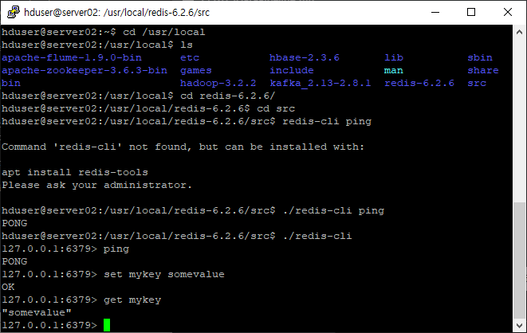

# 지난 내용들 요약

* 설치프로그램

  * 모든 서버 ubuntu 18.04 LTS

  * 서버별 구성요소들

    

* 계획

  * Hadoop, YARN, HBase와 같이 공통으로 설치된 요소들은 한 서버에 설치후 복제하여 환경을 갖춘다
  * 그 외의 요소들은 책에 쓰인 순서대로 설치하고 테스트해본다
  * 프로그램 중 오픈소스가 아닌 프로그램들은 검색하여 대체 or 생략한다

* 파이프라인 구조

  * cloudera manager는 제외

  

* 현재 상황

  * server 사전작업
    * ubuntu 18.04 LTS 설치
    * java 8버전 설치
  * Hadoop, YARN 설치
    * server ip주소, 주변 호스트 정보 설정
    * server끼리 ssh통신 설정
    * Hadoop, YARN xml파일 설정
    * Hadoop, YARN 실행
  * Zookeeper 설치
  * 스마트카 로그 시뮬레이터 설치
  * Flume 설치
  * Kafka 설치
  * 수집 기능 테스트
    * 시뮬레이터->Flume
    * 시뮬레이터->Flume -> Kafka
  * HBase 설치
  * Redis 설치 <------------------------------------ 다음 순서
  * Storm 설치
  * Esper 설치
  * 적재 기능 테스트
    * Flume -> HDFS
    * 실시간 적재
      * Flume -> Kafka -> Storm -> Redis
      * Flume -> Kafka -> Storm -> HBase
  * Hive 설치
  * Spark 설치
  * Oozie 설치
  * Hue 설치
  * 탐색 기능 테스트
  * Impala 설치
  * Zeppelin 설치
  * Mahout 설치
  * Sqoop 설치
    * MySQL 설치(PostgreSQL 대신)

# Redis 설치

* Redis란

  * 분산 캐시 시스템
  * 대규모 데이터 관리 가능
  * 키 값 형식의 데이터 구조를 분산 서버상의 메모리에 저장하여 고성능의 응답 속도 보장

* Redis 다운 및 설치

  * server02
  * https://redis.io/topics/quickstart

  ```shell
  sudo wget https://download.redis.io/releases/redis-6.2.6.tar.gz
  # /usr/local/에 압축풀기
  sudo tar xvzf redis-6.2.6.tar.gz -C /usr/local/
  # 사용자와 그룹 지정
  sudo chown -R hduser:hadoop /usr/local/redis-6.2.6
  # build
  sudo apt install make
  sudo apt-get install pkg-config
  
  cd /usr/local/redis-6.2.6
  # 실수로 전에 make하여 쓸데없는 파일이 생겼을 때
  # make distclean
  make
  # make test를 하고 싶으면(build가 제대로 되었는지 확인)
  # sudo apt-get install tcl
  ```

  

* .bashrc

  ```shell
  export JAVA_HOME=/usr/lib/jvm/java-8-openjdk-amd64
  export HADOOP_HOME=/usr/local/hadoop-3.2.2
  export HBASE_HOME=/usr/local/hbase-2.3.6
  export REDIS_HOME=/usr/local/redis-6.2.6
  export PATH=$PATH:$JAVA_HOME/bin:$HADOOP_HOME/bin:$HADOOP_HOME/sbin:$HBASE_HOME/bin:$REDIS_HOME/src
  ```

* redis 실행

  ```shell
  # 1번 창
  redis-server
  # redis-server /etc/redis.conf
  # 2번 창
  redis-cli
  ping
  set mykey somevalue
  get mykey
  ```

  

  

# Storm 설치

* Storm 특징

  * https://earthconquest.tistory.com/213?category=888284
  * 데이터를 실시간으로 다루기 위해 모든 데이터를 인메모리상에서 분산 병렬 처리한다
  * 분리, 정제, 통합, 집계 기능 제공

* Storm 설치

  ```shell
  sudo wget https://dlcdn.apache.org/storm/apache-storm-2.3.0/apache-storm-2.3.0.tar.gz
  sudo tar xvzf apache-storm-2.3.0.tar.gz -C /usr/local/
  sudo chown -R hduser:hadoop /usr/local/apache-storm-2.3.0
  ```

* storm.yaml

* cluster.xml

* worker.xml

* Storm 실행
  
  * Zookeeper가 실행되어 있어야 함
  
    ```shell
    storm nimbus &
    storm supervisor &
    storm ui &
    ```
  
    
  
* 에러대응

  ```shell
  sudo ln -s /usr/bin/python3 /usr/bin/python
  ```

  

# Esper 설치

# 적재 기능 테스트