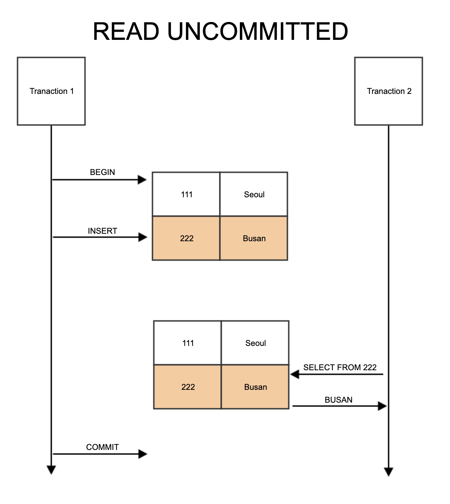

# DB 중요한 특징들

* 관계형 데이터베이스와 NoSQL(MySQL, MongoDB)

  * 관계형 데이터베이스를 쓰는 상황과 아닌 상황
    * 쓰는 상황
    * 스키마가 정해져 있고 자주 변하지 않을 때
    * 데이터의 무결성을 보장(삽입, 갱신, 삭제 이상 방지)해야 할 때(관계를 통해 여러 테이블에 분산)
    * 아닌 상황
    * 스키마를 수정할 일이 많을 때
    * 수평 확장까지 고려해야 할 정도로 처리량/처리 능력이 필요할 때
  * NoSQL을 쓰는 상황과 아닌 상황
    * 쓰는 상황
    * 정확한 데이터 요구사항을 알 수 없거나 데이터 스키마가 자주 바뀔 때
    * 읽기를 많이하고 데이터의 변경(여러 컬렉션에 중복되어 있는 데이터의 변경)이 적은 경우
    * 막대한 양의 데이터를 다루거나 읽기/쓰기 처리량이 커서 수평확장이 필요한 경우
    * 아닌 상황
    * 데이터의 변경이(여러 컬렉션에 중복되어 있는 데이터의 변경)이 자주 일어날 때
  * 수직확장, 수평확장이란
    * 수직확장(vertical scaling)은 데이터베이스 서버의 성능 향상(cpu 업그레이드 등)
    * 수평확장(horizontal scaling)은 데이터베이스 서버를 여러대 추가하여 성능 향상

* 트랜잭션

  * 트랜잭션이란

    * 데이터베이스 조회, 삽입, 수정, 삭제를 수행하는 작업 단위

  * 특징 4가지(ACID)

    * 원자성(atomicity)
      * 트랜잭션 하나는 무조건 성공하거나 실패하여야 한다(일부 성공 존재 안함)
    * 일관성(consistency)
      * 트랜잭션을 수행하기 전에 일관된 상태였다면, 트랜잭션 수행 후에도 일관된 상태여야 한다
      * 계좌 이체 시 진행 전의 돈의 합과 진행 후의 돈의 합이 같아야 함
    * 독립성(isolation)
      * 둘 이상의 트랜잭션이 동시에 병행 실행되고 있을 때, 어떤 트랜잭션도 다른 트랜잭션 연산에 끼어들 수 없다
    * 지속성(durability)
      * 트랜잭션이 성공적으로 완료되었으면, 결과는 영구적으로 반영되어야 한다

  * 트랜잭션 격리 수준(Isolation level)이란

    * 특정 트랜잭션이 다른 트랜잭션에서 변경하거나 조회하는 데이터를 볼 수 있도록 허용할지 말지를 결정하는 것

  * 트랜잭션 격리 수준이 필요한 이유

    * 트랜잭션의 독립적인 수행을 위해 lock을 이용해 트랜잭션이 DB를 다루는 동안 다른 트랜잭션이 관여하지 못하게 막는 것이 필요
    * lock의 범위를 늘려 정확성을 보장하면 성능이 떨어지고, lock의 범위를 줄여 성능을 늘리면 정확성이 떨어질 수 있어 효율적인 lock을 위해 단계 구별

  * 트랜잭션 격리 수준 4단계

    * https://joont92.github.io/db/%ED%8A%B8%EB%9E%9C%EC%9E%AD%EC%85%98-%EA%B2%A9%EB%A6%AC-%EC%88%98%EC%A4%80-isolation-level/

    * https://nesoy.github.io/articles/2019-05/Database-Transaction-isolation

    * Read Uncommitted

      * commit되지 않아도 데이터 조회 가능

      * Dirty Read 발생 가능

        * 사용자1이 A라는 데이터를 B라는 데이터로 변경하는 동안 사용자2는 아직 완료되지 않은(Uncommitted) 트랜잭션이지만 데이터B를 읽을 수 있다

        

    * Read Committed

      * commit되어야 데이터 조회 가능

      * Non-Repeatable Read 발생 가능

        * 한 트랜잭션에서 같은 select 쿼리를 수행할 때, 해당 트랜잭션이 시작된 후에 update 쿼리가 수행되고 종료될 때, update 쿼리가 수행되었을 때의 select 쿼리 결과와, update쿼리가 있는 트랜잭션이 commit되고 나서의 select 쿼리 결과가 달라진다

        

    * Repeatable Read

      * 트랜잭션이 시작되기 전에 커밋된 내용만 조회 가능

      * 실제로는 undo공간에 값을 백업해놓고 실제 레코드 값을 변경한다(insert 시)

      * Phantom Read 발생 가능

        * 한 트랜잭션에서 같은 select 쿼리를 수행할 때 다른 트랜잭션에서 어떤 레코드를 insert하면 insert하기 전의 select쿼리 결과와 insert한 후의 selelct쿼리 결과가 다르다(insert한 레코드가 후에 등장)

        

    * Serializable

      * 읽기 작업에도 공유 잠금을 설정하여 다른 트랜잭션에서 접근을 못하게 막는다
      * 트랜잭션 내에 읽기 작업이 있는 동안 다른 트랜잭션은 해당 데이터를 못 읽는다

* 인덱스

  * 사용하면 좋은 경우와 나쁜 경우

    * 좋은 경우
    * where 절에서 자주 사용되는 column
    * order 절에서 자주 사용되는 column(질의시 sort가 이미 되어있어서 부하 적음)
    * min, max함수
    * 외래키가 사용되는 column
    * join에 자주 사용되는 column
    * 나쁜 경우
    * data 중복도가 높은 column(selectivity가 낮은 경우)
    * dml이 자주 일어나는 column(수정, 삽입, 삭제)

  * 인덱스의 종류 중 B+ Tree에 대해 설명

    * log N의 시간복잡도

    * Root Node, Branch Node, Leaf Node로 구성

    * branch 노드에 key만 담아둔다

    * leaf 노드에 key와 data를 저장한다

    * 같은 level의 노드들은 서로 Double linked list로 연결되어 있다

    * 자식 노드는 linked list로 연결되어 있다

    * 풀스캔시 리프 노드에서 선형 탐색한다

    * 좌우 자식노드 개수의 밸런스를 유지하여 탐색시간 log N을 유지한다

    * 같은 노드 내에서는 배열처럼 연속적으로 저장되어 있고 데이터는 정렬된 상태이다

      

  * B+ Tree사용이유

    * 항상 정렬된 상태로 부등호 연산에 문제가 없다
    * 참조 포인터가 적어 방대한 데이터 양에도 빠른 메모리 접근이 가능하다
    * 데이터 탐색, 저장, 수정, 삭제에 O(logN) 시간복잡도를 가져 다른 구조보다 빠르다

  * Hash table을 인덱스로 사용하지 않는 이유

    * 단 하나의 데이터를 탐색할 때만 O(1)만큼 시간이 걸리지만 특정 범위 내의 데이터(부등호 연산)를 찾을 때는 정렬이 안되어있어 비효율적이다

  * B+ Tree에서 insert, delete, update가 발생했을 때 Table과 Index의 상황 설명

    * https://ju-hy.tistory.com/106
    * insert, update
      * 기존 B+Tree에 일치하는 key값이 있으면 해당 pointer를 통해 데이터베이스 접근 후 데이터 수정
      * 일치하는 key값이 없고 leaf node에 공간이 있으면 pointer, key 삽입
      * 일치하는 key값이 없고 leaf node에 공간이 없으면 split 후 빈 공간에 삽입
    * delete
      * B+Tree에서 key값을 검색하여 데이터베이스의 데이터 삭제
      * 해당 pointer, key 쌍 삭제
      * 삭제 후 entry가 얼마 남지 않았고 형제 노드와 merge가 가능한 경우 merge하여 하나의 노드로 만든다
      * 삭제 후 entry가 얼마 남지 않았고 형제 노드와 merge가 불가능한 경우 재분배한다

* 정규화, 비정규화

  * 정규화와 비정규화를 하는 상황(장단점)

    * 정규화
    * 정규화는 관계형 데이터베이스의 설계에서 중복을 최소화하게 데이터를 구조화하는 프로세스
    * 이상현상을 해결하여 무결성을 보장하기 위해 여러 개의 릴레이션으로 분해하는 과정이다
    * 비정규화
    * 정규화하였을 때 join해야하는 테이블의 개수가 엄청 많거나 테이블 안에 데이터가 엄청 많아서 읽기 효율이 떨어졌을 때 하는 것

  * 이상현상 종류 3가지와 문제점과 해결방법

    * 삽입
      * 데이터를 새로 삽입하려고 할 때 불필요한 세부정보를 입력해야 함
      * 학번, 이름, 교수번호, 지도교수 속성이 있을 때, 202003학번의 이철수라는 정보만으로는 삽입이 불가능하다(학번만 알아도 알수있는 교수번호, 지도교수 정보도 넣어야 한다)
    * 갱신
      * 데이터를 갱신하려고 할 때 일부의 속성만 갱신시킴으로써 정보의 모순이 발생
      * 학번, 이름, 교수번호, 지도교수 속성이 있을 때, (202001, '홍길동', 1, '김 교수')가 유일하게 지도교수가 김 교수이고, 홍길동 학생 정보의 교수번호, 지도교수를 갱신하면 김 교수에 대한 정보가 아예 사라진다.
    * 삭제
      * 데이터를 삭제할 때 유지되어야 하는 정보까지도 연쇄적으로 삭제
      * 학번, 이름, 교수번호, 지도교수 속성이 있을 때, 지도교수 이름이 '이 교수'인 사람이 나가서 해당 튜플을 삭제하려고 할 때 삭제되어서는 안될 학생 정보도 사라진다

  * 1, 2, 3차 정규화 과정에 대한 설명

    * 원자값으로 구성

      | 고객ID | 이메일                                       |
      | ------ | -------------------------------------------- |
      | 1      | customer@domain.com; newcustomer@domain.com; |

      | 고객ID | 이메일                  |
      | ------ | ----------------------- |
      | 1      | customer@domain.com;    |
      | 1      | newcustomer@domain.com; |

      * 한 속성에는 하나의 값만 ex)이메일 주소 여러개가 있으면 여러개의 튜플로

    * 부분 종속 제거(주식별자가 아닌 속성 분리)

      | _고객명_ | _서비스 이름_ | 서비스 가격 | 서비스 이용기간 |
      | -------- | ------------- | ----------- | --------------- |
      | 홍길동   | 헬스          | 70000       | 1달             |
      | 홍길동   | 수영          | 100000      | 2달             |
      | 장길산   | 수영          | 100000      | 2달             |

      | _고객명_ | _서비스 이름_ | 서비스 이용기간 |
      | -------- | ------------- | --------------- |
      | 홍길동   | 헬스          | 1달             |
      | 홍길동   | 수영          | 2달             |
      | 장길산   | 수영          | 2달             |

      | _서비스 이름_ | 서비스 가격 |
      | ------------- | ----------- |
      | 헬스          | 70000       |
      | 수영          | 100000      |

      * primary key를 제외한 나머지 attribute가 모든 primary key에 의해 값이 결정되어야 함
      * 일부 primary key만으로 결정되는 attribute가 있다면 따로 테이블 생성

    * 이행 종속 제거

      | _책번호_ | 도서 이름 | 도서 가격 | 출판사 | 홈페이지  |
      | -------- | --------- | --------- | ------ | --------- |
      | 1        | C언어     | 30000     | A사    | www.a.com |
      | 2        | C++언어   | 25000     | B사    | www.b.com |
      | 3        | JAVA언어  | 40000     | B사    | www.b.com |

      | _책번호_ | 도서 이름 | 도서 가격 | 출판사 |
      | -------- | --------- | --------- | ------ |
      | 1        | C언어     | 30000     | A사    |
      | 2        | C++언어   | 25000     | B사    |
      | 3        | JAVA언어  | 40000     | B사    |

      | _출판사_ | 홈페이지  |
      | -------- | --------- |
      | A사      | www.a.com |
      | B사      | www.b.com |

      * attribute a, b, c가 있을 때 a에 의해 b가 결정되고, b에 의해 c가 결정되면 테이블을 분리한다