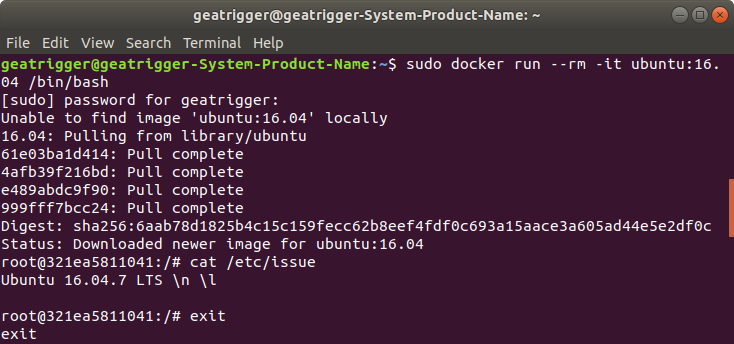
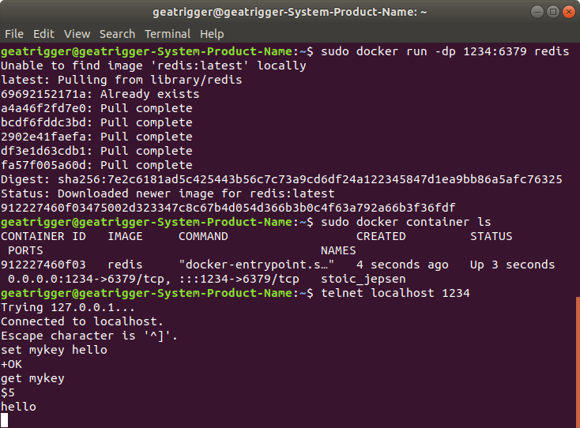
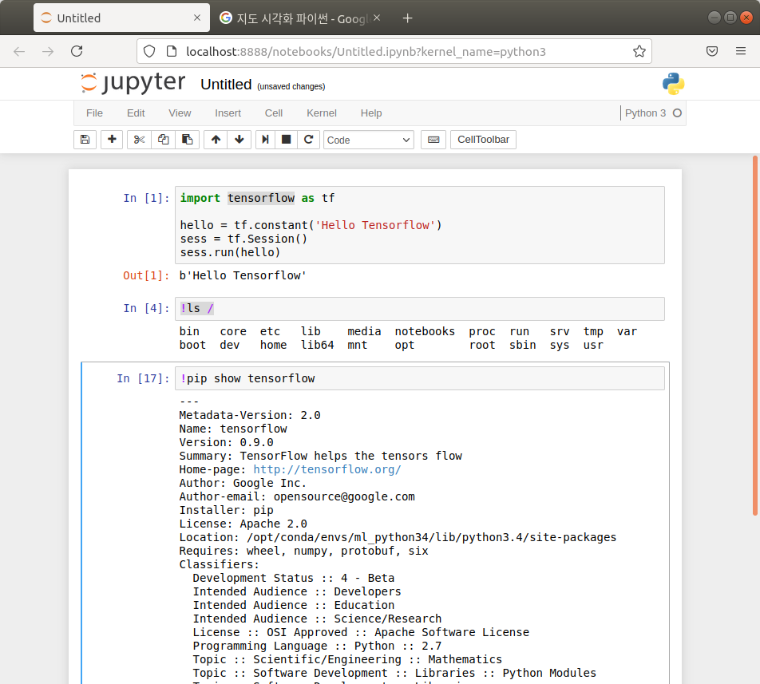

* 참고자료

  * https://docs.docker.com/get-started/overview/
  * https://subicura.com/2017/01/19/docker-guide-for-beginners-1.html
  * https://kycfeel.github.io/2017/03/15/DockerFile%EA%B3%BC-Docker-Compose/

* 도커를 쓰게 된 배경

  * 서버환경이 계속 바뀌고, 버전을 업데이트 할 필요성도 생기고, 하나의 서버에 여러 개의 프로그램을 설치하는데 사용하는 라이브러리 버전이 다르거나 동일한 포트를 사용하는 경우가 있다.
  * 격리된 공간에서 프로세스를 동작하기 위해 Hypervisor를 이용한 OS를 가상화하는 VM(Virtual Machine)이 등장하였지만, 타입 1(Xen), 타입 2(VMware, VirtualBox) 모두 추가적인 OS를 설치해야해서 운영 환경에서는 너무 무거웠다.

  

* 도커란?

  * 다양한 실행환경을 컨테이너로 추상화하고 동일한 인터페이스를 제공하여 프로그램의 배포 및 관리를 단순하게 해주는 것

    

* Container

  * 프로세스를 격리하여 실행
  * 컨테이너가 지워지면 그 상태가 저장되지 않는다(그러려면 image를 만들어야 함)

* Image

  * 컨테이너 실행에 필요한 파일과 설정값 등을 포함
  * Immutable
  * Docker hub에 등록하거나 Docker Registry 저장소를 직접 만들어 관리할 수 있다.

* 레이어 저장방식

  

  * 아이디어 : 파일 하나 추가했다고 기존 이미지를 모두 다시 다운 받는 건 비효율적
  * web app source만 수정하면 기존에 있던 A, B, C, nginx 레이어는 놔두고 web app source만 다시 받으면 된다.
  * container를 실행시키고 file을 쓰면, 그 파일은 image layers 위에 top-level read-write layer가 추가되어 쓰기가 실행된다.
  * 모든 layer들은 base에서 파일단위의 차이(diff) 정보를 가지고 있다.(git은 line단위의 차이정보)

* Dockerfile

  * image를 만들 수 있도록 생성 과정이 적혀있는 파일

    ```dockerfile
    # vertx/vertx3 debian version
    FROM subicura/vertx3:3.3.1
    MAINTAINER chungsub.kim@purpleworks.co.kr
    
    ADD build/distributions/app-3.3.1.tar /
    ADD config.template.json /app-3.3.1/bin/config.json
    ADD docker/script/start.sh /usr/local/bin/
    RUN ln -s /usr/local/bin/start.sh /start.sh
    
    EXPOSE 8080
    EXPOSE 7000
    
    CMD ["start.sh"]
    ```

* 도커 컨테이너 실행

  * 도커 명령어 옵션
  
  | 옵션  | 설명                                               |
  | ----- | -------------------------------------------------- |
  | -d    | detached mode(백그라운드 모드)                     |
  | -p    | 호스트와 컨테이너의 포트를 연결(포워딩)            |
  | -v    | 호스트와 컨테이너의 디렉토리를 연결(마운트)        |
  | -e    | 컨테이너 내에서 사용할 환경변수 설정               |
  | -name | 컨테이너 이름 설정                                 |
  | --rm  | 프로세스 종료시 컨테이너 자동 제거                 |
  | -it   | -i -t 동시에 사용한 것으로 터미널 입력을 위한 옵션 |
  
  *  다양한 예제
  
     * ubuntu 컨테이너 생성 후 내부에 들어가기
  
        ```bash
        sudo docker run --rm -it ubuntu:16.04 /bin/bash
        
        cat /etc/issue # ubuntu version 확인
        ```
  
        
  
     * redis 컨테이너 생성 후 telnet을 이용해 포트로 접근하기
  
        ```shell
        sudo docker run -dp 1234:6379 redis
        
        telnet localhost 1234
        set my key hello
        get my key # hello
        ```
  
        
  
     * tensorflow 컨테이너를 포트 이용해 접근
  
       ```shell
       sudo docker run -dp 8888:8888 teamlab/pydata-tensorflow:0.1
       ```
  
       
  
  * docker 명령어들
  
     * 컨테이너 중지 및 삭제
  
        ```bash
        sudo docker stop <container-id or container-name> # 중지만
        sudo docker rm -f <container-id or container-name> # 중지 및 삭제
        ```
        
     * 중지된 컨테이너 모두 확인
     
       ```shell
       sudo docker container ls -a
       ```
     
     * 중지된 컨테이너 모두 삭제
     
       ```bash
       sudo docker rm -v $(docker ps -a -q -f status=exited)
       ```
     
     * 도커 이미지 확인
     
       ```shell
       sudo docker images
       ```
     
     * 도커 이미지 삭제
     
       * 이미지가 컨테이너로 실행되는 게 있으면 삭제 불가
       * 이미지는 name으로 삭제 안됨
     
       ```bash
       sudo docker rmi <image_id>
       ```
     
     * 컨테이너 로그 확인
     
       * 표준 스트림 중 stdout, stderr를 수집하여 json으로 어딘가에 저장됨(설정으로 특정 로그 서비스에 스트림을 전달 가능)
       * 어플리케이션의 규모가 커지면 너무 커진 json파일 대신 관리할 로그 서비스를 고려해야 한다.
     
       ```bash
       # 마지막 10줄만 확인
       sudo docker logs --tail 10 <container-id or container-name>
       # 실시간 로그 확인
       sudo docker logs -f <container-id or container-name>
       ```
     
     * 실행중인 도커에서 bash 열기
     
       ```bash
       # /bin/bash가 안되는 경우 sh
       sudo docker exec -it <container-id or container-name> /bin/bash
       ```

# 다음에 알아 볼 것

* DockerFile과 docker-compose.yml
  * DockerFile은 이미지를 실행하면서 특정 작업까지 같이 처리
  * docker-compose.yml은 다수의 컨테이너를 쉽게 실행해주는 도구
  * 둘 다 같이 쓸 때는 DockerFile은 컨테이너 내부에서 실행하는 작업 정의하고, docker-compose.yml은 컨테이너 외부에서 실행하는 작업(ports, volumes 등)을 정의한다.
* 도커 PyMySQL과 MySQL 사용하기
  * 서로 통신하기 위해 network 설정
  * DB 데이터는 영구적으로 남아야하므로 volume 설정
  * MySQL 컨테이너 새로 업데이트
  * 내부 컨테이너 접근하여 DB직접 보기 

