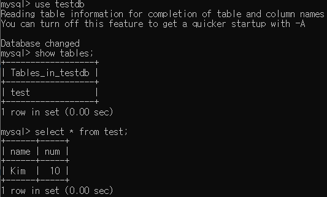
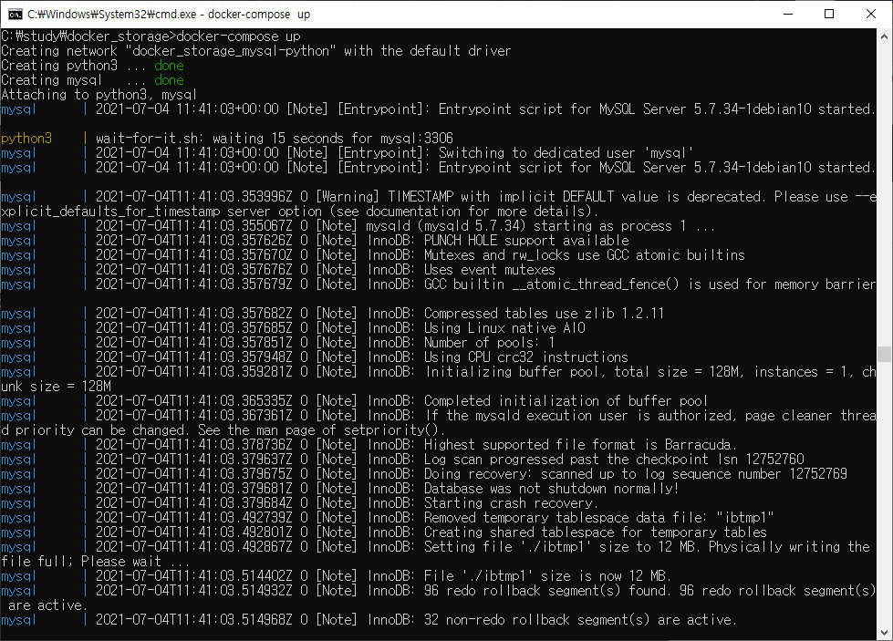
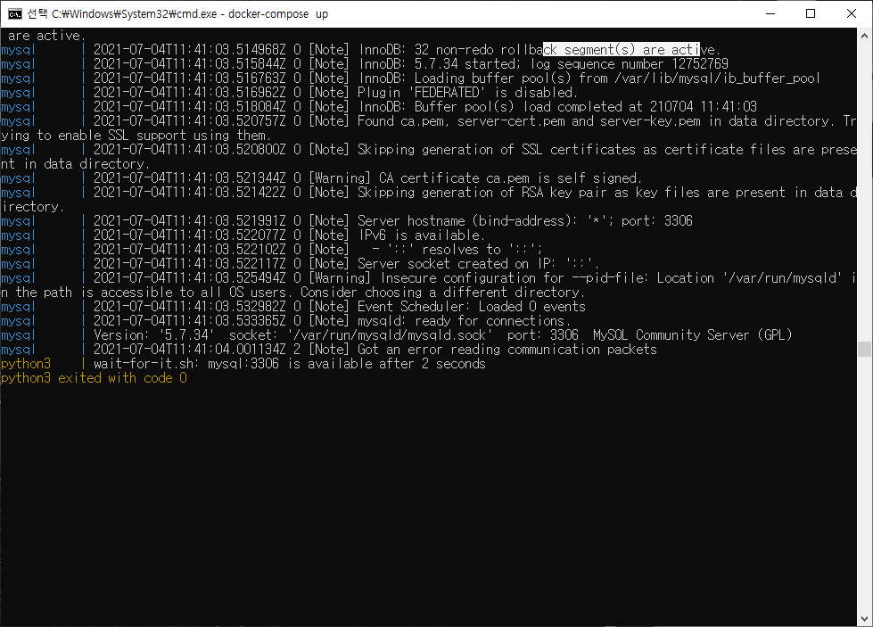

# python과 mysql 연동

* 네트워크 생성

  * 같은 네트워크가 있어야 컨테이너가 서로 통신이 가능
  
  ```shell
  docker network create mysql-python
  ```


* mysql 컨테이너


  * 컨테이너를 재시작해도 db정보를 보존하기 위한 영구적인 저장소 volume을 지정(mysql-data)
  * 처음부터 testdb라는 데이터베이스를 만들고 시작
  * mysql version 5 사용(실제 설치된 버전은 5.7.34)

  ```shell
  docker run -d --network mysql-python --name mysql -v mysql-data:/var/lib/mysql -e MYSQL_ROOT_PASSWORD=root -e MYSQL_DATABASE=testdb mysql:5
  ```

* python 스크립트

  
  * 주의사항 : sql을 excute할 때 sql 여러 문장을 실행하면 에러난다, 항상 commit과 close를 해줘야한다
  * C:\study\docker_storage\python\test.py
  
  ```python
  import pymysql
  import sys
  
  # python version파악
  with open('./version.txt', 'w', encoding='utf-8') as f:
    f.write(sys.version + '\n')
  
  # container이름이 mysql인 host와 연결
  conn = pymysql.connect(
    host='mysql', 
    port=3306, 
    user='root', 
    password='root',
    db='testdb'
  )
  cur = conn.cursor()
  
  # 이미 test테이블이 존재하면 지운다
  sql = '''drop table if exists test;'''
  cur.execute(sql)
  sql = '''
  create table test(
    name varchar(20) primary key,
    num int not null
  );'''
  cur.execute(sql)
  sql = '''
  insert into test(name, num) values("Kim", 10);
  '''
  cur.execute(sql)
  conn.commit()
  conn.close()
  
  ```
  
  
  
* python 컨테이너

  
  * 편의를 위해 "C:\study\docker_storage\python"를 영구적인 저장소로 지정
  * python3 컨테이너에는 pymysql이 설치되어 있지 않으므로 설치
  * 컨테이너 시작할 때 작성한 test.py도 실행
  * 이 컨테이너는 test.py가 모두 실행되면 저절로 종료된다.
  
  ```shell
  docker run -d --network mysql-python --name python3 -v "C:\study\docker_storage\python":/usr/src -w /usr/src python:3 sh -c "pip install pymysql && python test.py"
  # 같은 컨테이너 다시 시작할 때
  docker restart python3
  ```

* 결과확인을 위한 유용한 커맨드

  * logs 확인

    ```shell
    docker logs -f python3
    ```

  * mysql 내부 들어가기

    ```shell
    docker exec -it mysql mysql -u root -p
    # 패스워드 치기(root)
    ```

    

* 결과

  * C:\study\docker_storage\python에서 version.txt파일이 생겼고 설치된 버전을 알려줌(3.9.6)

  * testdb에서 test테이블이 생성되어 ('Kim', 10)이라는 값이 들어감

    

# Dockerfile

* https://docs.docker.com/engine/reference/builder/

* https://blog.d0ngd0nge.xyz/docker-dockerfile-write/

* image를 빌드하기 위한 커맨드라인을 모아놓은 것

* 빌드하기 전에 해당 디렉토리에 꼭 필요한 파일만 넣을것(그렇지 않으면 CLI가 관계없는 모든 디렉토리, 파일 경로를 Docker daemon에게 보냄)

  * dockerignore 파일을 만들어도 됨

* build flag

  ```shell
  # Dockerfile이 시작하는 지점 설정
  docker build -f .
  # 빌드한 image의 tag지정
  docker build -t geatrigger/test .
  ```

* build-cache로 빌드를 더 빨리 할 수 있다고 한다

* BuildKit을 이용하여 최적화된 빌드를 할 수 있다

  * 안쓰는 build stage 스킵
  * 독립적인 build stage 병렬처리
  * 사용하려면 환경변수를 ```DOCKER_BUILDKIT=1```로 바꾸어준 다음 build해야한다

* Dockerfile 형식

  * 대소문자 구별안함(관습적으로 구분하기 쉽게 instruction부분은 대문자로 씀)
  * RUN명령어에서 \와 같은 line continuation은 지원하지 않는다

* Dockerfile 작성

  * volume의 경우 실행될 컨테이너 내부에 어떤 디렉토리가 마운트 포인트가 될지만 결정한다
    * window(host)와 매핑불가능
    * volume이름짓기 불가능
    * docker run할 때 마운트 포인트를 지정하면 덮어씌워진다
  * network 지정 불가
  * container 이름 지정불가(이미지 만드는 작업이라 당연히 불가능)

  ```dockerfile
  FROM python:3
  ADD test.py /usr/src
  WORKDIR /usr/src
  RUN pip install pymysql
  CMD python test.py
  VOLUME ["/usr/src"]
  # network는 여기서 설정 불가
  ```

  

* Dockerfile을 이용해 build하기

  ```shell
  docker build -t geatrigger/python-test .
  ```

* 테스트

  ```shell
  # mysql 컨테이너 실행상태
  docker run -d --network mysql-python --name python3 -v "C:\study\docker_storage\python":/usr/src  geatrigger/python-test
  # 컨테이너 세팅 확인
  docker inspect python3
  ```

* 장점

  * 컨테이너를 실행할 때마다 인자로 라이브러리 설치명령, python실행명령을 전해줄 필요가 없다

# docker-compose

* https://docs.docker.com/compose/gettingstarted/

* https://hoony-gunputer.tistory.com/entry/docker-compose-yaml-%ED%8C%8C%EC%9D%BC-%EC%9E%91%EC%84%B1

* docker-compose의 역할

  * 여러개의 컨테이너를 실행시킬 때 설정을 한 파일에 모아놓은 것

* docker compose 적용 예시

  * https://kycfeel.github.io/2017/03/15/DockerFile%EA%B3%BC-Docker-Compose/
  * http://labs.brandi.co.kr/2021/01/20/hwangsg.html
  * https://int-i.github.io/sql/2020-12-31/mysql-docker-compose/

* docker-compose.yml

  * 1차 코드

    ```yaml
    version: "3"
    services:
      mysql:
        image: "mysql:5"
        container_name: mysql
        ports:
          - "3307:3306"
        volumes:
          - mysql-data:/var/lib/mysql
        environment:
          - MYSQL_ROOT_PASSWORD=root
          - MYSQL_DATABASE=testdb
        networks:
          - mysql-python
      python3:
        build: ./python
        container_name: python3
        volumes:
          - C:\study\docker_storage\python:/usr/src
        networks:
          - mysql-python
          
    networks:
      mysql-python:
    
    volumes:
      mysql-data:
        external: true
    ```

    

  * volume declaration 해야함

  ```yaml
  # double quotes 때문에 에러남
  volumes:
  	- "C:\study\docker_storage\python":/usr/src
  ```

  

* 실행

  ```shell
  docker-compose up
  # 종료
  docker-compose down
  ```

* 결과

  * 두 컨테이너가 정상적으로 실행됨
  * 하지만 목표는 python3 컨테이너 안의 test.py까지 실행시키는 것


# docker-compose with wait-for-it.sh

* https://docs.docker.com/compose/startup-order/

* wait-for-it.sh

  * 각 컨테이너를 실행할 때 test.py는 mysql의 실행이 완전히 끝난 후에 실행할 수 있다
  * docker-compose의 depends_on, links를 이용해 컨테이너 시작 순서를 정할 수 있지만, 전 컨테이너가 시작하고 나서 바로 실행하는 커맨드라 소용없음(결과적으론 MySQL실행 전에 실행)
  * docker공식 홈페이지에서 wait-for-it, dockerize 추천

* 힘들었던 점

  * 컨테이너이름:컨테이너내부포트번호 라고 적어야 하는데 인터넷의 예제들은 죄다 db:5432 등의 식으로 적혀있고 postgreSQL등의 DB포트의 외부, 내부 번호가 같았다. 하지만 현재 컴퓨터에서 이미 따로 MySQL이 설치된 상태라 3306번 포트가 차지하고 있어 외부포트번호를 3307로 수정해야 했고, 당연히 외부포트를 참조하는 줄 알고 db:3307, mysql-python:3307, mysql:3307 등으로 시도를 했다.

* 최종 필요한 코드

  * C:\study\docker_storage\python

    * test.py : 같음

    * wait-for-it.sh : https://github.com/vishnubob/wait-for-it/blob/master/wait-for-it.sh 복사

    * Dockerfile

      * wait-for-it.sh를 python3 이미지의 /usr/src에 복사

      ```dockerfile
      FROM python:3
      ADD test.py /usr/src
      ADD wait-for-it.sh /usr/src
      WORKDIR /usr/src
      RUN apt-get update
      RUN pip install pymysql
      VOLUME ["/usr/src"]
      # network는 여기서 설정 불가
      ```

  * C:\study\docker_storage

    * docker-compose.yml

      * python3에 entrypoint 추가(command 옵션으로 넣어도 상관없음)
        * 컨테이너이름:내부포트번호
      * 15초 내에 연결이 되면 test.py실행

      ```yaml
      version: "3"
      services:
        mysql:
          image: "mysql:5"
          container_name: mysql
          ports:
            - "3307:3306"
          volumes:
            - mysql-data:/var/lib/mysql
          environment:
            - MYSQL_ROOT_PASSWORD=root
            - MYSQL_DATABASE=testdb
          networks:
            - mysql-python
        python3:
          build: ./python
          container_name: python3
          volumes:
            - C:\study\docker_storage\python:/usr/src
          networks:
            - mysql-python
          entrypoint: ./wait-for-it.sh mysql:3306 --timeout=15 -- python test.py
      
      networks:
        mysql-python:
      
      volumes:
        mysql-data:
          external: true
      ```

* 결론

  * docker-compose, Dockerfile 한 번 만들어 놓으면 ```docker-compose up``` 커맨드 하나로 MySQL과 python 세팅을 할 수 있다

  

  