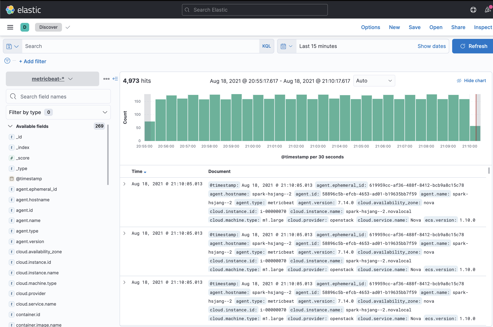
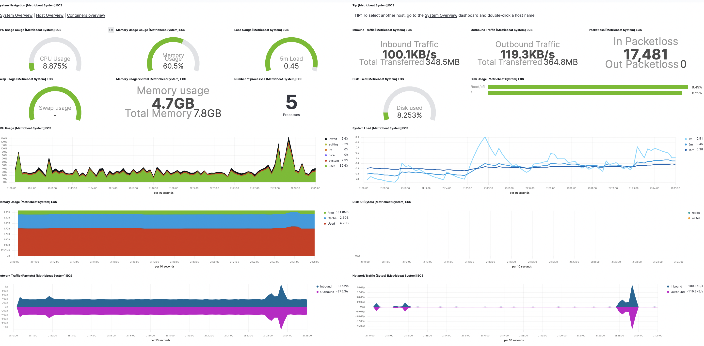
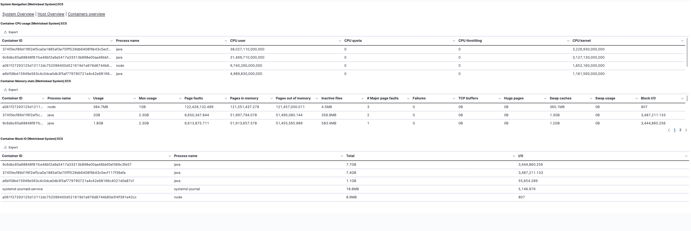
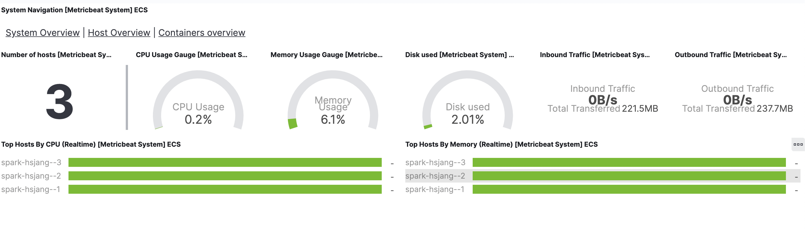

# 2주차 - 메트릭비트란? 간단한 설치와 모니터링 구축

### 메트릭비트란??

서버에서 생기는 다양한 메트릭들을 수집해서 전송해주는 경량수집기이다.

서버자체의 시스템 메트릭들 뿐만 아니라 MySQL,PostgreSQL 등 디비들과 Nginx, Redis, Zookeeper등 다양한 서비스의 메트릭들을 수집해준다.

[Metricbeat Reference](https://www.elastic.co/guide/en/beats/metricbeat/current/index.html)

메트릭비트 레퍼런스를 통해 어떤 모듈들을 지원하는지, 각 모듈에서 어떤 메트릭들을 수집해오는지 알 수 있다.

### **메트릭비트에서 지원하는 부가기능:**

다양한 서비스의 수많은 메트릭들을 손쉬운 설치로 수집할 수 있단 장점 말고도 수많은

메트릭비트는 엘라스틱서치에 바로 전송했을때 자동으로 인덱스를 생성하고 스키마도 자동으로 생성해준다. 

뿐만 아니라 kibana 와의 간단한 셋업을 통해 각 메트릭비트의 모듈별로 생성할수 있는 대시보드를 생성해 주어서 별도의 조작없이 모니터링 솔루션을 구성할 수 있다. 

### 메트릭비트 설치&구성

[Metricbeat installation](https://www.elastic.co/guide/en/beats/metricbeat/current/metricbeat-installation-configuration.html)

엘라스틱서치에서 제공하는 메트릭비트 공식문서를 참고해 설치를 진행했다.

APT install guide

```bash
wget -qO - https://artifacts.elastic.co/GPG-KEY-elasticsearch | sudo apt-key add -

sudo apt-get install apt-transport-https
echo "deb https://artifacts.elastic.co/packages/7.x/apt stable main" | sudo tee -a /etc/apt/sources.list.d/elastic-7.x.list
sudo apt-get update && sudo apt-get install metricbeat
sudo systemctl enable metricbeat
```

이후 /etc/metricbeat/metricbeat.yml 파일을 수정해서

```bash
# =================================== Kibana ===================================

# Starting with Beats version 6.0.0, the dashboards are loaded via the Kibana API.
# This requires a Kibana endpoint configuration.
setup.kibana:

  # Kibana Host
  # Scheme and port can be left out and will be set to the default (http and 5601)
  # In case you specify and additional path, the scheme is required: http://localhost:5601/path
  # IPv6 addresses should always be defined as: https://[2001:db8::1]:5601
  host: "spark-hsjang--1:5601"

  # Kibana Space ID
  # ID of the Kibana Space into which the dashboards should be loaded. By default,
  # the Default Space will be used.
  #space.id:

output.elasticsearch:
  # Array of hosts to connect to.
  hosts: ["spark-hsjang--1:9200"]

  # Protocol - either `http` (default) or `https`.
  #protocol: "https"

  # Authentication credentials - either API key or username/password.
  #api_key: "id:api_key"
  #username: "elastic"
  #password: "changeme"
```

kibana setup 부분과 output을 받을 엘라스틱서치를 주석해제한 후 관련 ip 와 port 를 입력해준다.

```bash
sudo metricbeat setup -e #셋업 적용

sudo service metricbeat start # 셋업 실행
```

metricbeat modules list 를 통해 지원하는 모듈들을 확인할 수 있고

/etc/metricbeat/module.d 에서 각 모듈들의 설정을 확인할 수 있다

데이터 확인:

Discover에서 수집되고 있는 데이터 확인











서버에서 top , df -h 등의 명령어를 통해 실제 서버들의 시스템 사용량을 조회해봐도 메트릭비트에서 수집해오는 내용과 동일함을 확인할 수 있다.

후기:

상당히 공들여 만들어야 할 대시보드들을 간단히 보여주고 있다.

만약 이러한 작업을 직접하게 되면 스키마 생성하는데 필요한 변수 파악이나 스키마 설정등 시간이 엄청 걸릴수도 있고 변수파악에도 시간이 걸릴 수도 있다. 그러나 메트릭비트는  대시보드까지 자동으로 생성해주니 필요한 변수를 빨리 파악할 수 있고, 각 대시보드 상세보기를 통해 어떠한 메트릭들을 사용했는지 알 수 있으므로 확장하는데 참고 하기도 유용하다. 사실 이는 모든 비트들에 해당하는 이야기라서 비트들만 잘 사용해도 상당한 서버 모니터링, 어플리케이션 모니터링을 손쉽게 구성할 수 있다.