# Hadoop Ecosystem이란

* https://inkkim.github.io/hadoop/Hadoop-Ecosystem%EC%9D%B4%EB%9E%80/

* https://velog.io/@kimdukbae/MapReduce

* Hadoop 환경에서 빅데이터 문제를 효율적으로 다루기 위해 만들어진 서브 프로젝트들의 집합

* 핵심요소

  * HDFS

    * Hadoop Distributed File System
    * Sequential Access 방식을 통해 불변 데이터를 저장하는데 최적화
    * 데이터를 설정가능한 크기(기본값 128MB)의 블록으로 나눠 저장
      * 1G 데이터는 8개의 블록으로 나누어 저장
      * 50M 데이터는 공간이 남더라도 1개의 블록에 저장
    * 여러 대의 서버에 각 블록의 복제본 저장(기본값 3)
      * 1G 데이터를 저장하기 위해서는 총 3G의 용량이 필요
      * 개별 디스크나 데이터 노드에 장애가 발생하더라도 데이터가 안전(장애 허용성)
    * 데이터 노드(로컬 스토리지도 포함)를 클러스터에 추가하면 파일시스템 용량이 늘어남(확장성)
      * 분산 파일 시스템 전체로 볼 때 읽기, 쓰기 처리량도 늘어남

  * MapReduce

    * 병렬 프로그래밍으로 클러스터 내에서 분산 처리를 도와줌

    * 분할 정복 방식으로 작동

    * word count 프로세스 작동 예시

      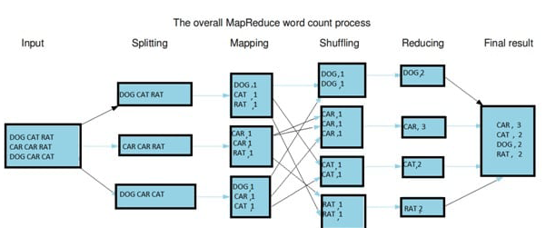

      * Splitting : 문자열 데이터를 라인별로 나눔
      * Mapping :  Key-Value 짝을 맺어 출력
      * Shuffling : 같은 Key를 가지는 데이터끼리 분류
      * Reducing: 각 Key별로 빈도수를 합산해서 출력
      * Final Result : 출력 데이터를 합쳐서 하둡 파일시스템에 저장

* 그 외

  * 분산 코디네이터
    * https://kerpect.tistory.com/64
    * 각각의 클라이언트들이 동시 작업할 수 있도록 부하를 분산
    * lock을 통해 하나의 서버에서 처리된 결과가 다른 서버들과 동기화
    * ZooKeeper
  * 워크플로우 관리
    * https://m.blog.naver.com/PostView.naver?isHttpsRedirect=true&blogId=kbh3983&logNo=221103970790
    * 특정 시간마다 작업을 순차적으로 실행시켜줌
    * Ozzie, Airflow
  * 분산 리소스 관리
    * 하둡 내 작업 스케쥴링, 클러스터 리소스 관리 담당
    * YARN
  * 분석
    * 데이터 요약, 질의, 분석 기능
    * Hive, Impala
  * 수집
    * 데이터 소스(스트리밍 데이터, 관계형 DB 등)에서 원하는 형태로 가져오는 것
    * Kafka, Sqoop, Flume

# Hadoop 2와 3의 차이

* https://blog.geunho.dev/posts/hadoop-docker-test-env-hdfs/

# Hadoop 설치

* https://www.guru99.com/how-to-install-hadoop.html

* https://hadoop.apache.org/docs/r3.3.1/hadoop-project-dist/hadoop-common/SingleCluster.html

* https://blog.geunho.dev/posts/hadoop-docker-test-env-hdfs/

* 하둡 클러스터 도커를 이용해 설치

  * https://eyeballs.tistory.com/144

* 도커를 이용해 dependencies를 간편히 설치

  * 버전 다른 거 설치
  * https://github.com/apache/hadoop/blob/rel/release-3.2.1/dev-support/docker/Dockerfile

* git에서 발생한 문제

  * https://github.com/apache/hadoop/tree/rel/release-3.2.1

  * 해당 프로젝트를 윈도우에서 클론할 때 Filename too long 에러 발생

    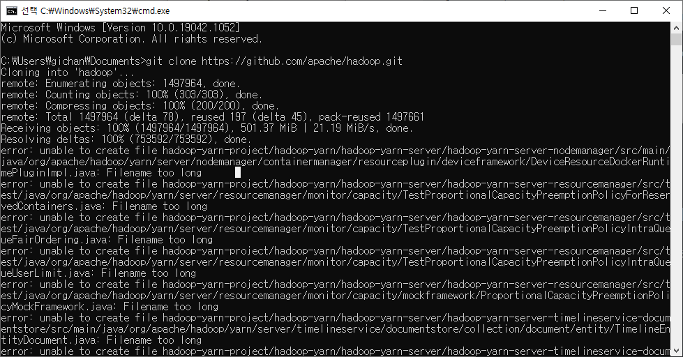

  * 윈도우 API의 파일경로길이 제한이 260자라서 발생한 문제
  * `git config --system core.longpaths true` 로 git 설정을 바꿔서 해결

* 도커로 의존성 설치 과정

  * 2400초(40분) 걸림

  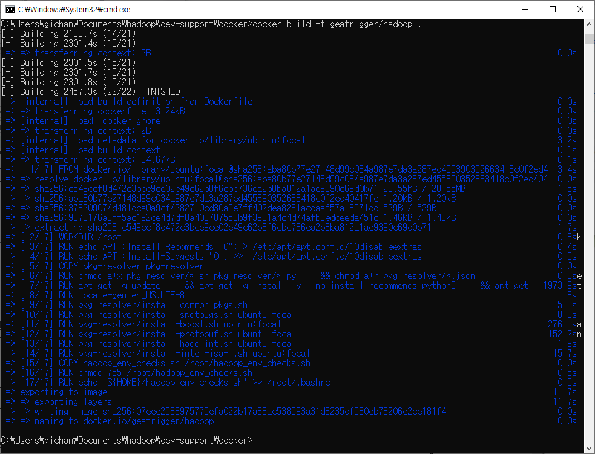

* 하둡파일 추가 후 다시 빌드

  * 캐시된 기록 덕에 빌드 시간 단축

    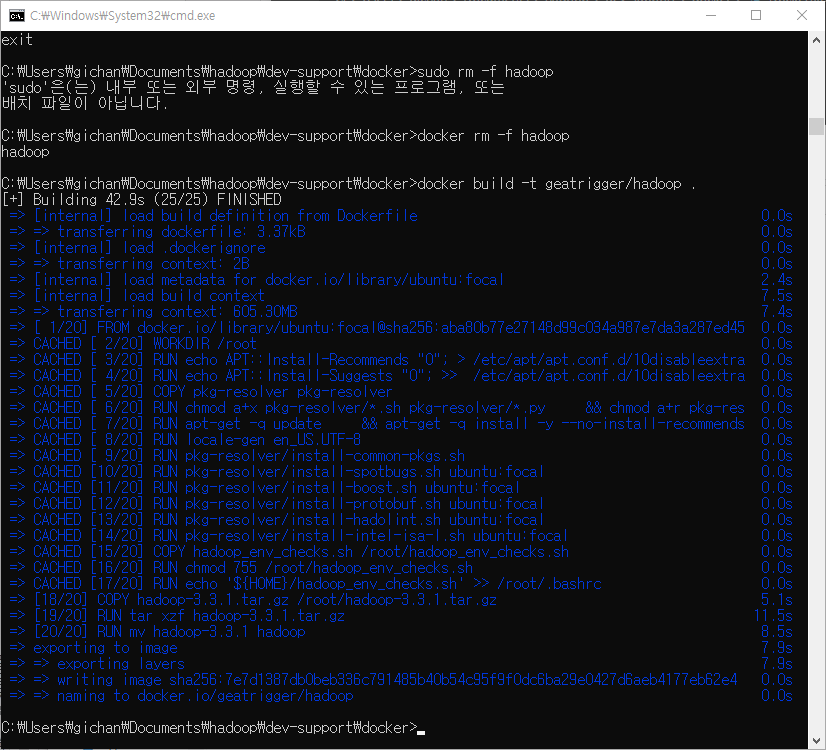

# 하다가 중간에 포기한 세팅방법

* 필요했던 작업들

  * HADOOP_HOME, JAVA_HOME 환경변수 지정

  * `$HADOOP_HOME/etc/hadoop/hadoop-env.sh`에 필요한 환경변수 지정

    ```shell
    export JAVA_HOME=/usr/lib/jvm/java-8-openjdk-amd64
    export HDFS_NAMENODE_USER=root
    export HDFS_DATANODE_USER=root
    export HDFS_SECONDARYNAMENODE_USER=root
    export YARN_RESOURCEMANAGER_USER=root
    export YARN_NODEMANAGER_USER=root
    ```

    

  * ssh  설치 및 localhost접속 가능하도록 세팅

    * https://stackoverflow.com/questions/24319662/from-inside-of-a-docker-container-how-do-i-connect-to-the-localhost-of-the-mach

    * docker는 기본적으로 network값이 bridge로 docker0라는 이름의 bridge를 만든다

    * .network값을 host로 바꾸면 docker container안에서 localhost는 docker host를 지칭하게 된다

    * `docker run -p 22:22 --network="host" --name=hadoop -it geatrigger/hadoop`

    * ssh

      ```shell
      ssh-keygen -t rsa -P '' -f ~/.ssh/id_rsa
      cat ~/.ssh/id_rsa.pub >> ~/.ssh/authorized_keys
      chmod 0600 ~/.ssh/authorized_keys
      # ssh 서비스 시작
      /etc/init.d/ssh start
      ```
    * 하둡 single node cluster실행, 중단

      ```shell
      $HADOOP_HOME/sbin/start-dfs.sh
      $HADOOP_HOME/sbin/start-yarn.sh
      # verify whether all the Hadoop related processes are running or not.
      jps
      $HADOOP_HOME/sbin/stop-dfs.sh
      $HADOOP_HOME/sbin/stop-yarn.sh
      ```

​      

# 새로 찾은 세팅 방법

* 파일들 위치

  * base/pkg-resolver, base/Dockerfile, base/hadoop_env_checks.sh는 https://github.com/apache/hadoop/tree/rel/release-3.3.1 파일로 시작

  * hadoop-3.3.1.tar.gz는 미러사이트에서 다운로드(너무 커서 깃에는 안올림)

    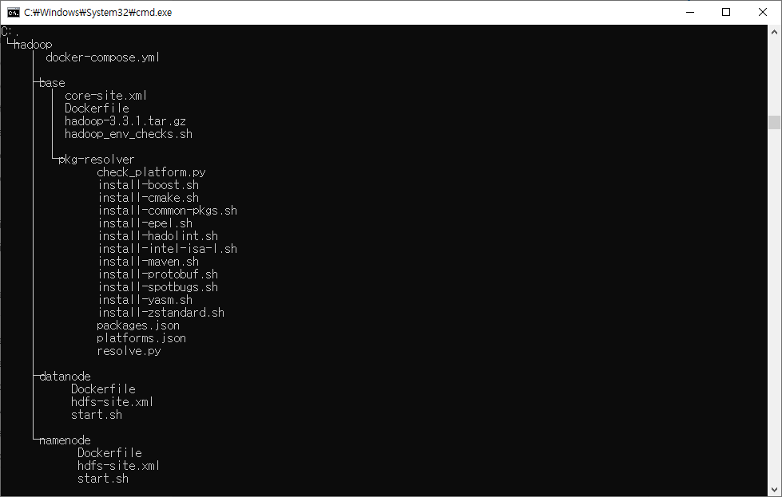

* 필요했던 작업들

  * https://github.com/apache/hadoop/tree/rel/release-3.3.1 에서 /dev-support/docker에 있는 Dockerfile로 시작

  * hadoop-base이미지를 만들어 HADOOP_HOME 환경변수 지정(JAVA_HOME는 이미 지정되어 있었음)

  * 다운받은 미러 파일을 이미지 내로 옮기고 이름을 hadoop으로 바꿈

  * `docker build -t hadoop-base:3.3.1 .`로 빌드

  * configuration파일인 core-site.xml 작성후 이미지에 추가

    ```dockerfile
    COPY hadoop-3.3.1.tar.gz /root/hadoop-3.3.1.tar.gz
    RUN tar xzf hadoop-3.3.1.tar.gz
    RUN mv hadoop-3.3.1 hadoop
    ENV HADOOP_HOME /root/hadoop
    ADD core-site.xml ${HADOOP_HOME}/etc/hadoop/
    ```

    ```xml
    <?xml version="1.0" encoding="UTF-8"?>
    <?xml-stylesheet type="text/xsl" href="configuration.xsl"?>
    <configuration>
      <property>
        <name>fs.defaultFS</name>
        <value>hdfs://namenode:9000/</value>
        <description>NameNode URI</description>
      </property>  
    </configuration>
    ```

  * hadoop-base이미지를 바탕으로 hadoop-namenode, hadoop-datanode 이미지 생성

    * 지속적인 healthcheck를 통해 해당 노드가 살아있는지 죽어있는지 확인

    * configuration파일인 hdfs-site.xml 작성후 이미지에 추가

    * 주의사항 : 2버전과 3버전에서 포트번호가 달라졌기 때문에 2버전 튜토리얼 보고 따라할 때 포트번호 바꿔야 했음(이전에는 Hadoop 기본 서비스들의 default port가 리눅스 임시 포트 범위(32768 - 61000)에 있어서 종종 다른 응용프로그램의 포트들과 충돌로 인해 서비스 포트 바인딩이 실패하는 경우가 있어서 번호를 바꿔줌)

      * Namenode : 50407 → 9871, 50070 → 9870, 8020 → 9820
      * Secondary NN : 50091 → 9869, 50090 → 9868
      * DataNode : 50020 → 9867, 50010 → 9866, 50475 → 9865, 50075 → 9864 

    * hadoop-namenode

      * namenode를 만들기 위한 이미지

      * 네임스페이스 디렉토리 포맷 필요

      * 블록 사이즈는 10M로 지정(기본값은 128M)

      * `docker build -t hadoop-namenode:3.3.1 .`로 빌드

        ```dockerfile
        FROM hadoop-base:3.3.1
        # NameNode Web UI 응답 여부를 통해 Healthcheck
        HEALTHCHECK --interval=30s --timeout=30s --start-period=5s --retries=3 CMD curl -f http://localhost:9870/ || exit 1
        
        WORKDIR /root
        # 설정 파일 복제
        ADD hdfs-site.xml ${HADOOP_HOME}/etc/hadoop/
        
        # FsImage, EditLog 파일 경로를 volume으로 연결
        RUN mkdir ${HADOOP_HOME}/dfs
        RUN mkdir ${HADOOP_HOME}/dfs/name
        VOLUME ${HADOOP_HOME}/dfs/name
        
        # 실행 스크립트 복제
        ADD start.sh /root/start.sh
        RUN chmod a+x /root/start.sh
        
        # NameNode의 HTTP, IPC 포트 노출
        EXPOSE 9870 9000
        
        # 시작 명령어 등록
        CMD ["/root/start.sh", "${HADOOP_HOME}/dfs/name"]
        ```

        ```shell
        #!/bin/bash
        
        # 네임스페이스 디렉토리를 입력받아서 
        NAME_DIR=$1
        echo $NAME_DIR
        
        # 비어있지 않다면 이미 포맷된 것이므로 건너뛰고
        if [ "$(ls -A $NAME_DIR)" ]; then
          echo "NameNode is already formatted."
        # 비어있다면 포맷을 진행
        else
          echo "Format NameNode."
          $HADOOP_HOME/bin/hdfs --config $HADOOP_HOME/etc/hadoop namenode -format
        fi
        
        # NameNode 기동
        $HADOOP_HOME/bin/hdfs --config $HADOOP_HOME/etc/hadoop namenode
        ```

        ```xml
        <?xml version="1.0" encoding="UTF-8"?>
        <?xml-stylesheet type="text/xsl" href="configuration.xsl"?>
        <configuration>
          <property>
            <name>dfs.namenode.name.dir</name>
            <value>file:///root/hadoop/dfs/name</value>
          </property>
          <property>
            <name>dfs.blocksize</name>
            <value>10485760</value>
          </property>
          <property>
            <name>dfs.client.use.datanode.hostname</name>
            <value>true</value>
          </property>
          <property>
            <name>dfs.namenode.rpc-bind-host</name>
            <value>0.0.0.0</value>
          </property>
          <property>
            <name>dfs.namenode.servicerpc-bind-host</name>
            <value>0.0.0.0</value>
          </property>
          <property>
            <name>dfs.namenode.http-bind-host</name>
            <value>0.0.0.0</value>
          </property>
          <property>
            <name>dfs.namenode.https-bind-host</name>
            <value>0.0.0.0</value>
          </property>
        </configuration>
        ```

        

    * hadoop-datanode

      * datanode를 만들기 위한 이미지

      * 블록 사이즈는 10M로 지정(기본값은 128M)

      * `docker build -t hadoop-datanode:3.3.1 .`로 빌드

        ```dockerfile
        FROM hadoop-base:3.3.1
        
        # DataNode Web UI 응답 여부를 통해 Healthcheck
        HEALTHCHECK --interval=30s --timeout=30s --start-period=5s --retries=3  CMD curl -f http://localhost:9864/ || exit 1
        
        RUN mkdir ${HADOOP_HOME}/dfs
        RUN mkdir ${HADOOP_HOME}/dfs/data
        VOLUME ${HADOOP_HOME}/dfs/data
        
        ADD start.sh /root/start.sh
        RUN chmod a+x /root/start.sh
        
        # WebUI, 데이터전송
        EXPOSE 9864 9866
        
        CMD ["/root/start.sh"]
        ```

        ```shell
        #!/bin/sh
        
        $HADOOP_HOME/bin/hdfs --config $HADOOP_HOME/etc/hadoop datanode
        ```

        ```xml
        <configuration>
          <property>
            <name>dfs.datanode.data.dir</name>
            <value>file:///root/hadoop/dfs/data</value>
          </property>
          <property>
            <name>dfs.blocksize</name>
            <value>10485760</value>
          </property>  
          <property>
            <name>dfs.datanode.use.datanode.hostname</name>
            <value>true</value>
          </property>
        </configuration>
        ```

        

  * docker-compose 작성

    * namenode와 datanode 여러개를 한 번에 실행시키기 위한 파일

    * 새로운 문법 : &datanode_base한 다음 *datanode_base로 공통된 속성은 미리 정의해서 사용

    * 주의 : docker-compose 입장에선 환경변수 ${HADOOP_HOME}을 몰라서 해당 주소인 '/root/hadoop/'을 직접 쳐야 한다

      ```yaml
      version: "3.4"
      
      # 이미지와 네트워크 정보에 대한 base service를 지정
      x-datanode_base: &datanode_base
        image: hadoop-datanode:3.3.1
        networks:
          - bridge
      
      services:
        namenode:
          image: hadoop-namenode:3.3.1
          container_name: namenode
          hostname: namenode
          ports:
            - "9870:9870"
            - "9000:9000"
          volumes:
            - namenode:/root/hadoop/dfs/name
            - /tmp:/tmp
          networks:
            - bridge
        
        datanode01:
          <<: *datanode_base
          container_name: datanode01
          hostname: datanode01
          volumes:
            - datanode01:/root/hadoop/dfs/data
        
        datanode02:
          <<: *datanode_base
          container_name: datanode02
          hostname: datanode02
          volumes:
            - datanode02:/root/hadoop/dfs/data
      
        datanode03:
          <<: *datanode_base
          container_name: datanode03
          hostname: datanode03
          volumes:
            - datanode03:/root/hadoop/dfs/data
      volumes:
        namenode:
        datanode01:
        datanode02:
        datanode03:
      
      networks:
        bridge:
      ```

      

# HDFS 파일 생성, 삭제

* 용량 작은 파일도 무조건 1개의 블록(여기서는 설정기본값 10M)을 차지한다(단, 0B파일은 블록을 0개 차지)

  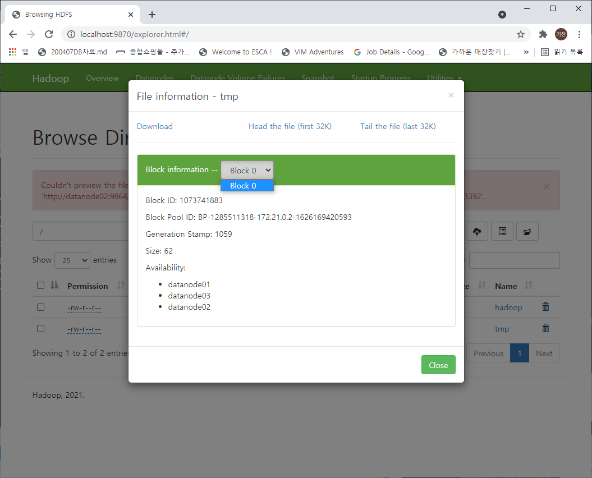

* 용량 큰 파일은 최소한의 블록개수 필요(577.15MB는 0~57번까지 58개)

  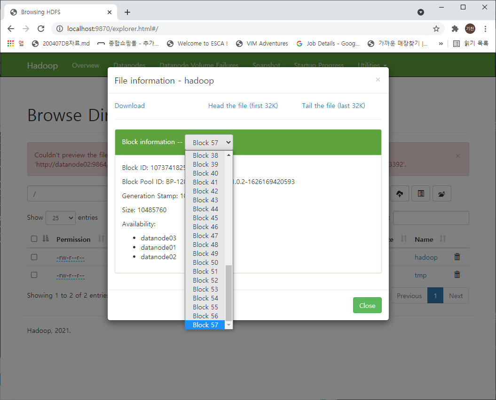

* 코드

  * https://analytics4everything.tistory.com/122

```shell
# 하둡압축파일 업로드
${HADOOP_HOME}/bin/hdfs dfs -put hadoop-3.3.1.tar.gz /hadoop
# tmp 파일 업로드하고 삭제하기
# 삭제연산은 hdfs 특성상 느리다
${HADOOP_HOME}/bin/hdfs dfs -put tmp.txt /tmp
${HADOOP_HOME}/bin/hdfs dfs -rm -R /tmp
# 그외
$ hdfs dfs -mkdir -p /user/nova
$ hdfs dfs -mkdir arline
$ hdfs dfs -ls /user/nova
$ hdfs dfs -put 2008.csv airline/
$ hdfs dfs -get airline/2008.csv  : 다운로드
$ hdfs dfs -cat ariline/2088.csv : 700MB다 읽음
$ hdfs dfs -cat ariline/2088.csv |  head -5 : 앞에 5줄 ('|' 앞에 실행한 결과를 뒤에 이어서 5개 줄 더 보여준다)
$ hdfs dfs -cat ariline/2088.csv |  tail -5 : 하위 5줄 ('|' 앞에 실행한 결과를 뒤에 이어서 5개 줄 더 보여준다)
$ hdfs dfs -tail ariline/2008.csv  : 1000자만 보여줌
$ dhfs dfs -setrep 1 ariline/2008.csv : 복제가 1개밖에없다
$ dhfs dfs -setrep 5 ariline/2008.csv : 데이터노드가 3개이지면 5개로 하라고하면, 실행은되지만 3개까지만..됨.
```

 * 웹을 통해서 삭제하려면?

    * 권한문제로 삭제, 업로드, preview 모두 불가

      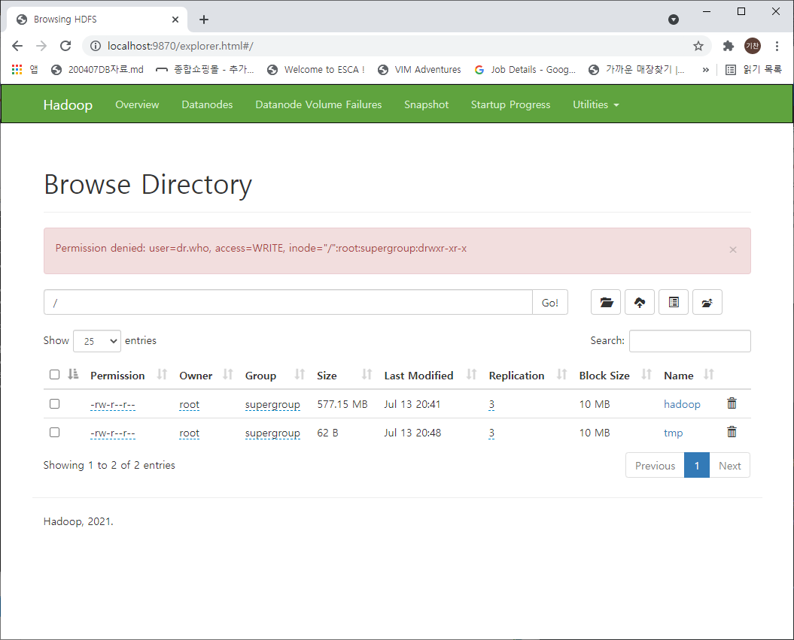

* datanode가 4개이고, 복제본을 3개(기본값) 저장할 때 577.15 MB파일 올릴 때 상황

  * 총 사용량 약1.5GB, 174블록

  * datanode가 3개일 때와 동일하다

  * 다만 4개인 경우 모든 노드가 동일한 블록 개수를 차지하진 않는다

    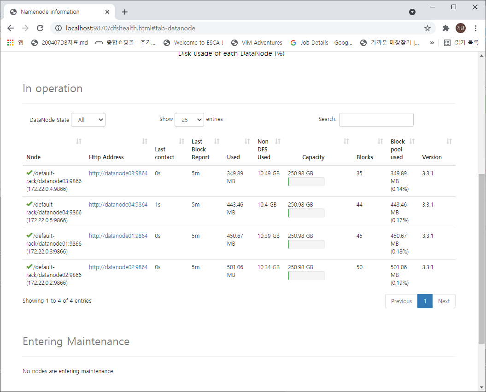

* datanode 4개 중 datanode04 컨테이너를 강제 종료하였을 때

  * https://cyberx.tistory.com/152

  * 초반에는 새로고침해도 달라지는 것이 없다

  * 일정시간이 지나면 Dead로 판단하고, Replication 설정수(3개)만큼 다른 DataNode로 복제가 이루어 진다

  * 다시 datanode04 컨테이너를 띄우면, 원래 있던 데이터 블록이 잠깐 떴다가 지워진다(3개만 유지해야 하므로)

    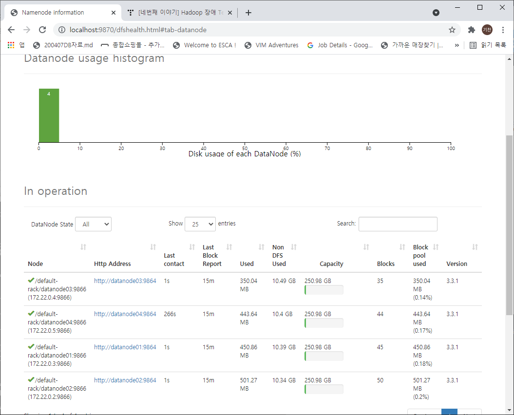

    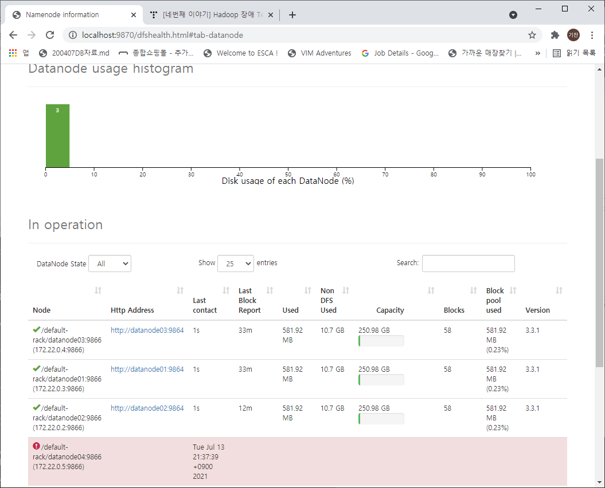

    