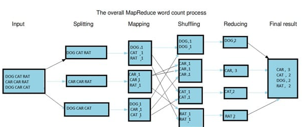
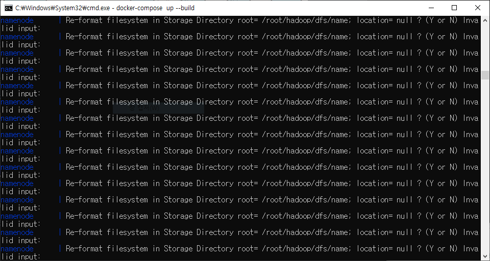
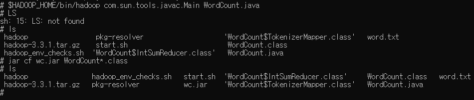
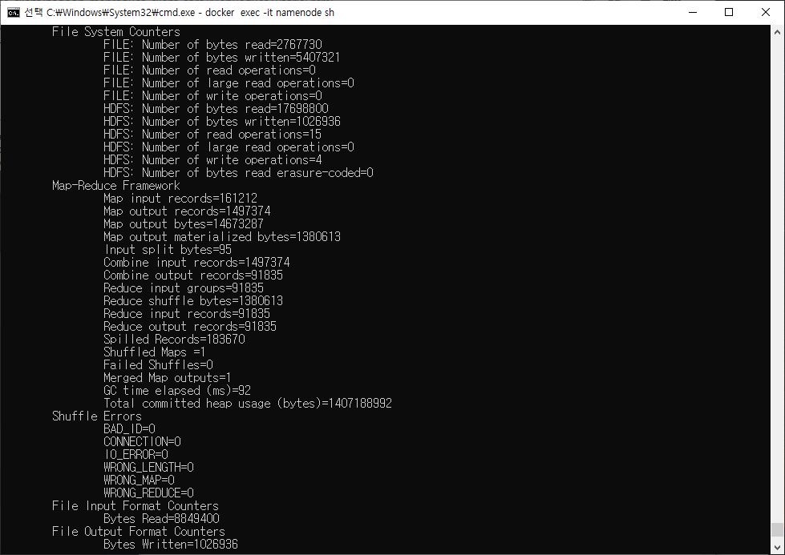
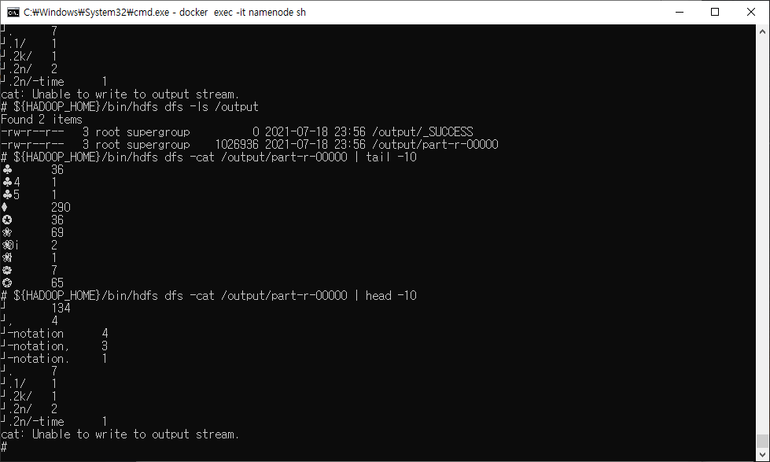
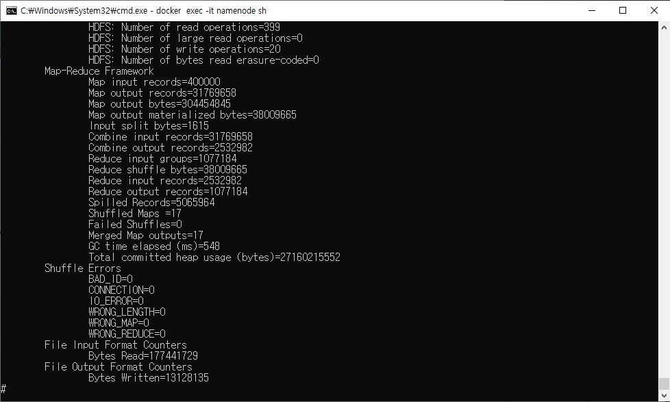

# MapReduce 원리

* 병렬 프로그래밍으로 클러스터 내에서 분산 처리를 도와줌

* 분할 정복 방식으로 작동

* word count 프로세스 작동 예시

  

  * Splitting : 문자열 데이터를 라인별로 나눔
  * Mapping :  Key-Value 짝을 맺어 출력
  * Shuffling : 같은 Key를 가지는 데이터끼리 분류
  * Reducing: 각 Key별로 빈도수를 합산해서 출력
  * Final Result : 출력 데이터를 합쳐서 하둡 파일시스템에 저장

# 문제발생

* 잘실행되던 namenode가 format하는 부분에서 이상이 생김

  

* 일단 format하는 명령어만 지우고 임시로 해결

# WordCount 예제 실행하기

* https://hadoop.apache.org/docs/r3.3.1/hadoop-mapreduce-client/hadoop-mapreduce-client-core/MapReduceTutorial.html

* 먼저 namenode dockerfile에 파일추가

  * input으로 들어갈 word.txt
    * computer architecture, database, algorithm pdf 에 있는 텍스트 긁어모아 저장
  * WordCount.java

* namenode에서 환경설정

  * JAVA_HOME, PATH, HADOOP_CLASSPATH 설정(앞의 두개는 이미 세팅되어서 classpath만 설정하면됨)

    ```shell
    export HADOOP_CLASSPATH=${JAVA_HOME}/lib/tools.jar
    ```

* WordCount.java

  ```java
  import java.io.IOException;
  import java.util.StringTokenizer;
  import org.apache.hadoop.conf.Configuration;
  import org.apache.hadoop.fs.Path;
  import org.apache.hadoop.io.IntWritable;
  import org.apache.hadoop.io.Text;
  import org.apache.hadoop.mapreduce.Job;
  import org.apache.hadoop.mapreduce.Mapper;
  import org.apache.hadoop.mapreduce.Reducer;
  import org.apache.hadoop.mapreduce.lib.input.FileInputFormat;
  import org.apache.hadoop.mapreduce.lib.output.FileOutputFormat;

  public class WordCount {

    public static class TokenizerMapper
         extends Mapper<Object, Text, Text, IntWritable>{
      
      private final static IntWritable one = new IntWritable(1);
      private Text word = new Text();
      
      public void map(Object key, Text value, Context context
                      ) throws IOException, InterruptedException {
        StringTokenizer itr = new StringTokenizer(value.toString());
        while (itr.hasMoreTokens()) {
          word.set(itr.nextToken());
          context.write(word, one);
        }
      }
    }
      
    public static class IntSumReducer
         extends Reducer<Text,IntWritable,Text,IntWritable> {
      private IntWritable result = new IntWritable();
      
      public void reduce(Text key, Iterable<IntWritable> values,
                         Context context
                         ) throws IOException, InterruptedException {
        int sum = 0;
        for (IntWritable val : values) {
          sum += val.get();
        }
        result.set(sum);
        context.write(key, result);
      }
    }
      
    public static void main(String[] args) throws Exception {
      Configuration conf = new Configuration();
      Job job = Job.getInstance(conf, "word count");
      job.setJarByClass(WordCount.class);
      job.setMapperClass(TokenizerMapper.class);
      job.setCombinerClass(IntSumReducer.class);
      job.setReducerClass(IntSumReducer.class);
      job.setOutputKeyClass(Text.class);
      job.setOutputValueClass(IntWritable.class);
      FileInputFormat.addInputPath(job, new Path(args[0]));
      FileOutputFormat.setOutputPath(job, new Path(args[1]));
      System.exit(job.waitForCompletion(true) ? 0 : 1);
    }
  }
  ```
  
  
  
* 컴파일

  ```shell
  $HADOOP_HOME/bin/hadoop com.sun.tools.javac.Main WordCount.java
  jar cf wc.jar WordCount*.class
  ```

  

* input파일 넣기

  * word.txt를 input.txt로 hdfs에 넣기

    ```shell
    ${HADOOP_HOME}/bin/hdfs dfs -put word.txt /input.txt
    ${HADOOP_HOME}/bin/hdfs dfs -ls /
    # output.txt 삭제
    ${HADOOP_HOME}/bin/hdfs dfs -rm -R /output.txt
    ```

  * mapreduce 실행

    ```shell
    $HADOOP_HOME/bin/hadoop jar wc.jar WordCount /input.txt /output
    ```

    

  * 확인

    ```shell
    ${HADOOP_HOME}/bin/hdfs dfs -ls /output
    ${HADOOP_HOME}/bin/hdfs dfs -cat /output/part-r-00000 | tail -10
    ${HADOOP_HOME}/bin/hdfs dfs -cat /output/part-r-00000 | head -10
    ```

    

# 더 큰 파일로 word count

* 더 큰 파일 large_word.txt를 준비하고 위의 과정 반복

* 중간에 생긴 문제

  * `docker-compose up`하고 나서 namenode가 safe모드라 기존 파일 삭제 불가능

    ```shell
    # safe mode를 off
    ${HADOOP_HOME}/bin/hdfs dfsadmin -safemode leave
    ```

* 기존 파일 삭제

  ```shell
  ${HADOOP_HOME}/bin/hdfs dfs -rm -R /input.txt
  ${HADOOP_HOME}/bin/hdfs dfs -rm -R /output
  ```

* 결과

  * 17개의 블록으로 이루어진 파일이라 map과정도 17번 시행

    