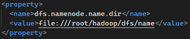

# Hadoop 3.3.1의 전체 특징

* https://hadoop.apache.org/docs/r3.3.1/index.html

* HDFS에서 erasure coding 지원

  * https://joonyon.tistory.com/67

  * 기존 장애허용성을 위해 replication으로 3x의 overhead가 들었는데, erasure coding을 사용하면 1.5x의 overhead만으로 똑같은 수준의 장애허용성을 가지게 할 수 있다(기본 EC policy인 RS(6, 3) 기준, 6개의 data block과 3개의 parity block)

  * decode하는 과정이 필요하기 때문에 replication하는 것보다는 읽기가 느리다

  * 일부 실행불가능한 HDFS operation들이 생긴다

    * hflush, hsync, concat, setReplication, truncate, append

  * policy들의 명명방법

    * *codec*-*num data blocks*-*num parity blocks*-*cell size*
    * built-in policies : RS-3-2-1024k, RS-6-3-1024k, RS-10-4-1024k, RS-LEGACY-6-3-1024k, XOR-2-1-1024k
    * intel의 경우 자체적으로 제공하는 ISA-L이 있어서 RS, XOR codec을 실행할 때 더 나은 퍼포먼스를 보여준다(RS-LEGACY는 불가능). intel이 아닌 다른 프로세서에서 실행할 때는 pure Java로 실행해야만 한다

  * ec 세팅하는 법

    * 기본적으로 erasure coding policies는 disabled
    * node-level fault-tolerance를 지키기 위해서 해당 ec policy에 대해 data block수+parity block수보다 data node가 많은지 확인(ex RS-6-3-1024k의 경우 6+3=9)
    * rack fault-tolerance를 지키고 싶다면, 해당 ec policy에 대해 (data blocks + parity blocks) / parity blocks개 이상의 rack이 있는지 확인(ex RS-6-3-1024k의 경우 (6+3)/3=3)
    * policy지정

    ```shell
    # 디폴트 policy지정
    hdfs ec -enablePolicy -policy <policyName>
    # 특정 디렉토리에 policy지정
    hdfs ec -setPolicy -path <path> [-policy <policyName>] [-replicate]
    # 특정 디렉토리의 policy파악하기
    hdfs ec -getPolicy -path <path>
    ```

* Shaded client jars

  * 기존 2버전에서 Hadoop transitive dependency들이 Hadoop application’s classpath에 새어나가는 것을 막았다
  
* 그 외

  * Java 버전 최소사항이 Java7에서 Java8로 증가
  * YARN Timeline Service v2(alpha버전) 제공
    * Timeline의 scalability와 reliability 상승, flow와 aggregation을 소개하여 사용성 향상
  * 기존에 있던 버그있는 shell sript 대폭 수정
  * Support for Opportunistic Containers and Distributed Scheduling
  * MapReduce의 task level에서의 최적화
  * Support for more than 2 NameNodes
  * 기본 포트번호 변화
    * 기존 하둡 서비스들의 기본포트가 Linux ephemeral port range(32768-61000)에 있어서 종종 서비스가 다른 어플리케이션과의 충돌로 인해 port binding에 실패하여 다른 포트번호로 바꿈
  * Microsoft Azure Data Lake와 Aliyun Object Storage System와 같은 filesystem과 통합 가능
  * Intra-datanode balancer
    * 기존에는 add, replace작업을 하면 intra-datanode(하나의 데이터 노드 내에서)단계에서 skew가 일어남
    * hdfs diskbalancer를 통해 intra-datanode balacer를 실행시킬 수 있게 됨
  * Reworked daemon and task heap management
  * S3Guard: Consistency and Metadata Caching for the S3A filesystem client
  * HDFS Router-Based Federation
  * API-based configuration of Capacity Scheduler queue configuration
  * YARN Resource Types

# Single node setup

* 의존성 설치

  * Java
  * ssh
  * pdsh(필수는 아님)

* Dockerfile에 환경변수 등록

  ```dockerfile
  # 기존에 있던 환경변수
  ENV HADOOP_HOME /root/hadoop
  # 새로 등록한 환경변수
  # PATH 업데이트하여 ${HADOOP_HOME}/bin를 입력안해도 hdfs, hadoop을 실행가능하게 함
  # {}안넣으면 인식 안됨
  ENV HADOOP_CLASSPATH="${JAVA_HOME}/lib/tools.jar"
  ENV PATH="${HADOOP_HOME}/bin:${PATH}"
  ```

* grep example

  ```shell
  hdfs dfs -rm -R /output
  hdfs dfs -mkdir /input
  # input으로 들어갈 파일들
  hdfs dfs -copyFromLocal $HADOOP_HOME/etc/hadoop/*.xml /input
  # input, output은 반드시 /input, /output이라 써야함
  hadoop jar $HADOOP_HOME/share/hadoop/mapreduce/hadoop-mapreduce-examples-3.3.1.jar grep /input /output 'dfs[a-z.]+'
  # 내용파악
  hdfs dfs -cat /output/part-r-00000 | head -10
  ```

# Cluster setup

* https://hadoop.apache.org/docs/r3.3.1/hadoop-project-dist/hadoop-common/ClusterSetup.html
* 설치시 참고사항
  * 모든 machine에 hadoop software가 설치되어야 한다
  * 주로 NameNode, ResourceManager는 다른 machine위에서 돌아가고 이를 통틀어 masters라고 부른다
  * 그 외의 다른 서비스들(Web App Proxy Server, MapReduce Job History Server등)은 전용 하드웨어나 공용 하드웨어 위에서 사용한다
  * DataNode와 NodeManager는 workers라고 부른다

* 하둡 daemon의 환경설정

  * 뼈대만 있는 쉘 스크립트 용도에 맞게 수정하여 사용

  * etc/hadoop/hadoop-env

    | NameNode                      | HDFS_NAMENODE_OPTS          |
    | ----------------------------- | --------------------------- |
    | DataNode                      | HDFS_DATANODE_OPTS          |
    | Secondary NameNode            | HDFS_SECONDARYNAMENODE_OPTS |
    | ResourceManager               | YARN_RESOURCEMANAGER_OPTS   |
    | NodeManager                   | YARN_NODEMANAGER_OPTS       |
    | WebAppProxy                   | YARN_PROXYSERVER_OPTS       |
    | Map Reduce Job History Server | MAPRED_HISTORYSERVER_OPTS   |

  * etc/hadoop/mapred-env.sh

  * etc/hadoop/yarn-env.sh

* 하둡 daemon의 설정

  * etc/hadoop/core-site.xml
    
    * 기본 설정
      
    * fs.defaultFS
    
      * 기본 파일시스템 설정
    
      * NameNode URI를 넣음
    
        
    
    * io.file.buffer.size
    
  * etc/hadoop/hdfs-site.xml(NameNode)
  
    * dfs.namenode.name.dir
  
      * namespace와 transation log들이 저장되는 local filesystem에서의 경로지정
  
      * comma로 구분되어 여러 경로값을 넣어주면 여러 곳에 복제가되어 저장된다
  
        
  
    * dfs.hosts / dfs.hosts.exclude
  
      * 허가하거나 제외할 DataNode설정
  
    * dfs.blocksize
  
      * HDFS blocksize지정
  
      * 보통은 128MB이지만 여기선 원리파악을 위해 10MB단위로 설정
  
        
  
    * dfs.namenode.handler.count
  
      * 데이터노드가 많을 때, RPC를 처리하기 위해 NameNode server thread 수를 지정할 수 있는 설정
  
  * etc/hadoop/hdfs-site.xml(DataNode)
  
    * dfs.datanode.data.dir
  
      * block들을 실제로 저장하는 local filesystem에서의 경로지정
  
      * comma로 구분되어 여러 경로값을 넣어주면 여러 곳에 복제가되어 저장된다
  
        
  
  * etc/hadoop/yarn-site.xml(ResourceManager and NodeManager)
  
    * yarn.acl.enable
    * yarn.admin.acl
    * yarn.log-aggregation-enable
  
  * etc/hadoop/yarn-site.xml(ResourceManager)
  
    * yarn.resourcemanager.address
      * client가 job을 제출하는 URI(host:port)
    * yarn.resourcemanager.scheduler.address
      * ApplicationMaster들이 자원을 Scheduler에게 요청하는 URI(host:port)
    * yarn.resourcemanager.resource-tracker.address
      * NodeManager의 URI(host:port)
    * yarn.resourcemanager.webapp.address
      * web-ui의 URI(host:port)
    * yarn.resourcemanager.hostname
      * ResourceManager host이름
      * 모든 yarn.resourcemanager주소에 사용됨
    * yarn.resourcemanager.scheduler.class
      * Scheduler class
      * 예시
        * org.apache.hadoop.yarn.server.resourcemanager.scheduler.fair.FairScheduler
    * yarn.scheduler.minimum-allocation-mb, yarn.scheduler.maximum-allocation-mb
      * 각각의 컨테이너에 할당할 수 있는 최소/최대 메모리제한(MB단위)
    * yarn.resourcemanager.nodes.include-path / yarn.resourcemanager.nodes.exclude-path
      * 허가하거나 제외할 NodeManger 설정
  
  * etc/hadoop/yarn-site.xml(NodeManager)
  
    * yarn.nodemanager.resource.memory-mb
      * NodeManager가 사용가능한 총 메모리양 정의
    * yarn.nodemanager.vmem-pmem-ratio
      * virtual memory가 physical memory를 초과하여서 쓸 때, 최대비율 설정
    * yarn.nodemanager.local-dirs
      * 작업 중간에 생기는 데이터를 저장하는 곳
      * 여러 경로가 있으면 disk I/O를 골고루 쓸 수 있는 이점이 있음
    * yarn.nodemanager.log-dirs
      * log저장 경로
      * 여러 경로가 있으면 disk I/O를 골고루 쓸 수 있는 이점이 있음
    * yarn.nodemanager.log.retain-seconds
      * 로그집계가 불가능할 때, NodeManager에서 log 파일들을 유지할 수 있는 시간 설정(초)
    * yarn.nodemanager.remote-app-log-dir
      * 로그집계가 가능할 때, application이 끝나고 log가 보관되는 원격 HDFS directory설정
      * /logs
    * yarn.nodemanager.remote-app-log-dir-suffix
      * 로그집계가 가능할 때, 원격 log directory에 붙는 접미사
    * yarn.nodemanager.aux-services
      * Map Reduce application들에 필요한 shuffle service 설정
    * yarn.nodemanager.env-whitelist
      * NodeManager에서 컨테이너가 상속할 환경 변수 설정
  
  * etc/hadoop/mapred-site.xml(MapReduce Application)
  
    * mapreduce.framework.name
      * 실행 프레임워크 설정
      * yarn으로 설정시 hadoop YARN사용
    * mapreduce.map.memory.mb
      * map들의 리소스 사용 제한값 설정
      * 1536
    * mapreduce.map.java.opts
      * map들의 자식 jvm들의 heap-size 설정
      * -Xmx1024M
    * mapreduce.reduce.memory.mb
      * reduce들의 리소스 사용 제한값 설정
      * 3072
    * mapreduce.reduce.java.opts
      *  reduce들의 자식 jvm들의 heap-size 설정
      * -Xmx2560M
    * mapreduce.task.io.sort.mb
      * 정렬 때 효율을 위해 설정해놓는 최대 메모리 사용량 설정
      * 512
    * mapreduce.task.io.sort.factor
      * 파일들을 정렬할 때 한번에 병합하는 stream수
      * 100
    * mapreduce.reduce.shuffle.parallelcopies
      * reduce들에 의해 실행되고, 많은 map들을 fetch하기 위해 실행되는 병렬 복제본의 개수
      * 50
  
  * etc/hadoop/mapred-site.xml(MapReduce JobHistory Server)
  
    * mapreduce.jobhistory.address
      * MapReduce JobHistory Server URI(host:port)
    * mapreduce.jobhistory.webapp.address
      * MapReduce JobHistory Server Web UI  URI(host:port)
    * mapreduce.jobhistory.intermediate-done-dir
      * MapReduce job history 파일들 위치
      * /mr-history/tmp
    * mapreduce.jobhistory.done-dir
      * JobHistory Server가 관리하는 history 파일들 위치
      * /mr-history/done
  
  * etc/hadoop/yarn-site.xml(NodeManager)
  
    * yarn.nodemanager.health-checker.script.path
      * Node health script 위치
    * yarn.nodemanager.health-checker.script.opts
      * Node health script options
    * yarn.nodemanager.health-checker.interval-ms
      * Node health script 신호간격
    * yarn.nodemanager.health-checker.script.timeout-ms
      * Node health script 신호간격 마지노선
  
* 설정들 요약

  * xml 형식으로 저장
  * log, namespace, block등을 저장할 경로를 적는 세팅이 많았음
  * 각 서비스와 통신할 host:port를 지정하는 세팅이 많았음
  * 분산 처리 시스템의 특성상 각각의 node manager, job history server에서 통합되기 전의 log위치, 통합된 후의 log위치 둘 다 지정해 줘야 한다
  * 메모리를 얼마나 할당하느냐라는 숫자 세팅도 있었음
  * Monitoring Health of NodeManagers
    * node가 healthy한지 확인하기 위해 NodeManager가 주기적으로 health check script를 실행시켜 상태가 안좋은 node를 발견하면(상태가 안좋은 disk의 개수가 일정개수 이상 등) ResourceManager가 해당 노드를 black-list화한다.
  * Slaves File
    * etc/hadoop/workers에 라인마다 worker hostname이나 IP주소를 쓰면, Helper script가 해당 host들에게 한꺼번에 명령을 실행시킬 수 있다.(단, passphraseless ssh, Kerberos등 ssh trust가 이미 갖춰져야한다)
  * Hadoop Rack Awareness
    * 하둡 컴포넌트들은 rack정보를 알면 성능면이나 안전면에서 네트워크의 장점을 활용할 수 있으므로 HDFS를 실행하기 전에 rack awareness를 설정하는 것이 좋다
  * Logging
    * logging framework로 Apache log4j를 사용하고 etc/hadoop/log4j.properties파일로 logging 설정을 할 수 있다
  * Cluster를 실행할 때 해당 설정 파일들을 모든 머신의 HADOOP_CONF_DIR 디렉토리에 배포한다

# 그동안 실행해왔던 것은

* NameNode와 DataNode는 있지만 ResoureManager, MapReduce JobHistory Server는 따로 세팅이 안되어 있음
  * yarn에 대해서 제대로 배워야 세팅가능할 듯

# HDFS

* https://hadoop.apache.org/docs/r3.3.1/hadoop-project-dist/hadoop-hdfs/HdfsDesign.html
* 