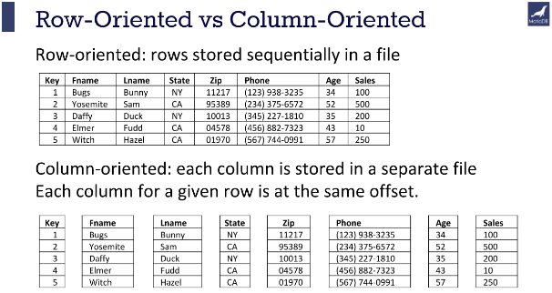

# Hadoop 중요한 특징들

* 하둡의 구성요소

  * NameNode

    * HDFS의 namespace관리(메타데이터 관리)
    * replication factor가 보관되어 있다

  * DataNode

    * NameNode가 지정해준 블록 저장, 삭제, 복제
    * 주기적으로 Heartbeat와 Blockreport를 NameNode에게 보낸다

    

* distcp

  * distcp의 용도

    * 대규모 inter/intra-cluster copy에 사용

      ```shell
      # a 폴더를 b 로 복사 
      $ hadoop distcp hdfs:///user/a hdfs:///user/b
      # 파일이름, 사이즈를 비교하여 변경 내역있는 파일만 이동 
      $ hadoop distcp -update hdfs:///user/a hdfs:///user/b
      # 목적지의 파일을 덮어씀 
      $ hadoop distcp -overwrite hdfs:///user/a hdfs:///user/b
      ```

  * hadoop fs -cp와 distcp의 차이

    * cp 명령어는 파일을 하나씩 복사하지만, distcp는 맵리듀스를 이용하여 대규모의 파일을 병렬로 복사

* FsImage와 EditLog

  * FsImage와 EditLog란
    * FsImage는 파일이름, 경로, block 개수, slave 정보 등 메타데이터들을 image 파일 형태로 저장한 것이고, namespace의 가장 마지막 checkpoint이다
    * EditLog는 마지막 checkpoint 이후로 namespace의 변화를 log로 저장한다
  * Secondary NameNode의 역할
    * NameNode가 시작할 때 FsImage를 통해 HDFS 상태를 읽어오고 EditLog들과 합치는데, EditLog들이 너무 많이 쌓이면 처음 실행이 매우 느려져서 fsimage와 edig log를 주기적으로 합치는 역할을 한다

* 복제과정
  * replication factor가 3일때 첫번째 replica는 write가 있는 곳 or writer와 같은 랙의 랜덤노드에, 두번째 replica는 writer와 다른 rack의 노드에, 세번째 replica는 두번째 replica와 같은 rack 다른 노드에 write한다
  * 이러한 전략은 replica를 모두 다른 rack에 두는 것보다 write하는 traffic을 줄여주면서, rack failure가 node failure보다 확률이 적어서 reliablilty에 영향 없음
  * replication factor가 3보다 큰 경우, 4번째 replica부터는 랜덤한 곳에 저장된다(단, 하나의 rack에는 최대 (replicas - 1) / racks + 2개의 replica가 존재할 수 있다)

* hadoop 3에서 바뀐 것
  * Erasure Coding
    * 패리티 블록을 사용하여  기존에 1G파일을 3G파일로 복제해서 저장할 때 갖는 안정성을 유지하면서 디스크를 덜 사용하게 되어 1G파일을 1.5G만 사용하여 저장이 가능해졌다
    * 3x replicated file환경에서는 6블록을 저장하려면 6*3블록을 차지하고, EC환경에서는 3개의 패리티블록이 필요하여 6+3블록을 차지한다
  * 기본포트 중 Linux ephemeral port 범위에 있어서 다른 실행 프로그램과 종종 충돌을 일으켰던 것을 그렇지 않은 범위로 바꿈
    * Namenode : 50407 → 9871, 50070 → 9870, 8020 → 9820
    * Secondary NN : 50091 → 9869, 50090 → 9868
    * DataNode : 50020 → 9867, 50010 → 9866, 50475 → 9865, 50075 → 9864 
  * YARN 타임라인 서비스 v2
  * 높은 장애허용성을 위해 2개 이상의 네임노드 지원
  * Intra-datanode balancer를 추가하여 DataNode안에서의 skew현상을 방지함(Inter datanode끼리의 데이터쏠림현상은 기존의 HDFS balancer가 해결)

* yarn의 구성요소(Resource Manager, Node Manager)

  * Resource Manager가 Node Manager로부터 정보를 전달받아 클러스터 전체의 자원 관리

  * Application Master와 Container

    * 애플리케이션 라이프 사이클 관리
    * 클라이언트가 Resource Manager에 애플리케이션을 제출하면, Resource Manager는 비어있는 노드에서 Application Master를 실행한다
    * Resource Manager는 Application Master에서 요청이오면 비어있는 자원을 사용할 수 있도록 처리
    * 자원을 할당받으면 각 노드에 Container로 실제 작업 진행
    * Container 작업이 종료되면 결과를 Application Master에게 알리고, Application Master는 모든 작업이 종료되면 Resource Manager에 알리고 자원을 해제한다

    

* Fair 스케줄러 특징

  * https://leeyh0216.github.io/posts/Fair_Scheduler/
  * Hierarchical한 각각의 큐에 weight를 부여하고 자원의 비중을 할당하는 스케줄러
  * minResources 이상 메모리를 써야하기 때문에 그것미만으로 메모리를 요구해도 minResource만큼 메모리를 써서 weight만큼 비중을 할당하지 않는 경우가 있다
  * queue들이 리소스를 보장받을 수 있도록 preemption값을 true로 하여 리소스를 뺏어오게 할 수 있다

* parquet

  * https://devidea.tistory.com/92

  * 전통적인 row기반 저장방식과 달리 column 데이터가 연속된 구조로 저장

  * 컬럼단위로 저장이 되어 I/O를 진행할 때 일부 컬럼들만 가져와서 빠른 읽기가 가능하다

  * 헤더에는 파케이 포맷의 파일임을 알려주는 4바이트 매직 숫자 PAR1만 포함

  * 꼬리말에는 모든 메타데이터 저장

  * 각 블록에는 행그룹이 저장되어 있고, 행그룹은 컬럼청크로 저장되어 있고, 각 컬럼청크는 페이지에 기록된다.

  * 같은 페이지는 동일한 컬럼값을 포함하고 있어 압축할 때 유리하다

    

