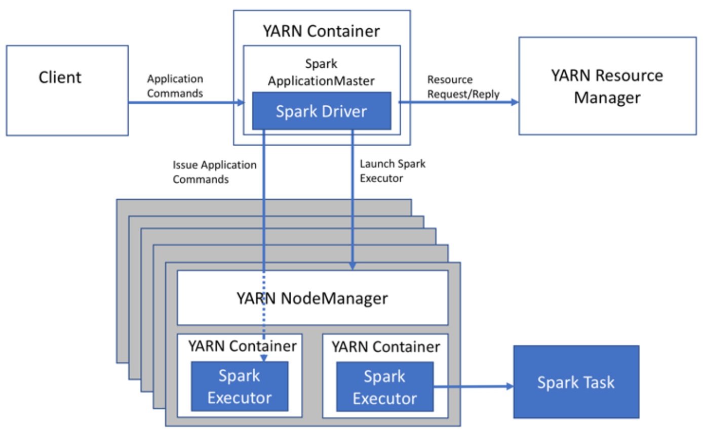
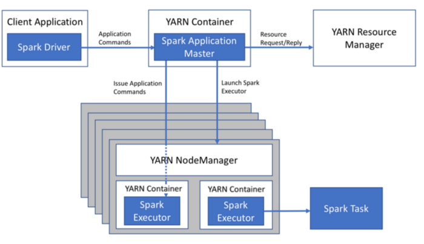
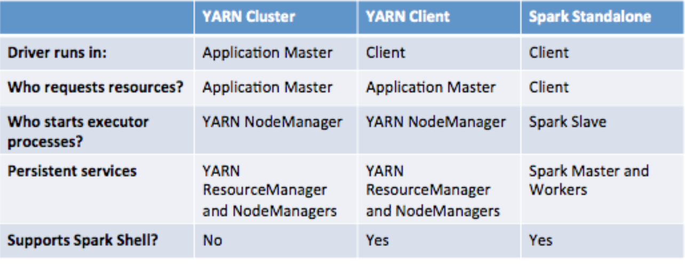

# 3주차 - Hadoop, Spark cluster 구성 및 yarn submit 실행 및 spark cluster 구동방식 비교

# 하둡 클러스터 구성

### java 설치

```bash
sudo apt update
sudo apt install openjdk-8-jdk openjdk-8-jre
java -version # 1.8.0 확인

#환경변수 추가
sudo vi /etc/profile
export JAVA_HOME=/usr/lib/jvm/java-8-openjdk-amd64
export JRE_HOME=/usr/lib/jvm/java-8-openjdk-amd64/jre
source /etc/profile
```

### 유닉스 사용자 계정 생성

동일한 컴퓨터에서 수행되는 다른 서비스와 하둡 프로세스를 구분하려면 하둡 전용 사용자 계정을 생성하는 것이 좋다.

  hdfs 는 자신을 실행시키는 계정에 superuser 권한을 준다.

```bash
useradd hadoop -G hadoop
```

(그러나 이번엔 ubuntu 로 그냥 해보기로 결정... 권한도 ubuntu 로 넣어줌)

### ssh 연결해주기

hadoop 은 node들에 대한 관리를 ssh 통신으로 날림

자기자신의 ssh 도 뚫어줘야함

1. client 서버

```bash
ssh-keygen –t rsa
## ~/.ssh/id_rsa.pub 값을 복사
cat ~/.ssh/id_rsa.pub
```

1. 원격서버

```bash
vi ~/.ssh/authorized_keys
#아까 복사한 key 값 복사해 저장
```

그리고 ssh@{server_name} 으로 접속하고싶으면  /etc/hosts 에 ip : name 추가

### 하둡 다운로드

[https://downloads.apache.org/hadoop/common](https://downloads.apache.org/hadoop/common)
여기서 최신 배포판의 tar.gz 파일을

```bash
wget 으로 설치
tar xvzf hadoop-3.3.1.tar.gz
mv hadoop-3.3.1.tar.gz /usr/local/hadoop-3.3.1 ###usr/local 로 이동
sudo chown -R hadoop:hadoop hadoop-3.3.1 ### 사용자, 그룹을 하둡으로 변경

#환경변수 추가
export HADOOP_HOME=/usr/local/hadoop-3.3.1
export PATH=$PATH:$HADOOP_HOME/bin:$HADOOP_HOME/sbin
```

수정해야할 파일들:

$HADOOP_HOME/etc/hadoop 에서

core-site.xml : 하둡 전반 관련 설정

```bash
<configuration>
    <property>
        <name>fs.defaultFS</name>
        <value>hdfs://server01:9000</value>
    </property>
</configuration>
```

hdfs-site.xml : hadoop file system 관련 설정

```bash
<configuration>
    <property>
        <name>dfs.replication</name>
        <value>3</value>
    </property>
    <property>
        <name>dfs.namenode.name.dir</name>
        <value>/usr/local/hadoop-3.3.1/data/namenode</value>
    </property>
    <property>
        <name>dfs.datanode.data.dir</name>
        <value>/usr/local/hadoop-3.3.1/data/datanode</value>
    </property>
    <property>
        <name>dfs.namenode.secondary.http-address</name>
        <value>server02:50090</value>
    </property>
</configuration>
```

yarn-site.xml : yarn resource manager 관련 설정

```bash
<configuration>
 	<property>
    	<name>yarn.resourcemanager.hostname</name>
    	<value>server01</value>
  	</property>
      <property>
        <name>yarn.nodemanager.aux-services</name>
        <value>mapreduce_shuffle</value>
    </property>
    <property>
        <name>yarn.nodemanager.aux-services.mapreduce_shuffle.class</name>
        <value>org.apache.hadoop.mapred.ShuffleHandler</value>
    </property>
</configuration>
```

mapred-site.xml : map reduce 관련 설정

```bash
<configuration>
    <property>
        <name>mapreduce.framework.name</name>
        <value>yarn</value>
    </property>
    <property>
      <name>yarn.app.mapreduce.am.env</name>
      <value>HADOOP_MAPRED_HOME=${HADOOP_HOME}</value>
    </property>
    <property>
      <name>mapreduce.map.env</name>
      <value>HADOOP_MAPRED_HOME=${HADOOP_HOME}</value>
    </property>
    <property>
    <name>mapreduce.reduce.env</name>
      <value>HADOOP_MAPRED_HOME=${HADOOP_HOME}</value>
    </property>
</configuration>
```

&&  datanode, namenode를 미리 생성해주었다( 혹시 몰라서...)

해당 폴더를 slave 서버들에 복사해준다음에 환경설정을 동일하게 해준다

```bash
scp  -r /usr/local/hadoop-3.3.1 ubuntu@100.0.0.94:/home/ubuntu/hadoop-3.3.1
### 이후 디렉토리이동 및 chown
```

### Hadoop 실행

```
> $HADOOP_HOME/bin/hdfs namenode -format -force
> $HADOOP_HOME/sbin/start-dfs.sh
> $HADOOP_HOME/sbin/start-yarn.sh
> $HADOOP_HOME/bin/mapred --daemon start historyserver
```

netstat -tulpn으로 확인하자

WEB_UIs:

8088: hadoop cluster, application 확인

9870: hdfs filesystem 확인

19888: history server

# Spark Cluster 구성

### Spark 설치

wget [https://mirror.navercorp.com/apache/spark/spark-3.1.2/spark-3.1.2-bin-hadoop3.2.tgz](https://mirror.navercorp.com/apache/spark/spark-3.1.2/spark-3.1.2-bin-hadoop3.2.tgz)

tar -zxvf spark-3.1.2-bin-hadoop3.2.tgz

sudo vi /etc/profile

```python
export SPARK_HOME=/home/ubuntu/spark-3.1.2-bin-hadoop3.2
export PATH=$PATH:$HADOOP_HOME/bin:$HADOOP_HOME/sbin:$SPARK_HOME/bin
```

cd $SPARK_HOME/conf

cp workers.template workers

vi workers

```python
spark-hsjang--1
spark-hsjang--2
spark-hsjang--3
```

cp spark.env.sh.template spark.env.sh

vi spark.env.sh

```python
export SPARK_MASTER_IP=spark-hsjang--1
export SPARK_WORKER_CORES=4
export SPARK_WORKER_MEMORY=3g
export SPARK_WORKER_INSTANCE=1
export PYSPARK_PYTHON=/usr/bin/python ##python version을 바꾸고싶으면
```

### 하둡과의 연동

sudo vi $SPARK_HOME/conf/spark-env.sh

```python
export HADOOP_HOME=/home/user/hadoop
export YARN_CONF_DIR=$HADOOP_HOME/etc/hadoop
export HADOOP_CONF_DIR=$HADOOP_HOME/etc/hadoop
```

mv $SPARK_HOME/conf/spark-defaults.conf.template $SPARK_HOME/conf/spark-defaults.conf

```python
# 아래 설정 추가
spark.master                     yarn
```

scp -r spark-directory to other servers

설정완료후 $SPARK_HOME/sbin/start-all.sh 실행

# Spark standalone vs Yarn

**Spark standalone**:

Spark 에 속한 가장 구성하기 쉬운 클러스터. 디폴트로 cluster 내에 모든 노드들을 구동하고 환경설정에 있는 고정 리소스를 사용한다.

**Yarn cluster:**

1. YARN을 사용하면 YARN에서 실행되는 모든 프레임워크 간에 동일한 클러스터 리소스 풀을 동적으로 공유하고 중앙에서 구성할 수 있습니다.
2. 워크로드를 분류, 격리 및 우선 순위 지정하기 위해 YARN 스케줄러의 모든 기능을 활용할 수 있습니다.
3. Spark 독립 실행형 모드에서는 각 애플리케이션이 클러스터의 모든 노드에서 실행기를 실행해야 합니다. YARN을 사용하면 사용할 실행기의 수를 선택합니다.
4. YARN은 인증, 서비스 수준 권한 부여, 웹 콘솔에 대한 인증 및 데이터 기밀성을 위한 보안이 있습니다.
5. 큰 Hadoop 클러스터가 이미 있는 경우 YARN이 더 나은 선택입니다.

Spark standalone vs Yarn :

spark 만 올려져있는 서버들을 따로 구성한다면 Spark standalone도 차이가 없으나 하둡에 있는 데이터를 활용해야하고, 이미 하둡이 구성되어 있는 클러스터에 스파크를 구축한다면 yarn 이 나은선택이라고 볼 수 있다.

Yarn cluster mode vs client mode

**Yarn Cluster mode:**



**Yarn client mode:**



Yarn client mode 는 Spark driver 가 local 에서 뜨기에 바로 stdout 을 확인할 수 있어 디버깅에 용이하고 Spark Shell 모드도 지원한다

Yarn cluster mode 는 job 을 제출하고 나면 진행사항을 바로 Client Server 에서 확인할수 없다 (아예 방법이 없다라기 보단 따로 하둡 어플리케이션 서버에 들어가서 확인해야함 or Spark 가 아직 떠있다면 spark 서버 ) 

**Yarn Cluster vs Client vs Standalone**



위 내용을 표로 요약하면 다음과 같이 정리할 수 있다.

**Sample code 생성해둔것 제출 (cluster, client 비교)**

spark-submit \
--master yarn \
--deploy-mode client \
--jars jars/org.elasticsearch_elasticsearch-spark-20_2.11-7.10.2.jar \
--py-files dependencies.zip   \
--files config.ini \
sample_prediction.py