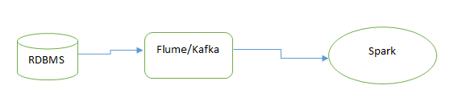
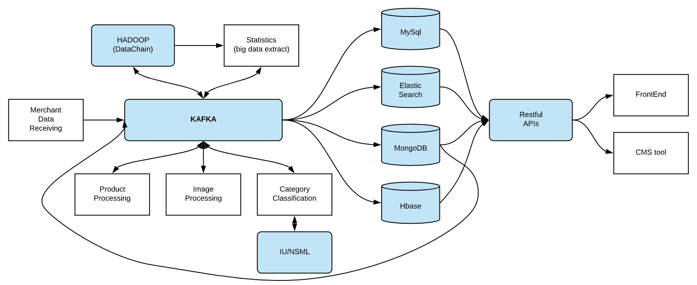
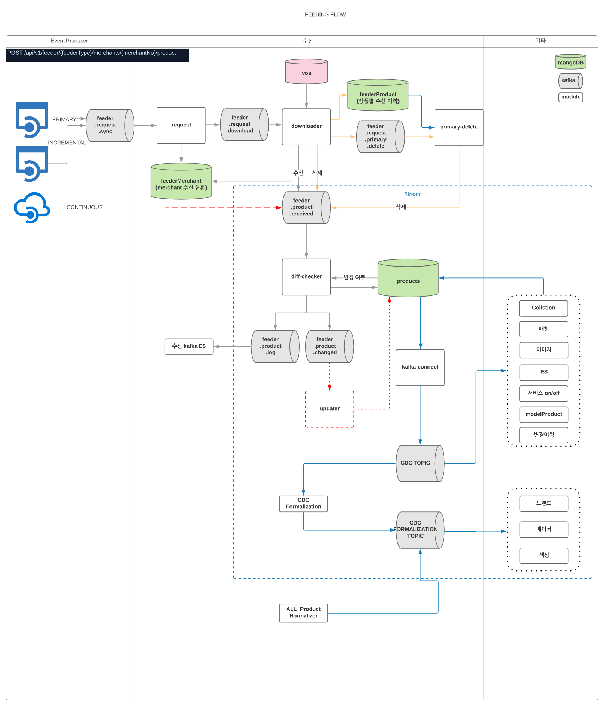

# kafka를 알아보게 된 계기

* https://www.educba.com/kafka-vs-spark/

* https://www.knowledgehut.com/blog/big-data/kafka-vs-spark

* 빅데이터 생태계에서 실시간 데이터 처리를 어떻게 하느냐에 대한 궁금증

  * spark
    * cluster computing system
    * 배치작업이나 실시간 스트리밍이 가능
    * 데이터 가공 가능
    * 하지만, 여기서 말하는 실시간 스트리밍은 타임 윈도로 분할한 스트림 데이터에 일괄 처리를 적용하는 것으로, 여러 개의 작은 데이터들을 처리하는 OLTP에는 적합하지않다(분산 아키텍처 때문에 처리 시간에 오버헤드가 발생해서)
    * scaling하려면 재설정이 필요하다
    * kafka->database, kafka->data science model 로 데이터가 이동할 때 spark stream이 적당
  * kafka
    * stream processing platform
    * 실시간 스트리밍 가능
    * 데이터 가공 불가능
    * per-second stream processing을 millisecond 단위의 지연시간으로 처리 가능
    * java process들만 더 추가하면 scaling이 쉽게 된다
    * kafka->kafka로 데이터가 이동할 때 kafka stream이 적당

* kafka와 spark의 주요 사용사례

  

* 어떤 것이 더 좋은 설계일까

  * https://dzone.com/articles/is-apache-kafka-a-database-the-2020-update

  * https://engineering.linecorp.com/ko/blog/line-shopping-platform-kafka-mongodb-kubernetes/

    * LINE 쇼핑 플랫폼의 사례

    * 전에는 Oracle

    * 후에는 MongoDB/MySQL->Kafka

      * 데이터를 이벤트 기반으로 처리하고, 스키마에 종속적이지 않으면서, 스케일 아웃이 가능하고, 서버를 쉽게 구성하고 자원을 효율적으로 사용하기 위해 도입
      * 먼저 판매자 데이터가 kafka를 통해 들어옴
      * kafka에서 mongodb로 변경내용 있으면 전달
      * mongodb가 업데이트되면 kafka connect가 감지하여 kafka topic에 저장
      * MongoDB/MySQL에 로그가 쌓일 때마다 Kafka Connect가 변경을 감지해 Kafka에 전달

      

      

  * 웹 크롤러 with 파싱->kafka->db

  * 웹 크롤러 with 파싱->db

  * 웹 크롤러->kafka->spark->db

* 다양한 데이터 producer, consumer 간의 데이터를 실시간으로 하나의 통일된 프레임워크에서 처리하는 방법부터 배우고 싶었다.

# kafka의 주요 특징

* https://twofootdog.tistory.com/86
* 메시징을 보내는 역할과 받는 역할이 분리
  * Publish and Subscribe
  * Consumer : 카프카로 메시지를 보내기만 함
  * Producer : 카프카에서 메시지를 가져오기만 함
  * 이러한 구조는 한 쪽 시스템에 문제가 발생해도 전체 시스템에 영향이 가지 않는다
* 하나의 토픽에 여러 Producer, Consumer가 접근 가능
  * sources와 sinks의 Integration
* 디스크에 메시지를 저장하고 유지
  * Store(fault-tolerant)
  * 정해져 있는 보관 주기 동안 디스크에 메시지를 저장
  * 트래픽이 일시적으로 많아지거나 컨슈머에 오류가 있더라도 메시지 손실 없이 작업 가능
* 이벤트 스트림 실시간처리
  * real-time stream process
* 확장용이
  * 하나의 카프카 클러스터는 3개이상의 브로커로 확장이 가능하다
* 성능이 높다
  * 내부적으로 분산처리, 배치처리 등의 기법을 사용하여 링크드인에서 1조개의 메시지를 생성하고 1PB 이상의 데이터 처리를 했다

# kafka with python producer

* https://needjarvis.tistory.com/607