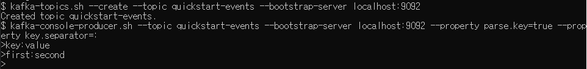

# 카프카 구성요소

* 한 대 이상의 주키퍼로 구성된 주키퍼 클러스터와 한 대 이상의 브로커로 구성된 카프카 클러스터

* 주키퍼(Zookeeper)

  * 브로커(혹은 다른 분산시스템)의 여러 메타 정보를 저장 관리
  * 카프카 클러스터의 식별 정보, 현재 살아있는 브로커 정보, 권한 정보 등 저장
  * 컨트롤러(지휘자) 브로커를 뽑는 역할
  * 디렉토리 형태로 데이터를 저장, 관리

* 브로커(Broker)

  * producer와 consumer 사이에서 메시지 중계

  * 모든 브로커는 클라이언트의 요청을 처리할 수 있는 p2p(Peer-to-Peer) 구조를 가진다

    

# Configuration 설정

* https://kafka.apache.org/documentation/#basic_ops

* https://always-kimkim.tistory.com/entry/kafka101-broker

* 새로 알게 된 것

  * docker-compose에서 << : base 로 공통된 기능을 정의할 때, 환경변수(environment) 값을 공통된 기능으로 적용할 수 없다(해당 설정 기반으로 만든 컨테이너들에 환경변수가 적용이 안됨)

* kafka 설정 위치

  * */opt/bitnami/kafka/config/*

* 전체 내용

  ```shell
  # Licensed to the Apache Software Foundation (ASF) under one or more
  # contributor license agreements.  See the NOTICE file distributed with
  # this work for additional information regarding copyright ownership.
  # The ASF licenses this file to You under the Apache License, Version 2.0
  # (the "License"); you may not use this file except in compliance with
  # the License.  You may obtain a copy of the License at
  #
  #    http://www.apache.org/licenses/LICENSE-2.0
  #
  # Unless required by applicable law or agreed to in writing, software
  # distributed under the License is distributed on an "AS IS" BASIS,
  # WITHOUT WARRANTIES OR CONDITIONS OF ANY KIND, either express or implied.
  # See the License for the specific language governing permissions and
  # limitations under the License.
  
  # see kafka.server.KafkaConfig for additional details and defaults
  
  ############################# Server Basics #############################
  
  # The id of the broker. This must be set to a unique integer for each broker.
  broker.id=-1
  
  ############################# Socket Server Settings #############################
  
  # The address the socket server listens on. It will get the value returned from
  # java.net.InetAddress.getCanonicalHostName() if not configured.
  #   FORMAT:
  #     listeners = listener_name://host_name:port
  #   EXAMPLE:
  #     listeners = PLAINTEXT://your.host.name:9092
  listeners=CLIENT://:9092,EXTERNAL://:9093
  
  # Hostname and port the broker will advertise to producers and consumers. If not set,
  # it uses the value for "listeners" if configured.  Otherwise, it will use the value
  # returned from java.net.InetAddress.getCanonicalHostName().
  advertised.listeners=CLIENT://kafka:9092,EXTERNAL://localhost:9093
  
  # Maps listener names to security protocols, the default is for them to be the same. See the config documentation for more details
  listener.security.protocol.map=CLIENT:PLAINTEXT,EXTERNAL:PLAINTEXT
  
  # The number of threads that the server uses for receiving requests from the network and sending responses to the network
  num.network.threads=3
  
  # The number of threads that the server uses for processing requests, which may include disk I/O
  num.io.threads=8
  
  # The send buffer (SO_SNDBUF) used by the socket server
  socket.send.buffer.bytes=102400
  
  # The receive buffer (SO_RCVBUF) used by the socket server
  socket.receive.buffer.bytes=102400
  
  # The maximum size of a request that the socket server will accept (protection against OOM)
  socket.request.max.bytes=104857600
  
  
  ############################# Log Basics #############################
  
  # A comma separated list of directories under which to store log files
  log.dirs=/bitnami/kafka/data
  
  # The default number of log partitions per topic. More partitions allow greater
  # parallelism for consumption, but this will also result in more files across
  # the brokers.
  num.partitions=1
  
  # The number of threads per data directory to be used for log recovery at startup and flushing at shutdown.
  # This value is recommended to be increased for installations with data dirs located in RAID array.
  num.recovery.threads.per.data.dir=1
  
  ############################# Internal Topic Settings  #############################
  # The replication factor for the group metadata internal topics "__consumer_offsets" and "__transaction_state"
  # For anything other than development testing, a value greater than 1 is recommended to ensure availability such as 3.
  offsets.topic.replication.factor=1
  transaction.state.log.replication.factor=1
  transaction.state.log.min.isr=1
  
  ############################# Log Flush Policy #############################
  
  # Messages are immediately written to the filesystem but by default we only fsync() to sync
  # the OS cache lazily. The following configurations control the flush of data to disk.
  # There are a few important trade-offs here:
  #    1. Durability: Unflushed data may be lost if you are not using replication.
  #    2. Latency: Very large flush intervals may lead to latency spikes when the flush does occur as there will be a lot of data to flush.
  #    3. Throughput: The flush is generally the most expensive operation, and a small flush interval may lead to excessive seeks.
  # The settings below allow one to configure the flush policy to flush data after a period of time or
  # every N messages (or both). This can be done globally and overridden on a per-topic basis.
  
  # The number of messages to accept before forcing a flush of data to disk
  #log.flush.interval.messages=10000
  
  # The maximum amount of time a message can sit in a log before we force a flush
  #log.flush.interval.ms=1000
  
  ############################# Log Retention Policy #############################
  
  # The following configurations control the disposal of log segments. The policy can
  # be set to delete segments after a period of time, or after a given size has accumulated.
  # A segment will be deleted whenever *either* of these criteria are met. Deletion always happens
  # from the end of the log.
  
  # The minimum age of a log file to be eligible for deletion due to age
  log.retention.hours=168
  
  # A size-based retention policy for logs. Segments are pruned from the log unless the remaining
  # segments drop below log.retention.bytes. Functions independently of log.retention.hours.
  #log.retention.bytes=1073741824
  
  # The maximum size of a log segment file. When this size is reached a new log segment will be created.
  log.segment.bytes=1073741824
  
  # The interval at which log segments are checked to see if they can be deleted according
  # to the retention policies
  log.retention.check.interval.ms=300000
  
  ############################# Zookeeper #############################
  
  # Zookeeper connection string (see zookeeper docs for details).
  # This is a comma separated host:port pairs, each corresponding to a zk
  # server. e.g. "127.0.0.1:3000,127.0.0.1:3001,127.0.0.1:3002".
  # You can also append an optional chroot string to the urls to specify the
  # root directory for all kafka znodes.
  zookeeper.connect=zookeeper:2181
  
  # Timeout in ms for connecting to zookeeper
  zookeeper.connection.timeout.ms=18000
  
  
  ############################# Group Coordinator Settings #############################
  
  # The following configuration specifies the time, in milliseconds, that the GroupCoordinator will delay the initial consumer rebalance.
  # The rebalance will be further delayed by the value of group.initial.rebalance.delay.ms as new members join the group, up to a maximum of max.poll.interval.ms.
  # The default value for this is 3 seconds.
  # We override this to 0 here as it makes for a better out-of-the-box experience for development and testing.
  # However, in production environments the default value of 3 seconds is more suitable as this will help to avoid unnecessary, and potentially expensive, rebalances during application startup.
  group.initial.rebalance.delay.ms=0
  
  auto.create.topics.enable=true
  
  inter.broker.listener.name=CLIENT
  
  max.partition.fetch.bytes=1048576
  max.request.size=1048576
  sasl.enabled.mechanisms=PLAIN,SCRAM-SHA-256,SCRAM-SHA-512
  sasl.mechanism.inter.broker.protocol=
  ```

  

* 필수 설정

  * broker.id

    * 같은 카프카 클러스터에서 현재 브로커를 식별하기 위한 숫자

      ```shell
      broker.id=-1
      ```

      ```yaml
      # 1
      KAFKA_BROKER_ID=1
      # 2
      KAFKA_BROKER_ID=2
      ```

      

  * log.dirs

    * 프로듀서로부터 받는 메시지들을 저장할 위치 경로

      ```shell
      log.dirs=/bitnami/kafka/data
      ```

      

  * zookeeper.connect

    * 카프카 클러스터의 메타 정보를 저장할 주키퍼에 관한 호스트 연결정보

      ```shell
      zookeeper.connect=zookeeper:2181
      # zookeeper에 여러 노드들이 있을 때 예시
      #zookeeper.connect=NAMENODE.local:2181,SECONDARY-NAMENODE.local:2181,DATANODE1.local:2181,DATANODE2.local:2181,DATANODE3.local:2181
      ```

      

* listeners

  * Listener List - Comma-separated list of URIs we will listen on and the listener names

    ```shell
    listeners=CLIENT://:9092,EXTERNAL://:9093
    ```

    ```yaml
    KAFKA_CFG_LISTENERS=CLIENT://:9092,EXTERNAL://:9093
    KAFKA_CFG_LISTENERS=CLIENT://:9092,EXTERNAL://:9094
    ```
    
    

* advertised.listeners

  * Listeners to publish to ZooKeeper for clients to use(client가 사용가능하게끔 하기 위해 만든 listeners)

  * 한 수신기가 다른 수신기의 주소를 알리도록 중복된 포트 사용가능

  * 값이 선언 안되어 있으면 listeners에 선언된 값 가용

    
    
    ```shell
    advertised.listeners=CLIENT://kafka:9092,EXTERNAL://localhost:9093
    ```

* listener.security.protocol.map

  * Map between listener names and security protocols

    ```shell
    listener.security.protocol.map=CLIENT:PLAINTEXT,EXTERNAL:PLAINTEXT
    ```

* auto.create.topics.enable

  * 클라이언트가 특정 토픽으로 요청했을 경우 자동 생성 여부(기본값 true)

  * true로 하면 상용 환경에서는 클라이언트의 요청에 따라 토픽이 지속적으로 생성되어 문제가 될 수 있다

    ```shell
    auto.create.topics.enable=true
    ```

    

* offsets.topic.replication.factor

  * 오프셋 토픽의 복제계수 (기본값 3)

    ```shell
    offsets.topic.replication.factor=1
    ```

* zookeeper 설정 위치
  * /opt/bitnami/zookeeper/bin
  * zkCli.sh
  * ls /brokers/ids

# broker 한곳에서 실행한 producer가 다른 곳에서도 반영되는지 확인

* producer 실행

  ```shell
  # kafka01
  docker exec -it kafka01 sh
  kafka-topics.sh --create --topic quickstart-events --bootstrap-server localhost:9092
  kafka-console-producer.sh --topic quickstart-events --bootstrap-server localhost:9092 --property parse.key=true --property key.separator=:
  ```

  

* consumer 실행

  ```shell
  # kafka02
  docker exec -it kafka02 sh
  kafka-console-consumer.sh --topic quickstart-events --from-beginning --bootstrap-server localhost:9092 --property print.key=true --property print.value=true  --property key.separator=:
  ```

  

* kafka02 브로커에서 produce한 데이터를 kafka01 브로커에서 consume 가능

# 궁금한 점들

* kafka-python을 이용한 producer

  ```python
  from kafka import KafkaProducer
  from json import dumps
  import time
  
  producer = KafkaProducer(
      acks=0,
      compression_type='gzip', 
      bootstrap_servers=['localhost:9093'], # 'localhost:9094'
      key_serializer=str.encode,
      value_serializer=lambda x: dumps(x).encode('utf-8')
  )
  start = time.time()
  for i in range(10000):
      key = str(i % 5) # str(i % 100)
      data = 'aa' + str(i)
      producer.send('quickstart-events', key=key, value=data) # 'test'
      producer.flush()
  print("elapsed :", time.time() - start)
  
  
  ```

  

* https://coe.gitbook.io/guide/messaging/kafka

* 똑같은 데이터에 대해 producer가 전송실패하고 다시보냈는데, broker 입장에선 중복된 데이터가 왔을 때, 이를 어떻게 처리할까

  * https://sowells.tistory.com/123
  * 중복되는 메시지는 메시지ID나 시간 등으로 보장 가능
  * 인터넷 검색으로는 카프카 0.11버전부터 레코드의유니크ID, 트랜잭션ID, 프로듀서ID 등을 조합하여 exactly-once를 보장한다고 한다

* 처리속도비교

  * 하나의 broker에 하나의 producer만 실행
    * 10.4817955493927
    * 11.311611652374268
  * 하나의 broker에 두개의 producer가 같은 topic에 event를 전달
    * 15.531545639038086/15.112783670425415 (가장 처음 실행해서 오래걸림)
    * 13.031087875366211/13.024411916732788
  * 각각의 broker에 각각의 producer가 같은 topic에 event를 전달
    * 13.183840990066528/13.024411916732788
    * 13.01158332824707/12.893577814102173
  * 어느 broker에 전달하든 동시에 실행되는 producer의 개수가 많아지면 producer 각각이 끝나는 시간이 길어진다.

* 파티션의 개수에 따라 처리속도가 달라질까

  * 인터넷에서는 파티션 수 증가하면 key ordering 보장이 안되지만, 병행수행이 가능해지면서 처리량이 늘어날 수 있다고 한다.

  * 파티션 1개(quickstart-events)

    * 10.355968236923218

    ```shell
    kafka-console-consumer.sh --topic quickstart-events --from-beginning --bootstrap-server localhost:9092 --property print.key=true --property print.value=true  --property key.separator=:
    ```

    

  * 파티션 5개(test)

    * 11.409797668457031

    ```shell
    kafka-topics.sh --create --topic test --bootstrap-server localhost:9092 --partitions 5
    ```

    ```shell
    kafka-console-consumer.sh --topic test --from-beginning --bootstrap-server localhost:9092 --property print.key=true --property print.value=true  --property key.separator=:
    ```

    * kafka01

    

    * kafka02

    

  * 파티션의 개수에 따라 차이나기보단 비슷한 코드를 계속 실행할수록 빨리처리함

* topic의 상황

  ```shell
  kafka-topics.sh --list --bootstrap-server localhost:9092
  kafka-topics.sh --describe --bootstrap-server localhost:9092 --topic quickstart-events
  ```

* 결론

  * 성능을 파악하기 위해서는 다른 여러 기기에서 돌려보는 것이 더 정확할 것 같다

