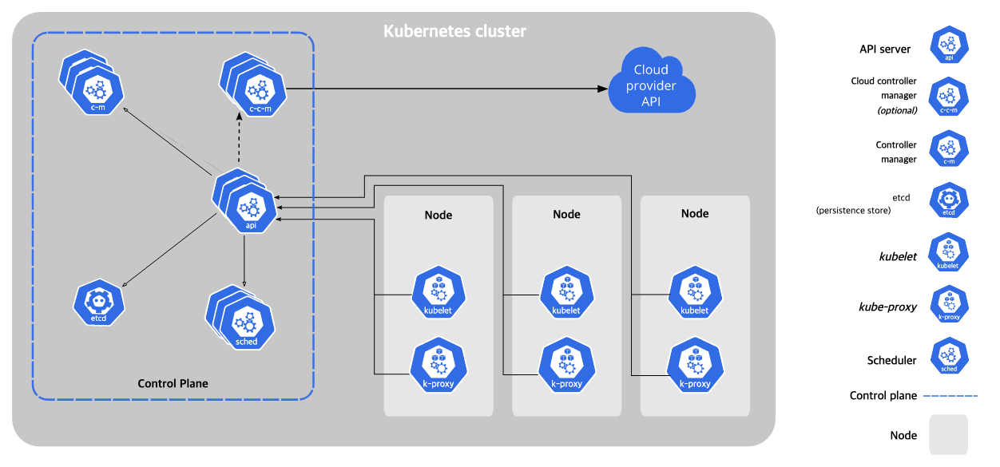
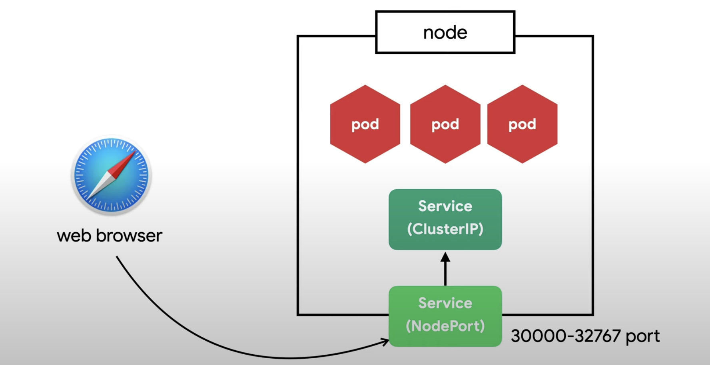
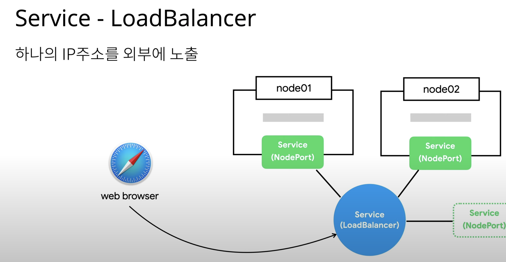
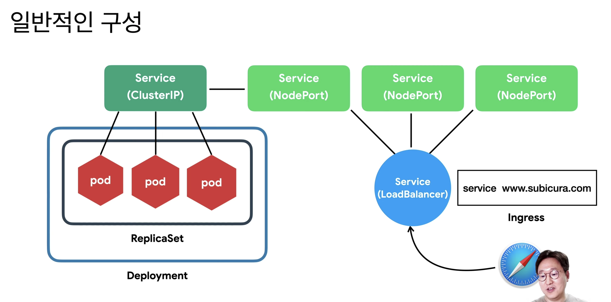

# 4주차- 쿠버네티스 설명 & kubeadm 으로 클러스터 구성하기

# 쿠버네티스란 :

Container Orchestration

복잡한 컨테이너 환경을 효과적으로 관리하기 위한 도구

주요기능:

클러스터 중앙제어, 상태관리 , 스케줄 , 배포 버전관리 ,  서비스 등록 및 조회,  볼륨 스토리지

다양한 후보군: docker-swarm, rancher 등등...

kubernetes가 대세로 올라옴

왜 쿠버네티스인가?

오픈소스, 엄청난 인기,  무한한 확장성, 사실상의 표준 핵심 역할

이젠 리눅스는 필요없다 쿠버네티스만 있으면 된다란 얘기가 나올정도!

 

### 쿠버네티스 아키텍처



일단 적어놓고 대처

쿠버네티스 - 원하는 상태 

상태체크 → 차이점발견 → 조치

 원하는 상태를 확인하는 컨트롤러를 여러개 띄울수 있다 (Replication Contoller, End point Controller, Machine learning Controller 등등.. )

**Master 상세 - etcd**

모든 상태와 데이터를 저장

분산 시스템으로 구성하여 안전성을 높임

가볍고 빠르면서 정확하게 설계

key-value 형태로 데이터 저장

**Master 상세 - API server (etcd 와 통신)**

상태를 바꾸거나 저장

etcd 와 유일하게 통신하는 모듈

rest api 형태로 제공

권한을 체크하여 적절한 권한이 없을 경우 요청을 차단

관리자 요청뿐 아니라 다양한 내부 모듈과 통신

수평으로 확장되도록 디자인

**Master 상세 - Sheduler**

새로 생성된 Pod 을 감지하고 실행할 노드를 선택

노드의 현재 상태와 Pod의 요구사항을 체크

**Master 상세 - Controller** 

논리적으로 다양한 컨트롤러가 존재

-복제 컨트롤러

-노드 컨트롤러

-엔드포인트 컨트롤러

끊임없이 상태를 체크하고 원하는 상태를 유지

복잡성을 낮추기 위해 하나의 프로세스로 실행

**Node 상세 - kubelet**

각 노드에서 실행

Pod을 실행/중지하고 상태를 체크 

CRI (Container Runtime Interface)

 -docker

 -Containerd

**Node 상세 - proxy** 

네트워크 프록시와 부하 분산 역할

성능상의 이유로 별도의 프록시 프로그램대신 iptables 또는 IPVS를 사용(설정만 관리)

## 쿠**버네티스 오브젝트**

**Pod**

가장 작은 배포 단위

전체 클러스터에서 고유한 IP를 할당

여러개의 컨테이너가 하나의 Pod에 속할 수 있음 (host 폴더 공유, [localhost](http://localhost) 네트워크 공유)

**ReplicaSet**

여러개의 Pod을 관리

새로운 Pod은 Template 을 참고하여 작성

신규 Pod 을 생성하거나 기존 Pod을 제거하여 원하는수 유지

**Deployment** 

배포 버전을 관리

버전을 바꿀때 :내부적으로 ReplicaSet 을 이용 (pod을 하나하나씩 바꾼다)

**다양한 Workload:**

Daemon Set :모든 노드에 하나씩

Stateful Set : 순서대로 실행하거나 , 같은 볼륨을 재활용

job : 한번 실행하고 죽는 pod 

**Service - ClusterIP (Pod들을 선택하는 LoadBalancer같이 작동)**

클러스터 내부에서 사용하는 Proxy

Pod 은 동적이지만 서비스는 고유 IP를 가짐

하지만 이건 내부에서만 사용하는 ip 노드에 노출되어 외부에서 접근 가능한 서비스는 따로



**Service - NodePort**

노드(host)에 노출되어 외부에서 접근 가능한 서비스

모든 노드에 동일한 포트에 생성

**Service - LoadBalancer**

하나의 IP 주소를 외부에 노출 ⇒ 여러개의 노드들이 연결



지금까진 port 별로 서비스를 나눈것이라면...

**Ingress**

도메인 또는 경로별 라우팅

-Nginx, HAProxy,ALB, ... 이런것들을 kubernetes 에 맞게 구성

**일반적인 구성**



**그 외 기본 오브젝트**

Volume - Storage(EBS , NFS, ...)

Namespace - 논리적인 리소스 구분

ConfigMap/Secret - 설정

ServiceAccount - 권한 계정

Role/ ClusterRole - 권한 설정 (get, list, watch, create, ...)

**쿠버네티스 API 호출**

Object Spec - YAML 파일로 명세 작성

```python
apiVersion - apps/v1, v1, batch/v1

kind - Pod, Deployment,m Service, Ingress ...

metadata - name, label, namespace, ..

spec - 각종 설정

status(read-only) - 시스템에서 관리
```

**API 호출하기**

원하는 상태(desired state)를 다양한 오브젝트(object)로 정의(spec)하고 API 서버에 yaml 형식으로 전달


잠시 생각해보자


굳이 뒷자석에 넣어도 될껄 이렇게 옮길 필요가 있을까?

필요한곳에 제대로 적용해야 효과가 있음!

# 쿠버네티스 클러스터 환경에 구축하기

우분투(ubuntu) 환경에서 Kubeadm(kubeadm)을 사용하여 kubernetes cluster를 설치하는 방법을 소개합니다.

Kubeadm:  kubeadm이란, kubernetes에서 제공하는 기본적인 도구이며, kubernetes 클러스터를 가장 빨리 구축하기 위한 다양한 기능을 제공한다.

### docker 설치

이미 설치 되어있으므로 pass 

 

```python
### docker 설치

sudo apt-get update

sudo apt-get install docker.io

sudo ln -sf /usr/bin/docker.io /usr/local/bin/docker

### docker 그룹 권한 부여

sudo groupadd docker

sudo usermod -aG docker $USER

newgrp docker
```

### package 로 kubeadm , kubelet, kubectl 설치

```python
# apt update
# apt install -y apt-transport-https ca-certificates curl
# curl -fsSLo /usr/share/keyrings/kubernetes-archive-keyring.gpg https://packages.cloud.google.com/apt/doc/apt-key.gpg
# echo "deb [signed-by=/usr/share/keyrings/kubernetes-archive-keyring.gpg] https://apt.kubernetes.io/ kubernetes-xenial main" | tee /etc/apt/sources.list.d/kubernetes.list
# apt update
# apt install -y kubelet kubeadm kubectl
# apt-mark hold kubelet kubeadm kubectl
```

### kubeadm init 명령어로 master node 초기화

```python
sudo kubeadm init --pod-network-cidr=10.244.0.0/16 --apiserver-advertise-address=$(hostname-i)
```

> 위 ‘–pod-network-cidr=10.244.0.0/16’ 옵션은 pod 통신을 위해 pod network add-on인 flannel CNI 설정입니다.
> 

> flannel은 레이어(layer) 3 네트워크(network) 패브릭(fabric)을 구성하는 kubernetes를 위한 오버레이(overlay) network입니다. 자세한 설명은 https://github.com/flannel-io/flannel 페이지를 참고하시기 바랍니다.
> 

> CNI((Container Network Interface, cni)는 linux container에서 network interface를 구성하기 위해 필요한 플러그인(plugin)에 대한 사양(specification) 및 라이브러리(library)로 구성된 CNCF(Cloud Native Computing Foundation)에서 관리하는 프로젝트이며, GO 언어로 개발되었습니다. 자세한 설명은 [https://github.com/containernetworking/cni](https://github.com/containernetworking/cni) 페이지를 참고하시기 바랍니다
> 

```python
sudo kubeadm join 100.0.0.94:6443 --token gkht6m.xuwz56etrnuhkyk1 \
--discovery-token-ca-cert-hash sha256:179e2a7ccc4c7cbd71975d77303e3beb6b2f84dd5c2253785156f9771cdf6910
```

위 내용 복사해둬야함

### 에러 발생시

```python
sudo mkdir /etc/docker
cat <<EOF | sudo tee /etc/docker/daemon.json
{
  "exec-opts": ["native.cgroupdriver=systemd"],
  "log-driver": "json-file",
  "log-opts": {
    "max-size": "100m"
  },
  "storage-driver": "overlay2"
}
EOF

sudo systemctl enable docker
sudo systemctl daemon-reload
sudo systemctl restart docker

*# kubelet가 실행인지 확인*

sudo systemctl status kubelet

*# 실행중이 아닐 경우*

sudo systemctl start kubelet
```

이후

```python
sudo kubeadm reset -f
sudo kubeadm init --pod-network-cidr=10.244.0.0/16 --apiserver-advertise-address=$(hostname-i)
```

### 워커 노드들이 연결이 바로 안됨

혹시 root 끼리 연결이 안되어있어서인가 ... nope 

6443 port 가 secure이어서 telnet도 안통함...  강제로 뚫어주기 

[우분투(Ubuntu) 환경에 방화벽(Firewalld) 설치 및 설정하기](https://lindarex.github.io/ubuntu/ubuntu-firewalld-installation/)

```python
$ sudo apt update && sudo apt install firewalld -y
$ sudo firewall-cmd --permanent --zone=public --add-port=6443/tcp
$ sudo firewall-cmd --reload
```

### kubectl 설정

root 사용자 

```
# mkdir -p $HOME/.kube
# cp -i /etc/kubernetes/admin.conf $HOME/.kube/config
# chown $(id -u):$(id -g) $HOME/.kube/config
```

일반 사용자

```
$ mkdir -p $HOME/.kube
$ sudo cp -i /etc/kubernetes/admin.conf $HOME/.kube/config
$ sudo chown $(id -u):$(id -g) $HOME/.kube/config
```

> 아래 결과는 flannel 설치 전이기 때문에 coredns pod가 pending 상태입니다.
> 

**`#** kubectl get pods -n kube-system
NAME                                    READY   STATUS     RESTARTS   AGE
coredns-74ff55c5b-jz6tz                 0/1     Pending    0          5m40s
coredns-74ff55c5b-ksnfl                 0/1     Pending    0          5m40s
etcd-ip-10-0-0-162                      1/1     Running    0          5m55s
kube-apiserver-ip-10-0-0-162            1/1     Running    0          5m55s
kube-controller-manager-ip-10-0-0-162   1/1     Running    0          5m55s
kube-proxy-rjqkc                        1/1     Running    0          5m40s
kube-scheduler-ip-10-0-0-162            1/1     Running    0          5m55s`

flannel 설치 

```python
# kubectl apply -f https://raw.githubusercontent.com/coreos/flannel/master/Documentation/kube-flannel.yml
```

flannel 설치 확인

```python
# kubectl get pods -n kube-system
NAME                                    READY   STATUS    RESTARTS   AGE
coredns-74ff55c5b-jz6tz                 1/1     Running   0          6m2s
coredns-74ff55c5b-ksnfl                 1/1     Running   0          6m2s
etcd-ip-10-0-0-162                      1/1     Running   0          6m17s
kube-apiserver-ip-10-0-0-162            1/1     Running   0          6m17s
kube-controller-manager-ip-10-0-0-162   1/1     Running   0          6m17s
kube-flannel-ds-dg45x                   1/1     Running   0          30s
kube-proxy-rjqkc                        1/1     Running   0          6m2s
kube-scheduler-ip-10-0-0-162            1/1     Running   0          6m17s
```

```python
kubectl get nodes -o wide
```

### worker node에서 kubeadm join (복사해둔 명령어) 로 cluster 에 join 한다.

```bash
sudo kubeadm join 100.0.0.94:6443 --token gkht6m.xuwz56etrnuhkyk1 \
--discovery-token-ca-cert-hash sha256:179e2a7ccc4c7cbd71975d77303e3beb6b2f84dd5c2253785156f9771cdf6910
```