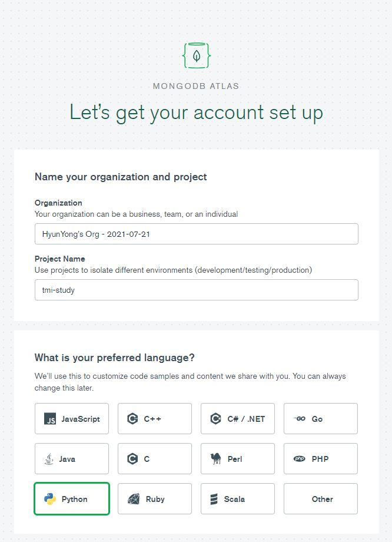
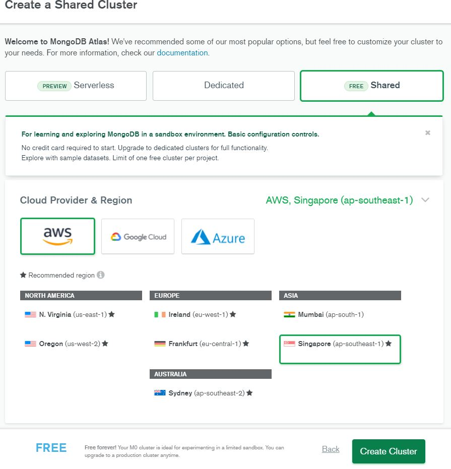
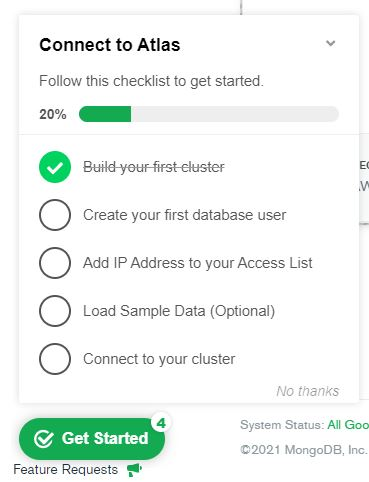
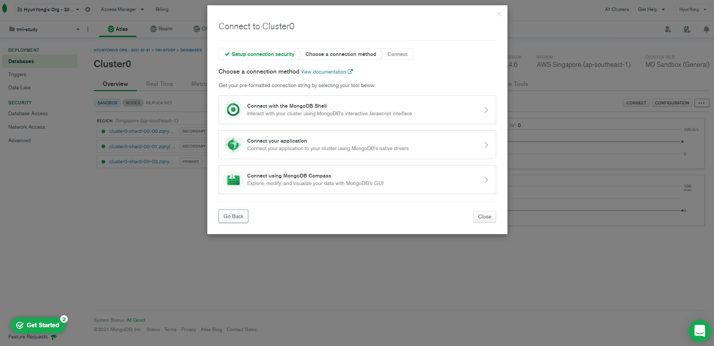
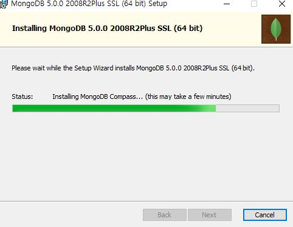
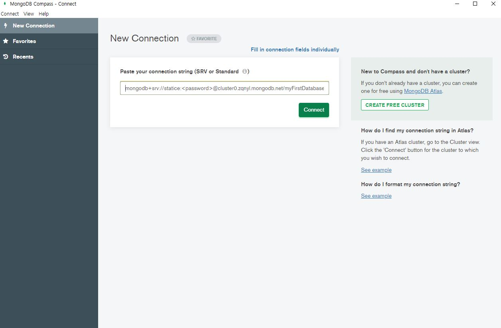

### MongoDB

---

1. MongoDB란?

   - NoSQL 데이터베이스

     NoSQL(not only sql) : 기존 관계형 RDBMS가 갖고 있는 특성 뿐 아니라 다른 특성들을 부가적으로 지원

     - 분산 시스템을 위해 탄생
     - MongoDB, HBase

     - 스키마(데이터베이스 관계 제약조건)가 없는 자유로운 데이터 모델
     - 수직뿐만 아니라 수평 확장까지 가능한 분산 아키텍쳐
     - 객체 기반 API 제공
     - 관계가 없기 때문에 사실상 정규화가 불가능. 연관된 데이터가 있을 경우 여러 컬렉션에서 데이터 수정 필요
     - 무결성이 보장되지 않아 사용자의 실수가 그대로 반영됨

   - open source(무료이용가능)

   - Transaction(DBMS상호작용 단위)으로 ACID(안전성 우선) 대신 BASE를 선택해 가용성, 성능 우선시


​     

2. MongoDB 계층구조

   

   - Collections

     - MongoDB Document들의 그룹
     - RDBMS의 Table과 비슷한 개념
     - 따로 스키마(schema)를 갖고 있지 않음

   - **Document**

     - Document 기반의 데이터베이스는 RDBMS와 다르게 자유롭게 데이터 구조를 잡을 수 있음

     - MongoDB는  BSON으로 데이터가 쌓여 Array 데이터나 중첩구조 데이터등을 쉽게 넣을 수 있음

     - _id 를 자동적으로 부여해 unique한 document를 가짐

       
       
       id : 12bytes의 hexadecimal 값, 각 document의 유일함(uniqueness)을 제공
       이 값의 첫 4bytes 는현재 timestamp, 다음 3bytes는 machine id, 다음 2bytes는 MongoDB 서버의 프로세스id, 마지막 3bytes는 순차번호.
       
        key : value 쌍으로 이루어짐
       
     - 동적 스키마를 가져 같은 Collection안의 Document들끼리 다른 데이터, 구조를 가질 수 있음
     
   - Fields

     - RDBMS의 속성과 비슷한 개념
     - key에 해당하는 값을 말하며, 주로 조회에 사용
   
   
   
   
   
3. MongoDB 설치

   - MongoDB Atlas (설치참고 :  https://www.youtube.com/watch?v=C2rhqCwho

   - 
   
     
   
     
   
     
   
     
   
      
   
4. MongoDB Atlas를 이용한 로컬과 클라우드 연동
   
   
   
   
   
   

5. 데이터 조작

  - Nosql이므로 sql을 사용하지 않고 별도 로 제공하는 API를 통해 데이터를 건들 수 있음

  - 기본적으로 자바스크립트 엔진 SpiderMonkey를 사용하여 API제공함

  - 자바스크립트 대신 파이썬 연동해서 진행

​        cmd 열어 명령어 실행해 파이썬에서 구현하기 위한 라이브러리 설치

  ```bash
  pip install pymongo
  ```

  

조작 모듈 내용추가예정


