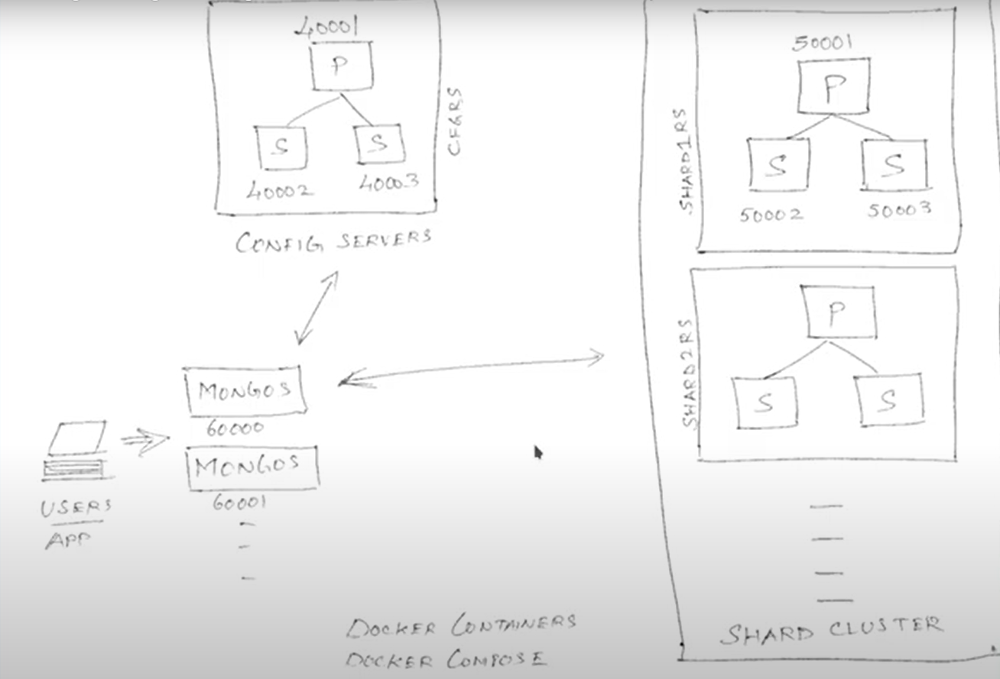

### 3. MongoDB Replica Set 

---

MongoDB의 Replica Set구성 기능은 DB의 고가용성 환경을 위해 필요한 기술임. DB 노드의 장애가 발생하거나, DB에 문제가 발생하는 경우에도 빠르게 장애에 대응하여 복구하는 시간을 줄일 수 있는 장점을 갖게 함. MongoDB는 자체적인 기능으로  Replication기능을 지원.

Replica Set의 가장 큰 목적은 서비스중인 MongoDB 인스턴스에 문제가 생겼을 때, Replica Set의 구성원 중 하나인 복제 노드가 쟁아 노드를 즉시 대체하는 것임. 

MongoDB의 복제를 수행하기 위해서는 여러 mongod 인스턴스가 모인 Replica Set이 필요함. Replica Set의 구성원이 되면 서로의 정보를 동기화


Replica Set은 세가지 역할로 구성원을 나눔

- Primary : 클라이언트에서 DB로 읽기 및 쓰기 작업 수행
- Secondary : 프라이머리 노드로부터 데이터를 동기화하고, 장애발생시 프라이머리로의 역할 전환. 프라이머리 장애 상황에서 어떤 세컨더리 노드를 프라이머리로 올리것인지 투표권 가짐
- Arbiter : 레플리카셋을 3대 이상의 홀수로 구성할 수 없을시, 투표권만을 가지고 레플리카 셋을 모니터링하는 역할

장애발생시 우선순위가 높고 가장 최신의 정보를 가지고 있는 Secondary가 Primary후보가 되며, 이후 세컨더리 구성원들과 아비터 구성원들이 찬성표를 전달, 과반이 넘으면 후보로 올라섰던 Secondary가 Primary가 됨.

PSA PSS 두가지 구조를 가짐


### 4. MongoDB Sharding

---

매우 큰 데이터를 처리할 때 하드웨어의 성능이 매우 중요함. 또한 높은 쿼리 속도는 디스크 드라이브의 CPU, RAM 및 I/O 용량에 부담을 주어 전체적인 성능을 저하시킬 수 있음

샤딩(Sharding) : 데이터를 여러 서버에 분산해서 저장하고 처리할 수 있는 기술. 복제(Replication)과의 차이점은 복제는 고가용성을 위한 솔루션이라면 샤딩은 분산 처리를 위한 솔루션임.


MongoDB가 자체적으로 제공하는 샤딩 기능을 통한 수평 확장

- Shared Cluster(몽고디비의 샤딩구성을 하는데 필요한 3가지 요소)

  - Shard : 샤드 데이터의 집합. 샤드는 Replica set이 될 수 있음. 여러 샤드를 구성하게 되면 그만큼 가용성을 높일 수 있고, 데이터의 이중화가 가능해짐.

  - Mongos : 몽고스는 애플리케이션과 샤드 클러스터간의 인터페이스 제공. 클라이언트의 요청으로 올바른 샤드로 라우팅하는 것이 주요 기능

  - Config servers : 설정 서버에서는 클러스터의 메타 데이터와 설정들을 저장

    

- Shard keys

  몽고디비는 샤드 키를 이용하여 컬렉션의 document를 샤드에 배포

  별도로 지정하지 않는다면 샤드키는 Object_id(_id)가 되며, 해당 컬렉션의 모든 document에 존재하는 field index라면 샤드 키로 지정 가능

  샤드키 제약 조건

  - 샤드키는 512byte를 넘을 수 없음

  - 샤딩한 컬렉션의 샤드 키는 변경 불가

  - 샤드 키로 지정된 필드의 value는 변경 불가

    

- Chunks

  몽고디비는 샤딩 된 데이터를 분할함. 각 분할 된 조각들을 여러개의 샤드 서버에 분산해서 저장하는데 이 데이터 조각을 Chunks라고 함. 이 chunk는 각 샤드 서버에 균등하게 저장되어야 좋은 성능을 낼 수 있는데, 균등하게 저장하기 위해서 chunks를 split하고 migration하는 과정을 거침

  

  샤드 키를 이용하여 샤드를 분할한 그림

  

  x를 샤드 키로 설정해 4개의 Chunks로 나누고, 각 Chunks마다 범위를 가지게 함

  즉, 샤드 키를 지정하는 것은 샤드의 Chunks 생성과 연관되며 데이터 활용에 영향을 줌. 샤드 키가 샤드 클러스터에서 효율성과 성능에 직결되어 있음


---


- docker에 mongodb연결 방법

  docker에 MongoDB설치

  ```bash
  docker run \
       --name some-mongo \
       -p 27017:27017
       -e MONGO_INITDB_ROOT_USERNAME=root \
       -e MONGO_INITDB_ROOT_PASSWORD=mongodb \
       -d mongo
  ```

  docker image 생성

  ```bash
  docker pull mongo
  ```

  container 사이를 이어주기 위해 network 생성

  ```bash
  docker network create mongo
  ```

  docker network list 확인

  ```bash
  docker network ls
  ```

  

  
  
  

### 5. Mongo DB Set up Sharding



```bash
cd play

git clone https://github.com/justmeandopensource/learn-mongodb

cd learn-mongodb

# 구조 확인
tree sharding

# docker 확인
sudo systemctl status docker

cd sharding

# config server 에서 3개의 volume, container 생성
docker-compose -f config-server/docker-compose.yaml up -d

docker ps
```

config-server/docker-compose.yaml 확인

3개의 다른 컨테이너 생성, 

동일 command(몽고디비 서버 실행, config server실행, 레플리카셋 cfgrs이름으로 생성(3개의 컨테이너가 cfgrs 레플리카셋의 part다), 볼륨 마운트)

```bash
# config-server에서 돌아가고 있는 컨테이너 확인
# 지정한 포트번호를 이용해 접근가능
docker-compose -f config-server/docker-compose.yaml ps
```

이 컨테이너들에 접근하기 위해서는 레플리카셋을 initiate해야 한다

```bash
# Initiate replica set
# 포트번호 40001에 해당하는 컨테이너에 접근
# ip주소는 본인에 맞게 변경해야함
# ifconfig -a 실행해 eth0 - inet에서 확인
mongo mongodb://172.18.127.82:40001

rs.initiate(
  {
    _id: "cfgrs",
    configsvr: true,
    members: [
      { _id : 0, host : "172.18.127.82:40001" },
      { _id : 1, host : "172.18.127.82:40002" },
      { _id : 2, host : "172.18.127.82:40003" }
    ]
  }
)


# primary 40001
# secondary 40002
# secondary 40003
rs.status()
```


Shard Server1

shard1/docker-compose.yaml 확인

3개의 다른 컨테이너 생성, 

동일 command(몽고디비 서버 실행, shard server실행, 레플리카셋 shardirs이름으로 생성(3개의 컨테이너가 shardirs 레플리카셋의 part다), 볼륨 마운트)

```bash
# 3개의 volume, container 생성
docker-compose -f shard1/docker-dompose.yaml up -d

# 컨테이너 확인
docker ps

# 볼륨 확인
docker volume ls
```

이 컨테이너들에 접근하기 위해서는 레플리카셋을 initiate해야 한다

```bash
# 포트번호 50001에 해당하는 컨테이너에 접근
mongo mongodb://172.18.127.82:50001

rs.initiate(
  {
    _id: "shard1rs",
    members: [
      { _id : 0, host : "172.18.127.82:50001" },
      { _id : 1, host : "172.18.127.82:50002" },
      { _id : 2, host : "172.18.127.82:50003" }
    ]
  }
)

# primary 50001
# secondary 50002
# secondary 50003
rs.status()
```


Mongos Router

mongos/docker-compose.yaml 확인

커맨드 mongos 로 시작 

--configdb : config server에 connect

config 레플리카셋 이름/ ip:port번호

```bash
# mongos 컨테이너 1 생성
docker-compose -f mongos/docker-compose.yaml up -d

# 총 7개 컨테이너
docker ps
```


mongos 에 연결

```bash
mongo mongodb://172.18.127.82:60000

# 샤드 추가(shard1rs)
sh.addShard("shard1rs/172.18.127.82:50001,172.18.127.82:50002,172.18.127.82:50003")

sh.status()
```


다음시간까지..

Shard Cluster에 Shard 추가 및 MongoDB Collection 샤딩

+mongodb shell, mongodb server versiona 매치에러 해결, ...


- mongodb shell , server version match error


mongod --version


sudo apt-get remove mongodb

sudo apt-get remove mongodb-org

sudo apt-get remove mongodb-server-core

sudo apt-get remove mongo

cd ~

sudo apt-key adv --keyserver hkp://keyserver.ubuntu.com:80 --recv 2930ADAE8CAF5059EE73BB4B58712A2291FA4AD5

echo "deb [ arch=amd64,arm64 ] https://repo.mongodb.org/apt/ubuntu xenial/mongodb-org/3.6 multiverse" | sudo tee /etc/apt/sources.list.d/mongodb-org-3.6.list

sudo apt-get update

sudo apt-get install -y mongodb-org

 cd ~

sudo mkdir -p data/db

sudo mongod --dbpath ~/data/db

