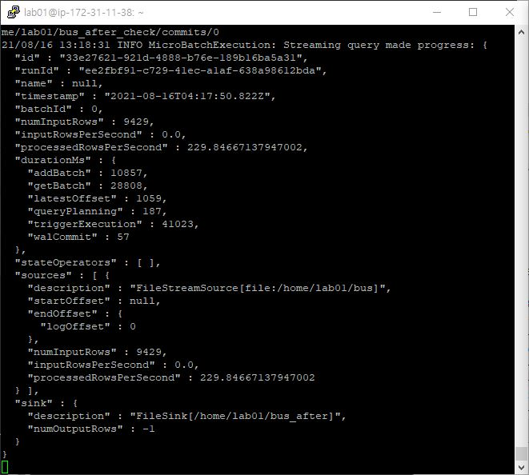

# Spark streaming

* https://spark.apache.org/docs/latest/streaming-programming-guide.html

* scalable, high-throughput, fault-tolerant

* input data stream을 받고, batch들로 나누어 처리된다

* DStream : discretized stream로 spark streaming에서 스트리밍을 위해 제공하는 고수준 추상화, 내부적으로는 RDD들의 sequence로 이루어져 있다

  

* SparkContext 사용 예제

  * Netcat으로 9999번 포트에 데이터를 보낸다
  * socketTextStream을 통해 데이터를 읽고 파싱하여 word의 개수를 센다

  ```python
  from pyspark import SparkContext
  from pyspark.streaming import StreamingContext
  
  # Create a local StreamingContext with two working thread and batch interval of 1 second
  sc = SparkContext("local[2]", "NetworkWordCount")
  ssc = StreamingContext(sc, 1)
  # Create a DStream that will connect to hostname:port, like localhost:9999
  lines = ssc.socketTextStream("localhost", 9999)
  # Split each line into words
  words = lines.flatMap(lambda line: line.split(" "))
  # Count each word in each batch
  pairs = words.map(lambda word: (word, 1))
  wordCounts = pairs.reduceByKey(lambda x, y: x + y)
  # Print the first ten elements of each RDD generated in this DStream to the console
  wordCounts.pprint()
  
  ssc.start()             # Start the computation
  ssc.awaitTermination()  # Wait for the computation to terminate
  ```

  ```shell
  # Netcat 실행하여 9999번 포트에 데이터 전달
  nc -lk 9999
  # 한 줄 입력하면 포트로 데이터 스트림이 전달됨
  ```

  ```shell
  # python 코드 실행
  ./bin/spark-submit examples/src/main/python/streaming/network_wordcount.py localhost 9999
  ```


# StreamingContext

* 실제로 cluster에서 실행시킬 때는 master를 하드코딩하진 않고 spark-submit으로 실행하지만, local testing을 하기 위해 "local[*]"를 인자로 준다

  * master URL에 local이나 local[1]은 인자로 사용금지
  * local[n]에 들어갈 n은 receiver개수보다 많아야한다

* batch interval을 정해야 한다

* context 정의 후 해야할 일

  * input DStreams 정의(input source)
  * DStreams에 대해 어떻게 계산하고 변환할 것인지 정의
  * 실제로 데이터를 받아오고 처리하는 역할을 하는 streamingContext.start() 실행
  * 에러가 생기거나 수동으로 멈출 때까지 실행시키는 streamingContext.awaitTermination() 실행
  * streamingContext.stop()를 이용하면 수동으로 멈추기 가능

* 기억해야 할 것

  * context가 시작되면 어떠한 새로운 streaming computation은 실행되거나 추가될 수 없다
  * context는 한 번 멈추면 다시 시작할 수 없다
  * JVM에서 오직 하나의 StreamingContext만 존재할 수 있다
  * StreamingContext를 stop하면 SparkContext도 stop한다(StreamingContext만 정지하려면 따로 설정 필요)
  * SparkContext는 다른 여러 StreamingContext를 생성하도록 재사용이 가능하다(한번에 하나의 StreamingContext만 실행되면 가능)

  ```python
  from pyspark import SparkContext
  from pyspark.streaming import StreamingContext
  
  sc = SparkContext(master, appName)
  ssc = StreamingContext(sc, 1)
  ```

* DStreams

  * Discretized Streams(이산화된 흐름)

  * 연속적인 데이터의 흐름

  * 연속적인 RDD를 갖고 있고, 각 RDD는 특정 interval에 발생한 데이터를 가지고 있다

  * DStreams에서 데이터가 처리(변환)되는 과정

    * 각 RDD별로 변환이 되는 것이다

    

* Input DStreams

  * streaming source에서 데이터를 받아온 데이터를 뜻함
  * streaming source 종류
    * Basic : file systems, socket connections.
    * Advanced : Kafka, Kinesis
      * extra dependencies
  * 한 application에서 여러 input DStreams를 받아오는 건 가능하지만, 데이터를 처리하고 receiver를 실행시키는데에 충분한 core(local에서는 thread)가 주어졌는지 확인해야 한다
    * receiver의 개수가 core개수보다 많아야 한다

* Checkpointing

  * fault-tolerant storage하게 만들기 위해 특정 정보를 저장하는 것
  * 종류
    * Metadata
      * *Configuration*(streaming application만들 때 필요한 설정), *DStream operations*, *Incomplete batches*(큐에 들어갔지만 끝나지 않은 job들)
      * driver failure에 사용
    * Data
      * stateful transformation에서 사용
      * 계속 이전 RDD의 정보가 필요하기 때문에 의존성을 제거하려고 stateful transformation에서 발생한 중간 RDD를 주기적으로 저장

# Structured Spark Streaming Concept

* https://spark.apache.org/docs/latest/structured-streaming-programming-guide.html

* Streaming을 table에 계속 추가하는 것이라고 생각하여 batch processing model처럼 처리할 수 있다

* Output의 경우 external storage에 쓰기를 하게 되는데, 3가지 모드가 존재한다

  * Complete Mode : 전체 Result Table

  * Append Mode : 마지막 trigger 이후에 Result Table에 새로 추가된 row들

  * Update Mode : 마지막 trigger 이후에 Result Table에 업데이트 된 row들

    

* 스트리밍 프로세스에서 fault-tolerance, data consistency가 보장되는 이유

  * Handling Event-time and Late Data
  * Fault Tolerance Semantics

* SparkSession을 이용한 실시간 스트리밍

  * 여러 개의 분산된 파일들을 일정 크기 이상의 파일들로 합쳐서 데이터를 더 빠르게 읽을 수 있음
  * 수집할 때 모든 데이터를 바로 저장했기 때문에 불필요한 status code 등의 정보가 남게 되는데, 이를 전처리하여 가공하기 쉽도록 전처리함
  * 1시간간격으로 새로 생긴 모든 파일들을 하나의 파일로 병합함(15KB 여러개->70MB 한개)

  ```python
  # process_bus100100073.py
  from pyspark.sql import SparkSession
  from pyspark.sql.functions import explode
  
  spark = SparkSession \
      .builder \
      .appName("bus100100073") \
      .getOrCreate()
  
  busSchema = spark.read.format('json').load('/home/lab01/bus/20210813142502Bus100100073.json').schema
  busDf = spark.readStream.schema(busSchema).json('/home/lab01/bus/*100100073.json')
  df_bus = busDf.select(explode(busDf.ServiceResult.msgBody.itemList).alias("buses")).select('buses.*')
  df_bus.coalesce(1).writeStream.format('json').option("checkpointLocation", "/home/lab01/bus100100073_check").option("path", "/home/lab01/bus100100073").trigger(processingTime='3600 seconds').start().awaitTermination()
  ```

  