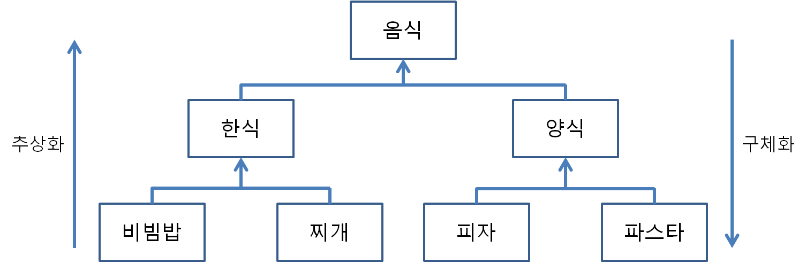
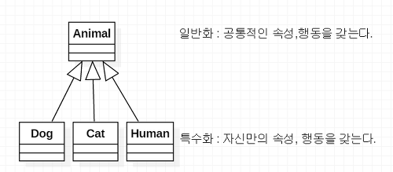
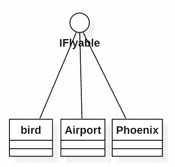
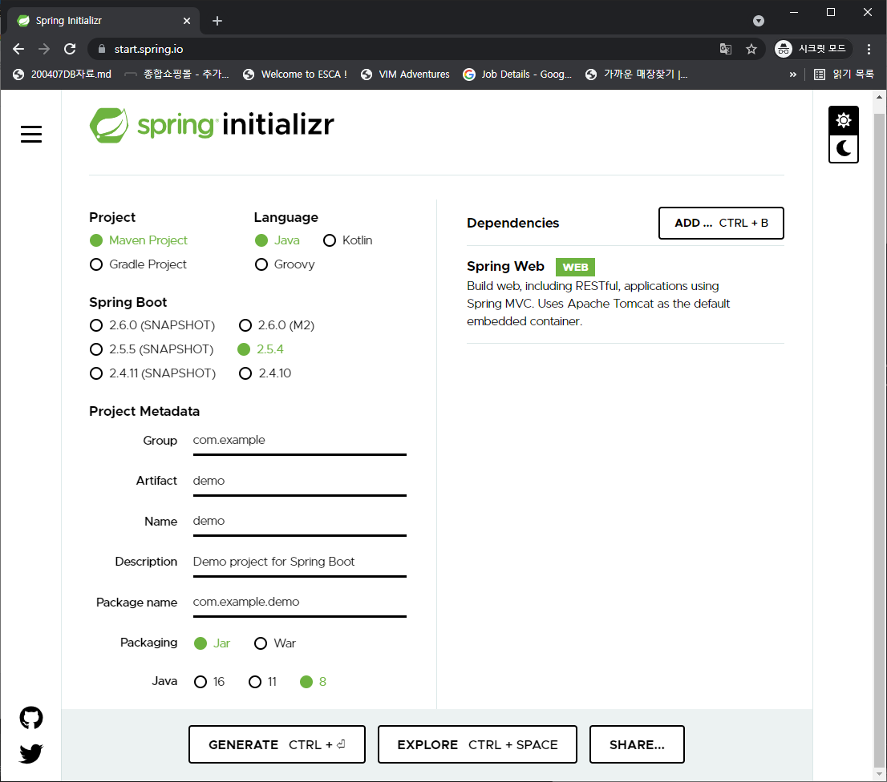
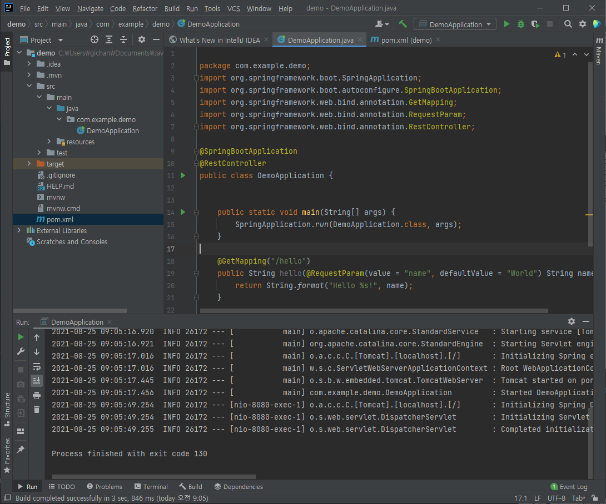
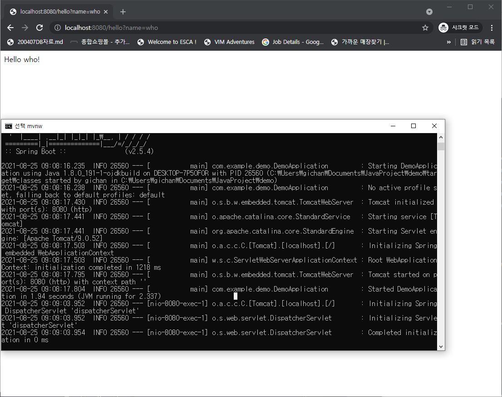

# Java의 객체지향에 대한 이해

* 참고 책

  * 스프링 입문을 위한 자바 객체 지향의 원리와 이해

* Java의 객체지향 프로그래밍

  * JVM 메모리 사용 방식

    

  * 메소드(Method)

    * 절차적/구조적 프로그래밍에서의 함수와 거의 같다
    * 차이점은 함수와 달리 메소드는 어떠한 경우에라도 클래스 정의 안에 존재해야한다(Java)
    * 사용용도
      * 논리를 함수(메소드) 단위로 분리해서 이해하기 쉬운 코드 작성 가능(논리 분할)
      * 중복 코드를 한 곳에 모아 관리용이(중복 제거)

  * 객체 지향의 4대 특성

    * 캡슐화(Encapsulation) : 정보 은닉

    * 상속(Inheritance) : 재사용 + 확장, Inheritance보다 extend(실제로 Java에서 상속할 때 extends 사용), 분류도를 이용해 super class, sub class 관계를 갖는것

      

    * 추상화(Abstraction) : 모델링

      * 구체적인 것을 분해해서 관찰자가 관심 있는 특성(애플리케이션 용도에 맞는)만 가지고 재조합하는 것
      * 객체(Object) : 세상에 존재하는 유일무이한 사물, heap 영역에 저장
      * 클래스(Class) : 분류, 집합, 같은 속성과 기능을 가진 객체를 총칭하는 개념, static 영역에 저장
      * 넓게 보면 상속을 통한 추상화, 구체화, 인터페이스를 통한 추상화, 다형성을 통한 추상화 모두 추상화이다
      * 예시
        * 같은 사람이어도 병원 애플리케이션에선 (시력, 몸무게, 혈액형, 키, 나이)에 관한 특성만 관심있고, 은행 애플리케이션에선 (나이, 직업, 연봉)에 관한 특성만 관심있다.

    * 다형성(Polymorphism) : 사용 편의

  * static member vs instance member

    * 둘 다 별도의 초기화가 없어도 0, 0.0, false, null 등으로 알아서 초기화된다
      * 지역변수와 달리 객체 변수는 하나의 객체 안에서 다수의 객체 메소드가 공유하고, 클래스 변수는 프로그램 어디서든 접근 가능한 공유 변수이기 때문에 누가 초기화해야할 지 명확하지 않아서 기본값으로 초기화시킴
    * static member
      * class member
      * 클래스에 값을 저장
      * 모든 객체가 공통적인 값을 가지고 있을 때 static 사용
      * main()메소드, main()메소드의 논리를 분해한 메소드, getter, setter, Math클래스 메소드 처럼 객체의 존재 여부와 관계 없이 써야하는 함수는 정적 메소드로 사용
    * instance member
      * object member
      * 객체에 값을 저장
      * 각 객체의 고유값

  * 다중 상속 불가능과 인터페이스

    * 만약, 다중 상속이 가능하다면, 인어의 경우 사람, 물고기를 상속한다고 할 때 swim이라는 메소드를 실행시키려면 사람의 swim을 실행시켜야할지, 물고기의 swim을 실행시켜야할지 모르는 다중 상속의 다이아몬드 문제가 발생한다

    * 상속은 is a kind of, 인터페이스는 be able to

    * 하나의 class에 여러 개의 인터페이스를 강제할 수 있다

      

      

* 스프링 삼각형

  * IoC/DI
  * AOP
  * PSA

# Spring 튜토리얼

* https://spring.io/quickstart

* spring initializer

  * https://start.spring.io/

  * 먼저 여기서 spring project를 다운받고 압축풀어 프로젝트로 열기

    

* IntelliJ community IDE를 사용해 프로젝트 열기

* 간단한 rest api 하나 만들기

  * Java annotation vs Python decorator
    * https://stackoverflow.com/questions/15347136/is-a-python-decorator-the-same-as-java-annotation-or-java-with-aspects
    * Java annotation
      * 컴파일러에게 이 코드에 대한 메타데이터 정보를 알려주는 역할
    * Python decorator
      * 해당 함수를 실행시키기 전후로 처리해주는 함수추가
  * `@RestController` : 해당 annotation은 Spring에게 web에서 사용가능한 endpoint라는 것을 알려준다
  * `@GetMapping("/hello")` : 해당 annotation은 Spring에게 http://localhost:8080/hello로 요청이 오면 hello() 메소드를 실행시키라고 알려준다
  * `@RequestParam(value = "name", defaultValue = "World")`: 요청에 name값이 들어올 것이라고 알려주고, 만약 요청에 해당 값이 없으면 디폴트로 "World"값을 사용한다

  ```java
  
  package com.example.demo;
  import org.springframework.boot.SpringApplication;
  import org.springframework.boot.autoconfigure.SpringBootApplication;
  import org.springframework.web.bind.annotation.GetMapping;
  import org.springframework.web.bind.annotation.RequestParam;
  import org.springframework.web.bind.annotation.RestController;
  
  @SpringBootApplication
  @RestController
  public class DemoApplication {
  	public static void main(String[] args) {
  		SpringApplication.run(DemoApplication.class, args);
  	}
  
  	@GetMapping("/hello")
  	public String hello(@RequestParam(value = "name", defaultValue = "World") String name) {
  		return String.format("Hello %s!", name);
  	}
  
  }
  
  ```

  

  

* 실행

  * 다음 명령어로 spring boot 실행

    ```shell
    # window
    mvnw spring-boot:run
    ```

  * 서비스가 정상적으로 동작하는지 확인

    * localhost:8080/hello?name=who
    * 

    