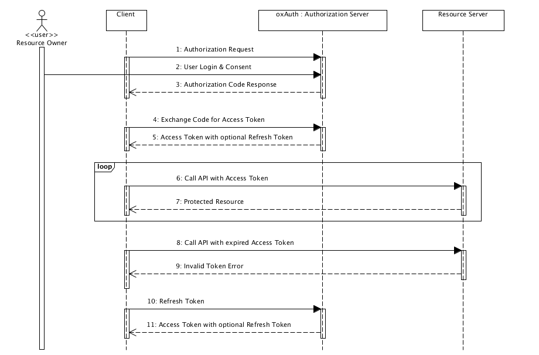

# Web

* rest api란
  * rest의 요소 3가지
    * request, uri, message
    * get, post, delete, put 등의 방법으로 요청
    * 자원을 요청하는 주소 전달
    * parameter, data를 전달
  * rest의 장점
    * 통합된 인터페이스로 자원요청이 간편해졌다
  * get과 post의 차이
    * get은 URL 파라미터에 요청하는 데이터를 담아 보내고, post는 body에 데이터를 담아 보내기 때문에 post의 경우 요청데이터를 암호화할 수 있다
    * get은 서버의 리소스에서 데이터를 요청할 때, post는 서버의 리소스를 새로 생성하거나 업데이트할 때 사용한다
    * get은 웹 캐시로 캐시가 가능하지만, post는 그렇지 않다
* status code중 400번대와 500번대
  * status code중 400번대와 500번대 차이점
    * 클라이언트측 에러, 서버측 에러
* 쿠키와 세션의 차이
  * https://interconnection.tistory.com/74
  * 쿠키와 세션 발급과정
    * 쿠키
      * 클라이언트가 페이지를 요청
      * 서버에서 쿠키를 만들고 HTTP헤더로 쿠키를 보냄
      * 클라이언트는 쿠키를 보관하고 같은 요청을 할 때 HTTP헤더로 쿠키를 보냄
      * 서버에서 쿠키를 읽어 이전 상태 정보를 변경해야할 때 쿠키를 업데이트하고 HTTP헤더로 쿠키를 보냄
    * 세션
      * 클라이언트가 서버 접속시 세션 ID를 발급받음
      * 클라이언트는 세션 ID에 대한 쿠키를 저장
      * 클라이언트가 서버에 요청할 때 쿠키의 세션 ID를 같이 전달
      * 서버는 세션 ID를 이용해 세션에 있는 클라이언트 정보를 가져와 사용 후 응답
  * 쿠키와 세션을 사용하는 이유
    * HTTP 프로토콜 환경에서는 connectionless(응답 받은 후 연결을 끊는다), stateless(통신이 끝나면 상태를 유지하지 않는다)한 특성을 가지고 있어 서버는 클라이언트가 누군지 구분을 못하기 때문에 사용
  * 쿠키와 세션의 차이(저장위치, 저장형식, 만료시점, 리소스, 용량제한)
    * 쿠키는 클라이언트에, 세션은 서버에
    * 쿠키는 문자열, 세션은 오브젝트
    * 쿠키는 지정된 기간, 세션은 서버의 설정에 따라 제한없음
    * 쿠키는 클라이언트 리소스, 세션은 서버의 리소스
    * 쿠키는 용량제한(4KB씩 300개) 존재, 세션은 용량제한 없음
    * 쿠키는 클라이언트에 저장되는 키와 값이 들어있는 파일이고 세션은 사용자의 정보 파일을 서버측에 저장한다
    * 세션은 정보를 서버에 저장하기 때문에 보안이 우수하지만 사용자가 많아지면 서버 메모리를 많이 차지한다. 따라서 보안이 중요한 로그인 등에 사용된다
    * 쿠키의 경우 브라우저가 종료해도 정보가 남아있지만, 세션은 브라우저가 종료하면 정보가 삭제된다
* 웹서버와 WAS서버의 차이
  * 웹서버와 WAS서버의 차이
    * 정적인 요청 처리, 동적인 요청 처리
    * 정적인 요청 처리는 특정 파일 제공(html, css, javascript, 이미지, 동영상 등)
    * 동적인 요청 처리는 db접근이나 다양한 로직 처리가 필요한 컨텐츠를 제공
  * 웹서버와 WAS를 동시에 쓰는 이유
    * 정적, 동적인 처리를 한 서버에서 담당하기에는 너무 많은 부하가 걸려서
* 3-way handshake와 4-way handshake
  * https://unordinarydays.tistory.com/172
  * 3-way handshake란
    * TCP/IP에서 호스트와 서버가 connection을 맺을 때 수행되는 전송제어 프로토콜
    * client -> server : SYN M
    * server -> client : SYN N, ACK M+1
    * client -> server : ACK N+1 
  * 3-way handshake인 이유
    * TCP/IP 통신은 양방향성 connection이므로 서버 입장에서도 클라이언트에게 전송한 패킷이 잘 도착했는지 알아야 해서 2-way handshake가 아닌 3-way handshake를 사용한다
    * 서버, 클라이언트 둘 다 서로 신호를 주고받을 수 있는지 확인해야해서
  * 4-way handshake란
    * https://beenii.tistory.com/127
    * TCP 연결을 해제할 때 수행
    * client, server 누구나 먼저 연결을 끊을 수 있다
    * A가 FIN_WAIT_1
    * A -> B : FIN, B가 CLOSE_WAIT(B에서 남은 데이터를 보내기 위한 상태, 보내고 난 후 B 내부에서 close로 어플리케이션을 종료한다)
    * B -> A : ACK, A가 FIN_WAIT_2
    * B -> A : FIN, A가 TIME_WAIT(B에서 받지 못한 데이터가 있을 수 있으므로 여기서 잠시 대기)
    * A -> B : ACK, B가 CLOSED
    * A는 TIME_WAIT상태에서 일정시간 대기 후 CLOSED
  * 4-way handshake인 이유
    * half-close기법으로 연결은 종료하는데 귀는 열어두어 더 보낼 데이터들이 있으면 처리하기 위해서
* OSI 7계층
  * Physical Layer
    * bit
    * 전기적으로 raw data를 주고받는 것에 대해 다룬다
    * voltage, pin layout, cabling, radio frequencies 등을 다룬다
  * Data Link Layer
    * frame
    * node-to-node(Point to Point) 간 신뢰성있는 전송을 보장하기 위한 계층
    * mac address로 통신
    * 이더넷, HDLS, ADCCP, 패킷 스위칭 네트워크 프로토콜, LLC, ALOHA 사용
  * Network Layer
    * packet
    * host-to-host(양 끝단, end-to-end)
    * ip address로 통신
    * 라우팅, 흐름 제어, segmentation, 오류제어, internetworking 수행
    * IP
  * Transport Layer
    * segment
    * process-to-process
    * 패킷들의 전송이 유효한지 확인하고 전송 실패한 패킷들을 다시 전송
    * TCP, UDP
  * Session Layer
    * 양 끝단의 응용프로세스가 통신을 관리하는 방법 제공
    * 세션 확립/유지/중단, 인증, 재연결
  * Presentation Layer
    * 인코딩과 암호화작업
    * EBCDIC 인코딩 파일을 ASCII 인코딩 파일로 변환, 데이터가 text인지 gif인지 jpg인지 구분
  * Application Layer
    * 응용프로그램, 응용서비스
    * 커뮤니케이션 파트너, 사용 가능한 자원량, 커뮤니케이션 동기화 등 명시
    * HTTP, FTP, SMTP, POP3, IMAP, Telnet
* TCP와 UDP
  * TCP와 UDP를 각각 사용하는 상황
    * TCP는 reliable network를 보장(데이터 분실, 중복, 순서가 뒤바꿈 등을 자동으로 보정)해야하는 상황에서 사용
    * UDP는 데이터의 처리속도가 중요한 실시간 방송, 온라인 게임에서 사용
  * Flow Control이란
    * 수신측에서 packet을 지나치게 많이 받지 않도록 조절하는 것
  * Flow Control 방법 2가지
    * Stop and Wait
      * 매번 전송한 패킷에 대해 확인 응답을 받아야만 그 다음 패킷을 전송
    * Sliding Window(Go Back N ARQ)
      * 수신측에서 설정한 윈도우 크기만큼 송신측에서 확인응답없이 세그먼트를 전송할 수 있게 하여 데이터 흐름을 동적으로 조절하는 제어기법
      * 마지막에 보내진 바이트 - 마지막에 확인된 바이트 <= 남아있는 공간
      * 호스트들은 실제 데이터를 보내기 전에 '3 way handshaking'을 통해 수신 호스트의 receive window size에 자신의 send window size를 맞추게 된다.
  * Congestion Control이란
    * 네트워크의 혼잡도를 조절하기 위해 송신측에서 데이터 전송속도를 조절하는 것
  * Congestion Control을 위해 쓰이는 전략 4가지
    * AIMD(Additive Increase / Multiplicative Decrease)
      * 처음에 패킷을 하나씩 보내고 이것이 문제없이 도착하면 window 크기를 1씩 증가시켜가며 전송
      * 패킷 전송에 실패하거나 일정 시간을 넘으면 패킷의 보내는 속도를 절반으로 줄인다
      * 처음에는 나중에 진입하는 호스트가 불리하지만, 시간이 흐르면 평형상태로 수렴하게되는 특징이 있다
      * 초기에 네트워크의 높은 대역폭을 사용하지 못하고, 네트워크가 혼잡해지는 상황을 미리 감지하지 못한다
    * Slow Start
      * 처음에 패킷을 하나씩 보내고, 문제없이 도착하면 ACK패킷마다 window size를 1씩 늘려준다(1주기가 지나면 window size가 2배로 됨)
      * 혼잡 현상이 나타나면 window size를 1로 떨어뜨린다
      * 한 번 혼잡 현상이 발생하면 수용량을 어느정도 예상할 수 있어서, 혼잡 현상이 발생했던 window size의 절반까지는 이전처럼 지수 함수 꼴로 창 크기를 증가시키고 그 이후부터는 1씩 증가시킨다
    * Fast Retransmit
      * 수신측에서 먼저 도착해야할 패킷이 도착하지 않고 다음 패킷이 도착한 경우에도 ACK패킷(순서대로 잘 도착한 마지막 패킷의 다음 패킷 순번)을 보낸다
      * 송신측에서 중복된 순번의 패킷을 3개 받으면 네트워크가 혼잡해졌고 패킷의 손실이 일어났다고 생각해 window size를 줄이고 재전송을 한다
    * Fast Recovery
      * 혼잡한 상태가 되면 window size를 1로 줄이지 않고 반으로 줄이고 선형증가시키는 방법
      * 혼잡 상황을 한 번 겪고 나서부터는 순수한 AIMD 방식으로 동작하게 됨
* 대칭키와 공개키
  * 대칭키란
    * 암호화와 복호화에 같은 암호키를 사용하는 알고리즘
    * 동일한 키를 주고받기 때문에 매우 빠르다
    * 대칭키 전달과정에서 해킹 위험
  * DES, AES, ARIA 암호화과정
  * 공개키란
    * 암호화와 복호화에 다른 암호키를 사용하는 알고리즘
    * A가 공개된 B의공개키를 이용해 평문을 암호화하여 B에게 보냄
    * B는 자신의 비밀키로 복호화한 평문을 확인하고, A에게 A의 공개키로 응답을 암호화하여 보냄
    * 암호화 복호화 키가 달라 복잡함(느림)
    * 암호화된 평문을 보낼 때 탈취당해도 안전함
  * RSA 암호화과정
    * 2개의 큰 소수를 이용한 인수분해의 원리를 이용해 암호화
    * 2개의 소수들은 개인키로 하고 이를 이용해 공개키를 만든다
    * 누구나 공개키를 사용해서 암호화가능
    * 2개의 소수를 알고있으면 복호화가능
  * 해시 암호화 알고리즘 특징
    * 단방향 암호화기법으로 원래의 데이터 찾기가 불가능
    * 사용자 자신만 알고 이외의 관리자와 3자가 알지 못하게 하는 비밀번호 암호화나 두 파일의 무결성을 확인하는데에 사용
    * 충돌로 인해 보안이 매우 중요한 곳에서는 사용하지 않는다
  * MD5, SHA-256 암호화과정
    * MD5 : 임의의 길이를 입력받아 128비트 길이의 해시값으로 출력, 32비트 워드 네 개로 이루어진 하나의 128비트 state에 512비트짜리 입력 메시지 블록을 차례대로 입력하여 변화시킴
* HTTP와 HTTPS
  * HTTP란
    * 인터넷 상에서 클라이언트와 서버가 자원을 주고 받을 때 쓰는 통신 규약
  * HTTPS와 HTTP의 차이점
    * HTTPS는 정보를 암호화하는 SSL 프로토콜방식을 사용해 통신하여 안전하다
    * HTTP의 경우에는 암호화하지 않아 도청하거나, 통신상대를 바꿔치기하거나, 중간에 정보를 변조할 위험이 있다
  * HTTPS 동작 원리
    * https://github.com/gyoogle/tech-interview-for-developer/blob/master/Computer%20Science/Network/HTTP%20%26%20HTTPS.md
    * 애플리케이션 서버를 만드는 기업이 공개키, 개인키를 만든다
    * 신뢰할 수 있는 CA(Certificate Authority)에게 공개키 관리를 부탁하며 계약을 한다
    * CA는 해당 기업의 이름, 서버 공개키, 공개키 암호화 방법을 담은 인증서를 만들고, 해당 인증서를 CA 개인키로 암호화하여 서버에 전달한다
    * 서버는 서버의 공개키로 암호화된 HTTPS 요청이 아닌 다른 요청이 오면, 암호화된 인증서를 클라이언트에게 건내준다
    * 클라이언트의 브라우저는 인증서를 탐색하여 CA 공개키를 알아낼 수 있고, 이 공개키로 인증서를 복호화한다(이 때, 신뢰받는 CA 기업이 아닌 경우 안전하지 않은 사이트라고 브라우저에서 알려준다)
    * 클라이언트는 인증서에 있는 서버 공개키로 요청을 암호화하여 서버와 통신이 가능해졌다
  * 전자서명이란
    * 송신자가 소유한 개인키로 암호화한 전자서명 정보와 원본 문서를 송신하면, 수신자가 공개키를 이용하여 전자서명 정보를 복호화하고 원본문서와 비교해서 인증과 무결성을 확인한다
  * 전자서명의 용도
    * 서버에서 어떤 프로그램을 다운받았을 때, 프로그램의 악성 여부(혹은 무결성)를 판단할 때 사용
  * TLS/SSL HandShake 동작 원리
    * 클라이언트가 random, session ID(첫 통신이면 빈값), cipher suite를 보낸다
      * random값은 나중에 master secret에 사용됨
      * session ID는 이미 생성된 세션이 있다면 해당 ID를 입력
      * cipher suite는 클라이언트가 지원가능한 키 교환 알고리즘(비대칭키), 대칭키 암호 알고리즘, 해시 알고리즘을 알려준다
    * 서버가 random, session ID, 인증서를 보낸다
      * random값은 나중에 master secret에 사용됨
      * session ID는 session을 만들고 해당 세션ID를 알려줌
      * 인증서에는 서버의 공개키가 있다
    * 클라이언트가 pre-master secret을 보낸다
      * pre-master secret은 서버로부터 받은 랜덤값, 클라이언트가 생성한 랜던값을 조합하여 만든다
      * pre-master secret은 인증서 안의 서버 공개키를 이용해 암호화를 하여 전송한다
      * 서버는 pre-master secret을 개인키로 복호화한다
      * 클라이언트, 서버는 일련의 과정을 통해 pre-master secret을 master secret를 만들고 이를 이용해 세션에 사용될 대칭키를 만든다
      * 앞으로 대칭키로 서로 통신을 주고받는다
* 로드 밸런싱
  * https://m.post.naver.com/viewer/postView.nhn?volumeNo=27046347&memberNo=2521903
  * 로드 밸런싱이란
    * 여러 서버로 서비스를 운용할 때 트래픽을 균등하게 분산해주는 것
  * 로드 밸런싱 알고리즘
    * 라운드로빈 방식
      * 서버에 들어온 요청을 순서대로 분배
      * 서버들이 동일한 스펙을 갖고 있고, 서버와의 연결이 오래 지속되지 않는 경우 사용
    * 가중 라운드로빈 방식
      * 각각의 서버마다 가중치를 매기고 가중치가 높은 서버에 클라이언트 요청을 우선적으로 분배
      * 서버의 트래픽 처리 능력이 서로 다를 때
    * IP 해시 방식
      * 클라이언트의 IP 주소를 특정 서버로 매핑하여 요청 처리
      * 사용자는 항상 동일한 서버에 연결된다
    * 최소 연결 방식
      * 요청이 들어온 시점에서 가장 적은 연결상태를 보이는 서버에 우선적으로 분배
      * 세션이 길어지거나, 서버에 분배된 트래픽들이 일정하지 않은 경우에 적합
    * 최소 리스폰타임
      * 가장 적은 연결 상태와 가장 짧은 응답시간을 보이는 서버에 우선적으로 배분
* Blocking/Non-blocking
  * Blocking이란
    * 함수 A, B가 있는데 A 안에서 B를 호출했을 때, B가 할 일을 다 마칠 때까지 제어권을 갖고 있는 경우
  * Non-blocking이란
    * 함수 A, B가 있는데 A 안에서 B를 호출했을 때, B가 할 일을 다 마치지 않았어도 A에게 제어권을 바로 넘겨주는 경우
    * A는 B를 기다리면서 다른 일을 할 수 있다
* Synchronous/Asynchronous
  * Synchronous란
    
    * 함수 A, B가 있는데 A 안에서 B를 호출했을 때, A가 B의 상태를 계속 체크하는 경우
  * Asynchronous란
    * 함수 A, B가 있는데 A 안에서 B를 호출했을 때, B의 수행 상태는 B 스스로 체크하는 경우
    * 호출시 callback을 전달하여 작업의 완료 여부를 A에게 답하게 된다
    
    
* 라우터와 스위치 차이
  * 라우터는 3계층 장비로, 경로를 설정해 패킷을 전송, LAN
  * 스위치는 2계층 장비로, MAC address table을 이용해 프레임을 전송, WAN
* OAuth2.0
  * Open Authentification
  
  * Third party application에 아이디와 비밀번호를 제공하지 않고도 로그인을 제공하는 플랫폼의 아이디만 있으면 사용할 수 있게 하는 것
  
  * user -> consumer : 서비스 접근 및 로그인 요청
  
  * consumer -> service provider : 로그인 요청
  
  * service provider -> user : 로그인 페이지 제공, ID/PW 요청
  
  * user -> service provider : ID/PW 입력
  
  * service provider -> user : Authorization Code 발급
  
  * user -> consumer : Redirect : Callback URL
  
  * consumer -> service provider : Access Token 요청
  
  * service provider -> consumer : Access Token 발급
  
  * consumer -> user : 인증 완료 및 로그인 성공
  
    
* Authentication and Authorization
  * https://baek.dev/post/24/
  * Authentication은 로그인, Authorization은 권한